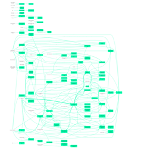
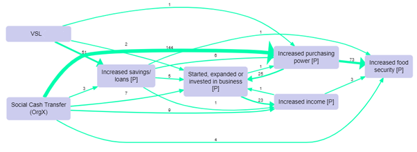
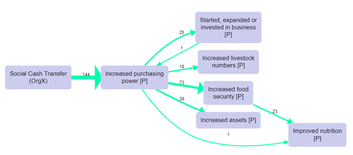
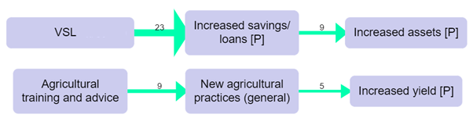
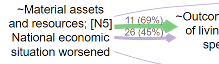
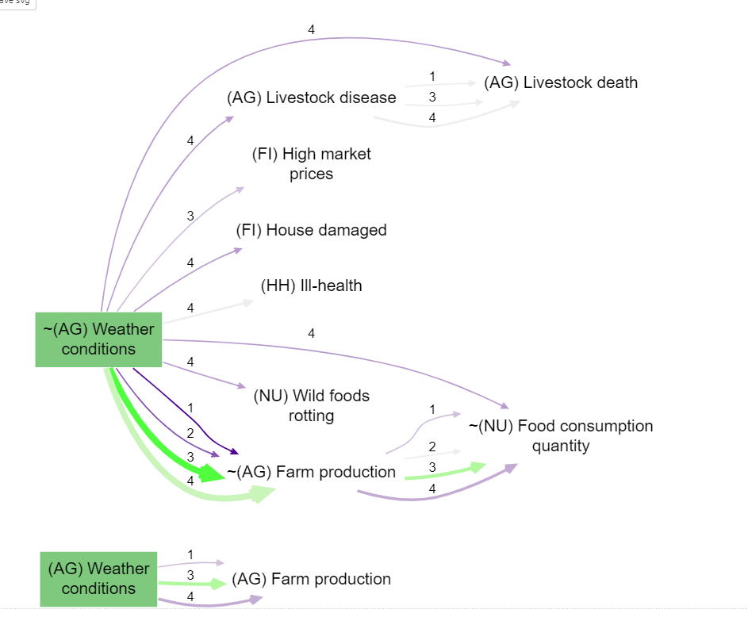

# 📚 Analysis: comparing maps between particular groups{#comparing}

## Filtering by respondent group

We code a causal map on the basis of text data. That text data can be usefully broken up into statements, usually of a length between a paragraph and a page. Each statement usually has "**additional data**" associated with it, for example the ID or gender of the respondent, the text of a question to which this statement is an answer, the page and name of the document from which this statement comes, etc. When we code a causal claim within a statement, we can associate the resulting link with the additional data. That means that for every link, we should know the additional data, e.g. the gender of the respondent, etc. 

We call the set of statements corresponding to a particular value of a particular additional data field a “**group**”. This definition of “group” is quite broad and does not have to refer only to respondents, e.g. the group for “question 3” is the subset of all the data relevant to that question. 

It is easy to filter a causal map by this additional data. This idea goes back at least to (Ford & Hegarty, 1984). For example, here is one map filtered to show all and only the links mentioned by with female respondents. We call these the **per-value maps**, e.g. the map consisting of all links mentioned by women. However, often the maps for different groups are quite similar as a large proportion of links are shared. When there are many links as in this example, the resulting filtered maps can be uninformative. 

 

There may still be a bewildering hairball of links. We can apply techniques like [hierarchical coding](https://causalmapdocumentation.blot.im/simplifying-causal-maps-with-hierarchical-coding) to “zoom out” of the map, or simply show only the most frequent factors. This map shows the top five factors for women: 

 

And this map shows only the top five factors for men (there were far fewer men in this project). 

This is disappointing. The maps are almost identical, though the frequencies are different. We might have a feeling that the men’s answers do indeed differ from the women’s, but how can we be sure? Does this pair of maps prove that there are no interesting differences? 

These are important problems:

- Which, if any, features of the map for one group are interestingly different from the map for another? 

- Are there in fact any relevantly different sub-groups within our data? When we have many additional data fields (gender, age, education level, parental occupation, size of village as well as question number, interviewer ID, etc), how can we focus on the most interesting differences? Is it *worth our time* looking at separate maps for different sub-groups like different villages or genders? 

## Showing *distinctive maps* for each group

One solution is to display only features which are distinctive for each group. This means the map for this group, which usually includes all links coded for statements from that group, now excludes any of those links if the factor at each end of the link is not **distinctive** for that group. The factor “increased income” is **distinctive** for men if it is mentioned significantly more often by men than by women taking into account the baseline, i.e. the total number of times men mentioned any factor at all. (For example, maybe there are more men than women, or they talk more, or both.) 

A slightly more technical discussion, which can be skipped:

*This means that for binary fields like (gender in this particular study), if there are links from factor F to factor G in the distinctive map for women, there cannot be any links between these factors for men. On the other hand, factor F may appear in both maps even though it is not distinctive for either group, but if it does so this is only because in each sub-map it is connected to a factor which is distinctive for that group.*

*More generally, we look at whether the proportion of mentions of a given factor from a given group compared to all the mentions (i.e. including those by the other values of the same additional data field, e.g. the other villages, the other gender) is significantly higher than the baseline, i.e. the overall proportion of mentions of all factors by this group compared to the other values. Is (Mentions of factor F by this group / Mentions of factor F by all groups) significantly higher than (Mentions of any factor by this group / Mentions of any factor by any group)?*

*Given a filtered set of statements, do the usual calculation to get what links would have been shown in the normal view, i.e. which links are coded in the current statements, i.e. create the variable shown vs not-shown for each link. Group all the links into co-terminal bundles (with the same from and to factor). Create the table which has IDs of bundles in the rows and two columns, the number of shown links and the number of not-shown links within each bundle. Run a chi squared test on this table and mark a bundle as "distinctive" if the standardised residual for the "shown" cell is greater than a given cut-off value.*

This idea takes a bit of getting used to. A distinctive map for a group filters out all links between pairs of factors which are both not distinctive for that group. That is the same thing as saying that it shows all the factors which are distinctive for that group, plus factors which are linked to those factors. 

Why don’t we just stop there, and simply display only the factors which are distinctive for a group? Why do we add factors which they are linked to, even if not distinctive? The trouble is that there might be a factor which was very distinctive for the group, but was not linked to any other factors which were distinctive, and would therefore disappear from the map (or we would have to display it floating on its own, which is not appropriate for a map of causal *connections*). In practice this step does not make much difference, and it is usually acceptable to think of a distinctive map as simply a map consisting of factors which are distinctive for that group. 

It is also possible, especially with smaller maps, that there are no links which are distinctive for a particular additional data field like gender. This suggests that there are no very interesting differences between the groups. It is also possible that there is a distinctive map for one group, e.g. women but not for men, or vice versa.

To continue the example, we can follow the algorithm and produce the distinctive maps for men and women. These maps even without any further filtering are interesting and readable in their own right, but as there are around 40 factors in each map, here we show the maps filtered further for only the most frequent factors. 

Distinctive map for women, showing the top seven factors.  

Distinctive map for men, showing the top seven factors, also filtering out a few links with just one mention: 

Here, some of the paths in the map for men, from VSL to Increased savings and thence to Increased assets, would be certainly worth following up, as well as the paths to and from “Increased purchasing power” in the map for women. 

As usual, we should treat the maps just as a gateway into the data, an invitation to read and understand the quotes in more detail and in context.

To repeat, the “distinctive map” for a group is *not* a good summary of everything that was said by that group. It is a good summary of what was said by that group more often than the other groups.

## 💻 Filtering statements and groups for comparisons in Causal Map 

When [filtering statements](#filtering-the-map-by-statement-source-question) it is easy, for example, to show the causal map just for specific **groups**, e.g. the female respondents, for which the additional data field “gender” is equal to “female”: you can cycle through the values using the arrow buttons, and you can flip through the statements for each group using the “previous” and “next” buttons in the statement pager. 

## Percentages{#percent}

It's very useful to bundle many links between every pair of factors into different bundles, one for each gender, say, or one for each village. Then you can compare how many times this particular connection was mentioned by each group (if you count link_id) or how many sources in each group mentioned the connection (if you count source_id). You can print this number as the label for each link, or you can scale or colour the link according to it.

However, if the base number of sources in each group is different -- for example, if there are many more women than men -- these numbers can be hard to deal with. In this situation, we recommend using percentages of the baseline for each group rather than absolute counts.

There are many [caveats](#caveat-numbers) to using counts and percentages of mentions of causal links and factors in causal mapping, as they arise (or don't arise) during conversations and are not answers to questions directly asked of respondents.

#### 💻 Percentages in the app

The details of how to do make these calculations are quite open; at the moment, the app uses the relevant baseline within the current map. So if you want to display "source count", or the number of sources who mentioned each link, and bundle the links by gender, the app takes as the baseline *the source count for each gender in the current map*. So if 7 women and 5 men mentioned a connection between X and Y, and altogether 14 women and 10 men mentioned anything in the whole map, then the percentage will be 50% on each

If you use percentages for labels, the label shows both the raw number and the percentage. 

If you use percentages for colour or width of the links, the percentage is used rather than the raw number. 

## Surprise{#xsurprise}

The most interesting filter uses a function which we call `surprise`. [Here](https://causalmap.shinyapps.io/CausalMap2?s=802) is an example.

 We have bundled the links by name of District (1, 2, 3 or 4) and scaled the links by source count (count of the number of sources mentioning each link): but we have coloured the links by `surprise`. The bright green from poor weather conditions to poor farm production means that this route was particularly often mentioned in district 3 *even taking into account the number of times people in district 3 mentioned anything (in the whole filtered map)*. And the bright purple link for district 1 means the opposite.  Whereas for district 4, there are quite a lot of mentions but the pale colour shows us that this is not particularly surprising. Basically, using `surprise` means you can ignore the pale links and just look at the brightly coloured ones.
