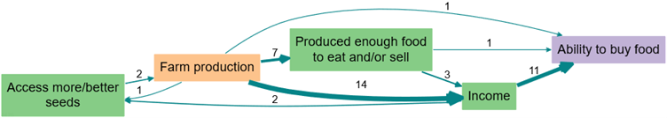
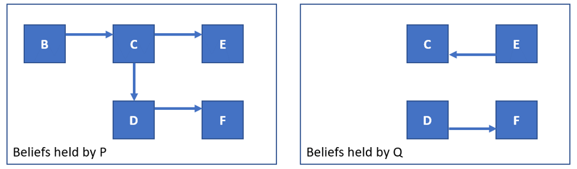
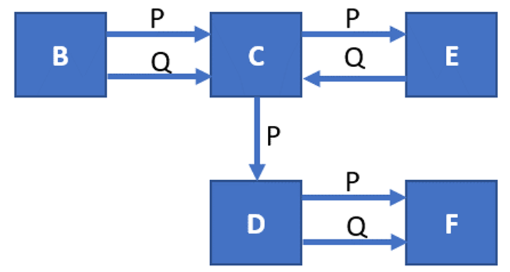
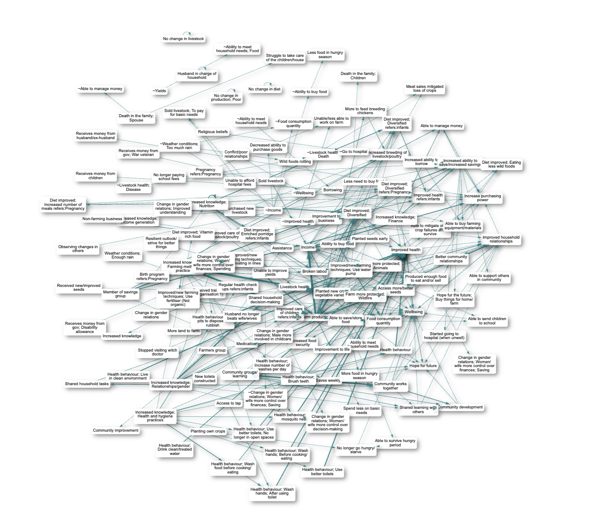

# 📚 What is a causal map?{#xcausal-maps}

{width=650}

A causal map consists of boxes (which we call "factors") joined by arrows (which we call "links").

A link from factor C to factor E means that someone (P) believes that C is some sense causally influences E. Every link represents one causal claim. 

- causal maps encode a belief about a *usually partial* causal *influence* of C on E, and only in special cases encode *total or exclusive* causation such that C entirely determines E or is *the* cause of E. 
- encoding a claim (like ‘the heavy rains were one reason the harvest was worse than usual’) in causal mapping does not require us to make any judgement about the quality of the evidence or the ability of the source to correctly judge that this link was causal (although we can add this information if we want).

{width=650}

*Two separate single-source causal maps: Beliefs held by sources P and Q about causal influences between various factors.*

{width=650}

*A combined, multi-source causal map about beliefs held by sources P and Q about causal influences between various factors*

When we have highlighted many causal claims we can present the entire, global causal map containing all the claims like this:

{width=650}

*A global causal map combined from many sources*

However this map is bewildering and not very useful. So to answer specific questions, we filter the map in certain ways to answer different questions, for example to simplify it, to trace specific causal paths, to identify significantly different sub-maps for different groups of sources, etc.
