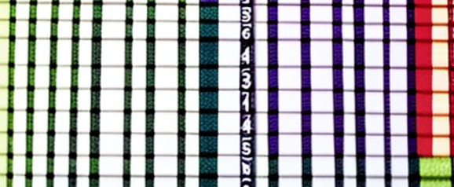
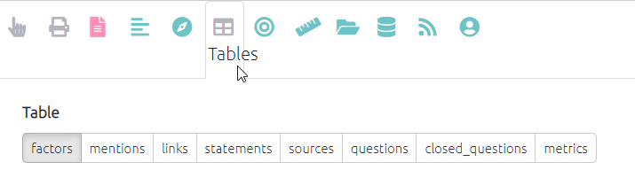
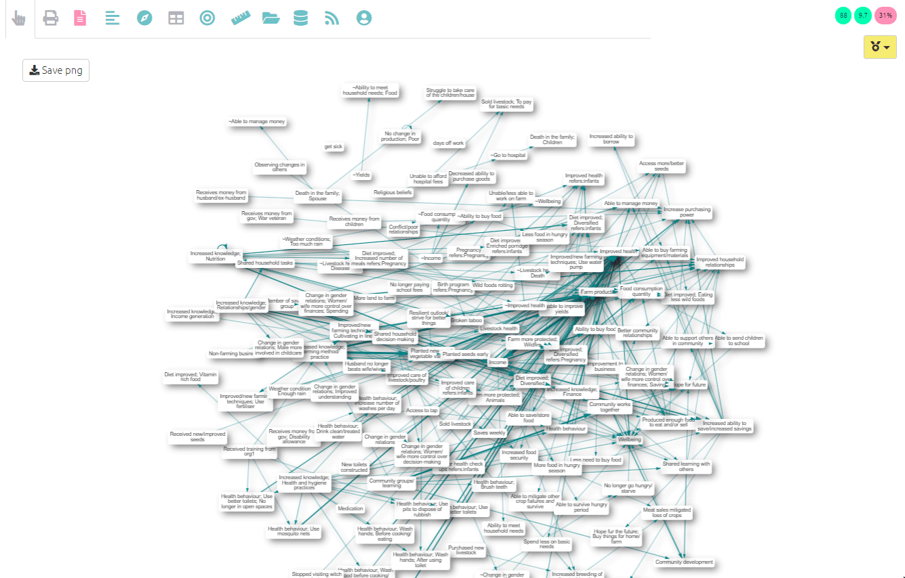

#  Tables{#xall-tables}

{width=650}

You will find all the tables under the table tab at the top of your screen.

{width=650}

As you can see there are lots of tables you can create, from a table simply showing the total links to and from each factor to a summary of each respondent's response to a closed question. The possibilities are large - and increase with the amount of additional data your project has.

## Presets{#preset-tables}

If you want to keep things simple click the presets button which you will find below the table tabs[^1].

[^1]: Any preset ending with`(basic)`is also the default filter that you will see when you first click onto that tab, making flicking between presets easy.

The preset button opens a list of views in the dashboard, these links will take you to the most commonly used tables. Once you have clicked on one of these views you will be taken to this table. There is a description of what table you are viewing displayed in the dashboard.

 {width=650}

----

Find out more about tables [here](#xtables-advanced).
