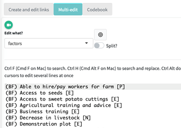
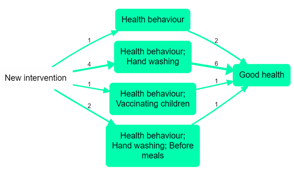

# Simplifying causal maps with hierarchical coding{#simplifying}

 

## Summary

You can use a separator like ; to create nested factor labels, like this:

<u>New intervention; midwife training ➜ Healthy behaviour; hand washing</u>

We can read this separator as “in particular” or “for example”:

<u>New intervention, in particular the midwife training</u>,

Or we can read it in reverse like this:

<u>The midwife training, which is an example of / part of the new intervention</u> 

Factor labels can be nested to any number of levels, e.g.

<u>New intervention; midwife training; hand washing instructions</u>

The higher level factors can, within the same coding scheme, themselves be used for coding, e.g. we could code “this whole new intervention has also led to happier health providers” like this:

<u>New intervention ➜ Happier health providers</u>

 

We can “zoom out” of a causal map containing nested factors to show a simpler, higher-level structure as a summary. This is done by re-routing links to and from the lower-level factors into their higher-level parents. So zooming out from the 

This then, loosely yet informatively and with certain caveats, accepting a loss of detail but affirming that the overall meaning is not distorted, we can deduce from the first example above the following causal map:

New intervention ➜ Healthy behaviour

Usually these higher-level factors will each be summaries of many lower-level factors.

## Introduction

An analyst coding text to create a causal map is confronted with the same challenge as any qualitative researcher: identifying recurring themes in such a way as to help a larger picture emerge, while retaining important detail. Expressing factor labels in a hierarchical fashion can help solve this problem. But hierarchical labelling also enables a particular strength of causal mapping: it lets us “zoom out” to view a whole causal map from a higher-level perspective, merging causally similar concepts to give a simpler map with far fewer components. Formally, the process of zooming out produces a map which logically *follows* *from*, is *implied by*, the original map. This chapter also introduces a smarter way to “zoom out” from a causal map, and explains how these features are implemented in the Causal Map app.

When conducting qualitative coding of any text, there is always a tension between wanting to keep the detail (e.g. hand washing) but also to code in such a way that general themes emerge (e.g. health behaviour). One way to do this is to organise the codes into a hierarchical structure, so that “Hand washing” is nested as part of “Health behaviour”. This can be done (see e.g. Dedoose, saturateapp.com) by using labels in which the hierarchy is directly expressed, for example “Hand washing; health behaviour” – using semi-colons or some other convenient character to separate the levels of the hierarchy. 

This approach is convenient for several reasons:

- A search for “Health behaviour” will find <u>Health behaviour; Hand washing</u> as well as <u>Health behaviour; vaccinating children</u> and other combinations.

- It can be arbitrarily extended to any number of levels, e.g. <u>Health behaviour; Hand washing; Before meals</u>

- Related items appear next to each other when they are listed alphabetically 

- The hierarchical structure does not require that the analyst (whether using paper-and-pencil or software) maintains a separate set of “parent” codes; the higher-level codes are simply whatever is visible before the semi-colons. Higher-level codes can be created and changed on the fly without having to open a separate codebook or software interface. 

- It is possible to code directly at higher levels, for example using the code <u>Health behaviour</u> where no more details are given. 

When reading a nested factor label aloud, the semi-colons could be substituted with “… and in particular ….”, e.g. “Health behaviour, and in particular Hand washing, and in particular Before meals”. 

The way factor (labels) emerge during causal mapping is just a special case of the way codes emerge in any qualitative coding process, and nested coding is useful in ordinary qualitative data analysis as well as in causal mapping. However, hierarchical coding in causal mapping is particularly exciting because it allows us to do things like simplify a causal map to give a higher-level version of it with far fewer components. 

## Interpretation of the ; separator


A causal map coded using a hierarchical separator can be "zoomed out" given a specific interpretation of the **;** separator, as follows.

If we know 

New intervention; midwife training ➜ Healthy behaviour; hand washing

then, loosely yet informatively and with certain caveats, accepting a loss of detail but affirming that the overall meaning is not distorted, we can deduce:

New intervention ➜ Healthy behaviour; hand washing

and

New intervention; midwife training ➜ Healthy behaviour

and even

New intervention ➜ Healthy behaviour

This actually reflects the dilemma of the analyst: with how much detail should I code the beginning (or the end) of this causal story? Expressing a factor as <u>Health behaviour; Hand washing; Before meals</u> shows that this is indeed to be understood as a kind of health behaviour, although of course not the whole of it. By using this approach, the analyst says: if you are just looking for the global picture, I am happy for this factor to be understood as <u>Health behaviour</u>. 

When factors are nested like this within one another as part of a hierarchy, it is possible to give an overview and ‘zoom out’ of the detailed data. This helps to simplify some of the analysis, enabling the user to focus on the links between the top-level groups rather than all the details. It follows that two factors like “Y; X” and “Y; Z” are *causally similar enough to one another to merge into Y* at a more general level. 

Expressing a factor in a form like "Y; X" **means** it can be replaced as needed with just “Y”, accepting a loss of detail but affirming that the overall meaning is not essentially distorted. If you wouldn’t be happy to accept this replacement, don’t use the “;” to code this factor.

## Semi-quantitative formulations work best


We already saw that causal mapping usually works best when the factors are semi-quantitative. The hierarchical approach also works best when the higher-level factors are themselves labelled such that also they are *semi-quantitative*, *causal* factors which could be used on their own – in a way which themes or categories [see here](#formulating-labels-semi-quantitative-factors) could not. Good examples would be:

- <u>Social problems</u>

- <u>Social problems; Unemployment</u>

- <u>Social problems; Addiction</u>

- <u>Psychosocial stressors</u>

- <u>Psychosocial stressors; Fear of job losses</u>

- <u>Psychosocial stressors; Pre-existing mental health issues</u>

Here, “Social problems” and “Psychosocial stressors” are causal factors in their own right; they are not just themes or boxes to put factors into. 

So we might have:

“The problem of unemployment is a psychosocial stress for many”

Social problems; Unemployment ➜ Psychosocial stressors

 

“When people get stressed they often turn to drugs“

Psychosocial stressors ➜ Social problems; Addiction

 

These could be combined into this story:

Social problems; Unemployment ➜ Psychosocial stressors ➜ Social problems; Addiction

 

If we zoom out of the above story, we could focus in on the higher-level factors and in this case we would get a vicious cycle:

Social problems ➜ Psychosocial stressors ➜ Social problems

## Higher-level factors are *generalisations* 


Usually, we don’t use higher levels merely to organise factors into themes which are not causally relevant. 

<u>Health; vaccinations law is passed</u>

<u>Health; mortality rate</u>

These two items can be grouped into a *theme* “health” but can hardly be understood as special cases of a more general causal factor, so it would be a mistake to use the semi-colon. Instead, it would be more suitable to include the word “Health” just as a **flag**, without the semi-colon. 

In other words, **causal factors in hierarchies should usually be semi-quantitative**.

In spite of what we just said [above](#higher-level-factors-are-generalisations), sometimes you *can* use higher-level factors just to group a mixed bag, like this:

<u>Politics; increase in populism</u>

<u>Politics; shift to the left</u>

<u>Politics; shift to the right</u>

<u>Politics; more engagement from younger voters.</u>

The higher-level factor <u>Politics</u> is not in any sense a generalisation of these very disparate factors. However, we can at least think of it as a ‘mixed bag’. If we roll the map containing these stories up to level 1, we’ll see this ‘mixed bag’ factor Politics as a cause and effect of other factors. It will be a bit hard to interpret, but we can live with it as long as we remember that it is a mixed bag rather than a semi-quantitative summary. 


**All the factors within one hierarchy should be desirable, or undesirable, but not both.**


Generally speaking, make sure that the **sentiment of a more detailed factor is interpretable in the same way as the factor higher up in the hierarchy**. Ideally *all* the detailed factors within a hierarchy should be broadly *desirable,* or all *undesirable*, but not both. For example, you don’t want to nest something undesirable into something desirable. E.g. you don’t want to formulate a factor like this: 

<u>Stakeholder capacity; Teachers; Lack of skills</u>. 

Because capacity would normally be understood as something desirable, and lack of skills would not. Try to reformulate as: 

<u>Stakeholder capacity; Teachers; Presence of skills</u>.

One limitation to this way of expressing the hierarchy as part of the factor label is that you can’t make one factor belong to two different higher-level concepts. For example, you could understand a particular midwife training both as causally part of a new intervention but also perhaps as causally part of an institution’s in-service training programme or an individual’s workload, but you can’t code it as both “New intervention; midwife training” and “In-service training; midwife training” at the same time.  

This limitation is because of the meaning of the semicolon: the ; in "Y; X" means that this label can be replaced as needed with just “Y” , accepting a loss of detail but affirming that the overall causal story is not essentially distorted. If a hierarchical label had more than one parent, we wouldn’t know which parent to "roll up" the factor into.

## Hierarchical coding as a way of coping with a large number of factors


Usually analysts are faced with the quandary of either having too many which they lose track of, or merging them into a smaller number of factors and losing information. With nesting, you can have your cake and eat it; it is similar to the process of recoding an unwieldy number of factors into a smaller number of less granular items, but with the advantage that the process is reversible; the information can be viewed from the new higher level but also viewed from the original, more granular level. For example, we can count that the higher-level factor component “Health behaviour” was mentioned ten times, while retaining the information about the individual mentions of its more granular components.

## Themes


When the analyst wants to group certain factors into a theme (like “health”) which is not itself a causal factor, hierarchical nesting should not be used. Instead, text flags like “#Environment” or “[Environment]” or just “Environment” can be used to create themes simply by adding the text flag to the factor label, e.g. 

<u>Soil loss (Environment)</u>

<u>Eco training courses for NGOs (Environment)</u>

or even a symbol:

<u>Soil loss 🌍</u>

<u>Eco training courses for NGOs 🌍</u>

We can still search and filter with text tags, even with icons, as long as they are unique. This practice has nothing to do with nesting or causal hierarchies, although it can be used in parallel with them.

## Re-usable factor components as text flags


Sometimes your factors relate to each other in ways which are not just hierarchical. For example:

- <u>Activities completed; Training; Health</u>

- <u>Activities completed; Distribution; Health; First-aid kits</u>

- <u>Outcomes achieved; Health; First-aid skills</u>

These are three (hierarchical) factors in which “health” appears in different places. In this example, "Health" appears only as a "component" of other factors. Although on its own it might look like a mere theme rather than a causal factor, it plays a role in differentiating the causal factors in which it participates, e.g. “Activities completed, in particular training, in particular on health”; and because "Health" is used across hierarchies, it functions as a text flag [see here](#using-flags-in-factor-labels) and can be used as part of searches, lists and counts of factors, etc.

Isn’t that a contradiction? Didn’t we just say that “Health” is not to be used on its own as a factor because it is just a theme and is not expressed in a semi-quantitative way? No, because here the word “Health” does not function as only a theme but as a way of differentiating causal factors: all the actual factor labels in which it participates are correctly expressed in a semi-quantitative way. So Activities completed; Training; Health is intended as a causal factor about the extent of completion of activities, in particular training activities, and in particular health training activities.

## 💻 Hierarchical factors in Causal Map

### 💻 Creating labels

Factors can optionally be expressed as part of a hierarchy by using semi-colons. If you want to use a different separator like “>” or “/”, you can change that in the settings.

For readability, it is usual to leave a space after the semi-colon, but this makes no difference to the functionality.

### 💻 Relabelling

In Causal Map, the process of renaming the factors into this kind of hierarchical structure can be conveniently carried out in the “Multi-edit” tab which is a simple text editor where you can edit anything you have created during coding. If you select factors, as in the image below, it will list the currently visible factor labels, sorted alphabetically.

  

Here it is easy to “move” an (incorrectly labelled) factor 

<u>Health behaviour; understanding of germ theory</u>

to something like

<u>Health knowledge; understanding of germ theory</u>

or

<u>Real-world knowledge; health; understanding of germ theory</u>

simply by retyping it, without worrying about whether the corresponding higher-level path (“<u>Real-world knowledge; health</u>”) exists already.

This editor has many features such as global search and replace, and multiple cursors, which make it easy to rapidly edit many factor labels.

Using this panel you can also combine several factors into one and split one factor into several.

### 💻 Additional functionality in the Create & Edit Links panel

Once you have created at least one hierarchical factor, i.e. one with a “;” in its label, the *influence factor* box and *consequence factor* box have some additional functionality to help you. Now, when you start to type, the list of existing factors which you can choose from is extended to include existing factor components, even if they have not (yet) been coded as such. This means:

It gets easier to add new detail to existing or implied higher-level factors.

- Suppose you want to create a new factor “Health behaviour; wearing a mask” and you know there is an existing higher-level factor “Health behaviour”, you can select “Health behaviour” from the list and then just add “; wearing a mask” with a leading semi-colon. These two fragments will be combined into a new factor label. This is quicker and ensures you don’t end up with different spellings of the higher-level factors. 

- It gets easier to re-use existing components at the *end* of your factor labels. For example, you might want to use a factor “Training courses completed; Health” and you already have the factor components “Training courses” and “Health” but not that exact label. You can simply select the component “Training courses completed” followed immediately by the component “; Health” and the two will be combined into a new factor label.

### 💻 Search with nested factors

The same principle applies in the Search and Filter Factors box: you can see factors you have already used but also implied higher-level factors (like “Health behaviour”) and other factor components, beginning with a semi-colon. 

 

 

## Zooming out


  

 

Assuming we have a causal map which has used nested coding, as in the small map shown above, how do we take advantage of this coding to “zoom out”? 


 

If we define the "level" of a factor as the number of semicolons in its label plus 1, here is the same map, zoomed out to level 2 (i.e. a maximum of one semi-colon per factor). 

 

 

Here is the same map, zoomed out to level 1 (i.e. there are no semi-colons at all).

 

**A warning**: for convenience, in both of these diagrams, the set of links between each pair of factors are displayed as one, with a number to tell us how many links there actually are. But most generally, we must not assume that links can in fact be combined in this way without caveats; it could be, for example, that some of them express increasing, and some decreasing, influences. 

Another, related, warning: causal mapping as described here is a *qualitative* process. While zooming in and out can be very useful, it should never be used mechanically. For example, if we had the information “my daughter went to the new training course and now she is quite obsessed about washing her hands, she just won’t stop”, we might code this as “Health behaviour; hand washing; obsessive” but we would certainly pause before zooming out without further thought. Perhaps this new behaviour belongs somewhere quite different. To a qualitative researcher, narrative is not additional colour, but raw data. 

## Smart simplification


A weakness of the above approach is already visible in the example, so simplification goes one step further. In many cases we may be happy to see all the factors “rolled up” to the top level but in the above example, “Health behaviour; hand washing” dominates. “Health behaviour” itself is only mentioned once in the raw data, and there is only one other mention of it as a higher-level component, in relation to vaccinations. What can we do about this? 

Another way to simplify a causal map is just to hide factors and/or links which are mentioned less frequently. Often it is hard to view a full causal map, especially because of the presence of very many of what we could call “tiddlers”: factors with just one or two mentions. But this is unsatisfactory because it throws away information. This won’t help us, but can we combine the two approaches?

A smarter approach is achievable with this simple algorithm: step by step, “roll up” the least frequent factor by one level, and stop when the desired level of generality has been reached, i.e. when the number of remaining factors is satisfactorily small. 

This is an improvement over zooming because it retains detail where it is necessary and removes it where it is not. It will roll up lots of infrequent, granular factors into their parents but only if they are infrequent; if you have a very granular factor like "health behaviour; hand washing" which actually has a lot of mentions, then it won't get rolled up. It will also completely remove infrequent top-level “tiddlers” which cannot be rolled up into anything else. It is also welcome because the process can be stopped at any desired stage to get just the right level of detail.

The above example can be rolled up to this:

 

This is an improvement because it still has a small number of factors, retaining frequently-mentioned factors but wrapping up infrequently-mentioned detail into higher-level concepts. 

Not all causal information is always retained: Infrequent factors which are either already top-level, with no nesting, or which already “contain” a few rolled-up factors but are still infrequent, cannot be simplified further and will be hidden from the map. 

 


## 💻 Simplifying (zooming out, and filtering out less frequent links and factors) in the app

```{r,echo=F}
show_mark("Interface/show-zoom-combo.md")
```

**Why would I use this filter?**
An unfiltered causal map can be quite overwhelming to begin with as it is presenting all the causal links which have been coded, so this filter can be a good place to start. By filtering out links/factors which have only been mentioned once or twice, the map becomes more manageable, easier to make sense of, and displays only the most frequent stories of change/causal pathways. 
