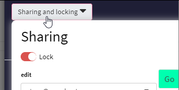
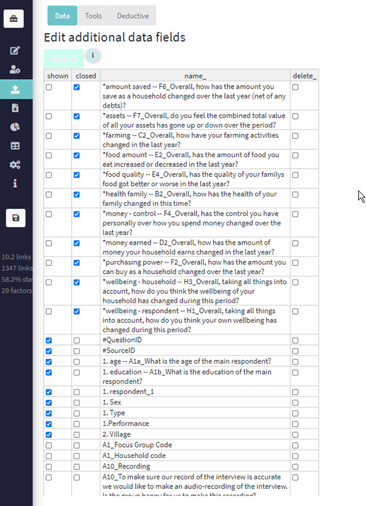
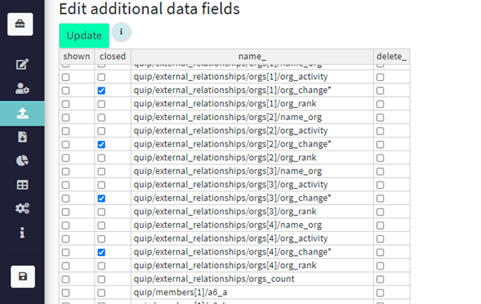

# 💻 The rest of the Causal Map app, tab by tab{.hi #restoftheapp}

The main “Code & View” tab has been described earlier. You will spend nearly all of your time in this tab. In this section we will look at the other tabs and what they do.

## The *Download* tab: Exporting your files

### Exporting

You can always export all your data in different formats at any time using the buttons in the File tab.

## The *File* button

Press the File button at the top right of the app to switch to a different file, restore from a backup, and share and lock your file.

This is what you see when you click the File button:

### Choosing a file

The menu shows you all the files you can edit or view. 

### Merging another file into the current one

If you want to merge another file into the current one, just select the other file from the menu and press `Merge`. 

### Backups

Every time you open a project, an auto backup is made. 

Every time you choose to press “Save”, a different kind of backup is made, called a user backup. 

If you click on "backups" in the File tab then choose a backup, you switch from your current project to the backup you selected. In detail: the current project is saved in the backups folder as "project name_replaced_backup current date and time" and the backup you clicked on becomes the current one with the existing project name. The old backup remains. 

The system saves up to 20 auto backups (usually ones make when you load up at the start), 20 user-created backups when you deliberately press the save_project button, and ten of these "replaced" backups: up to 60 backups altogether.

In summary:

- the app saves your work as you go along. If you just close your browser, you should always find your last coding or edits are restored when you revisit your project later.

- Also, the app makes an auto backup of your file every time you log on. 

- If you are making some changes which you are bit nervous about, or want to record a snapshot, press the save button in the sidebar at any time you want to make a "user backup". 

- The app stores the last 20 user backups and the last 20 auto backups, and you can restore any of them at any time using the File button at the top right of the app. 

### Sharing and locking{#sharing}

Here you can share your file with others.

There is only one editor for each file. So if you want someone else (who also has a Causal Map account) to edit your file, you can use the first control in this box to make them editor. Also, only the editor can change the sharing settings. 

You can add any number of other Causal Map accounts into the "copy" and/or "view" boxes. 

- "Copy" permission means that the other user can make their own copy of this file, which they can then edit.

- "View" permission means that the other user can make only view the file.

You can also use this switch to lock the file. This means that no-one can change it, not even you, until it is unlocked again.

It is also possible to create larger groups of users. Ask us for help with this: hello@causalmap.app. 

## The Upload and Fix tab: uploading and tweaking your data

The documentation is work in progress. 

### Uploading statements and additional data as one file

The only data you need to provide is a table of statements as a .csv file. Your .csv files must have a header row with the names of the fields. 

The statements are the texts which appear one by one by one in the Code & View tab, for you to read and code. Each statement is one row in your .csv file. 

If you want to import interviews which are several pages each, you should break each interview into several statements. Ideally a statement consists of between one and five paragraphs – enough to fit on the left-hand side of the Code & View tab when it is displayed there. Usually your text breaks up naturally into sections, for example the interviews might be responses to a number of questions, so your statements might consist of one or a few paragraphs for each question. 

We strongly recommend that you don’t try to import statements which are longer than 2500 characters or 500 words. It is harder to code very long statements. 

Your statements file must have at least one column with the text of the statements and the header for this column must be “text”. Other columns will be treated as additional data. 

The only required field in your data table is the text of each statement, like this. 

| **text**        |
| --------------- |
| Lorem ipsum ... |
| Ipsum lorem …   |
| Lorem sunt …    |
| Asdf …          |
| …               |

 

However you nearly always have additional information, first and foremost about the source, for example about the respondent who provided the information, or about the context of the information, e.g. if this statement was a response to a question, what is the question number, or the text of the question, or the name of the interviewer. You can think of additional data as just any additional fields in the statements table. If you provide all of these fields when you import your data, that’s fine, there is nothing more to do. For example, you can import the table below instead of the table above. At the moment the app understands only text fields and numerical fields. It will treat dates and currency as ordinary numbers. 

| **text**    | **respondent** | **Village** | **Region** | **Population** |
| ----------- | -------------- | ----------- | ---------- | -------------- |
| Lorem ipsum | 1              | Bigville    | North      | 1000           |
| Ipsum lorem | 1              | Bigville    | North      | 1000           |
| Lorem sunt  | 1              | Bigville    | North      | 1000           |
| asdf        | 2              | Smallville  | North      | 500            |
| …           | …              | …           |            |                |

 

Probably, each respondent belongs to one “village”, each village to one region and each village has one population figure. But the app does not need to know that. 

In each case, the app also adds a “statement ID” field, numbering the statements 1, 2, 3 etc. to help keep track of them. 

#### Preparing and uploading your .csv file

You provide this table, and any other tables you might need,[see below](#viewing-and-manually-editing-your-data), as .csv files. You can save any spreadsheet as a .csv file from Microsoft Excel and other spreadsheet programmes https://www.google.com/search?q=create+a+csv+file.

If your statements have non-Latin characters like à, è, ù, б, ж, etc, the app should reproduce these perfectly, although there may be problems with Print view. In order to work with data with non-Latin characters, you need to make sure your .csv file is encoded in Unicode (UTF-8): the free spreadsheet programs Open Office and Libre Office can do this fine, Excel sometimes struggles.

Once you have prepared your data like this, go to the "Upload & Fix" tab, and then click the green ("Upload") button on the right. You should also unclick "Append" first, unless you are adding statements to an existing file. (Only click “QuIP style” if you are importing QuIP-style data, [see information here](#quip-specific-importing-from-a-quip-spreadsheet).) Navigate to the place where you stored your file in the usual way. 

You should get a message at bottom of screen reporting success.

TIP: We have had reports of occasional errors uploading files which are on remote storage. If you have this problem, try copying the file to your desktop and uploading from there. 

### What are the #SourceID and #QuestionID fields?

If you want the app to recognise one of these additional data fields as source/respondent ID, make sure the header is exactly like this: #SourceID. 

If you want the app to recognise one of these additional data fields as question ID, make sure the header is exactly like this: #QuestionID.

\#SourceID and #QuestionID are used in some features of the app like the tables.

You can also edit the field names later using the Data Fields Editor.

### Viewing and manually editing your data

 

 

The Edit Data table on the right shows you all the statement texts and additional data. 

If you click on “Sources” you will see a subset of this data, just the data for each source or respondent.

If you click on “Questions” you will see a subset of this data, just the data for each question or section.

Remember to press Update when you have finished manually editing data.

#### Direct edits

You can make small changes manually to this table of data by directly typing and/or pasting corrections in the Edit Data table. Double-click to edit a single cell. 

You can paste a selection containing several cells, e.g. from a spreadsheet, if you want, but do check the pasting has succeeded in the way you expected before clicking Update. 

#### Sorting

You can sort the table by clicking on the field headers.

#### Rearranging columns

You can rearrange the columns by dragging the field headers around. These changes are not permanent, but rearranging the columns can be very useful for creating custom tables for reports.

#### Renaming fields

In most browsers, you can also edit the field names by double-clicking on the headers.

#### Deleting rows

You can delete rows by right-clicking on the row or rows and selecting “remove row”. If you delete rows in the Sources or Questions tables, the data will be removed but the source or question ID will remain. It is not possible to add rows (even though this option appears to e available). 

Remember to press Update when you have finished manually editing data.

### Uploading/appending more statements

You can add additional statements to your existing statements by repeating the process above but being sure to click “Append”. If your data includes additional data fields, they will be matched with existing fields if they exist already and otherwise new fields will be imported; NA or “missing data” will be shown for these fields for the *existing* respondents. 

You can also upload additional statements for existing respondents – they might be for example answers to additional questions, or additional answers to existing questions. As long as you click “append”, it is not possible to “overwrite” existing data in this way; all data is treated as new.

### Uploading Source/Respondent and Question data separately

Often it isn’t convenient to provide this whole table yourself. Often you think in terms of smaller sub-tables. For example you might have one table just with the statements and the respondents (say, there are 20 statements per respondent and 10 respondents, so a total of 200 statements), and another table with 20 rows giving information about each respondent, say with just the field “Village” or maybe with more fields. The app can help you combine this data with the statements. Here is an example.

 

Suppose you already uploaded just this table

| **text**    | **#SourceID** |
| ----------- | ------------- |
| Lorem ipsum | 1             |
| Ipsum lorem | 1             |
| Lorem sunt  | 1             |
| asdf        | 2             |
| …           | …             |

 

The app already added an additional statement_id field for you.

| **statement_id** | **text**    | **#SourceID** |
| ---------------- | ----------- | ------------- |
| 1                | Lorem ipsum | 1             |
| 2                | Ipsum lorem | 1             |
| 3                | Lorem sunt  | 1             |
| 4                | asdf        | 2             |
| …                | …           | …             |

(Or, suppose you already imported QuIP data as described elsewhere.) 

Suppose you now have additional information about the **sources**, like this.

| **#SourceID** | **Village** |
| ------------- | ----------- |
| **1**         | Bigville    |
| **2**         | Smallville  |
| **3**         | Bigville    |
| **…**         | …           |

Then you can upload this table as a csv file. The first field is called the key field and its name corresponds exactly to the name of one of the existing fields, in this case, #SourceID. All of the values in that field have to correspond to existing values of the key field. The name of the first column has to be exactly “#SourceID” (or “#QuestionID” if you are in the Questions table, uploading questions).

Upload this data by clicking “Sources” in the data editor on the right (where you will see any existing data for your sources) and then selecting your csv file.

If you are uploading additional data about *Sources* remember to click the Sources button first. If you are uploading additional data about *Questions* remember to click the Questions button first.
 

The app merges the information like this:

| **statement_id** | **Text**    | **#SourceID** | **Village** |
| ---------------- | ----------- | ------------- | ----------- |
| 1                | Lorem ipsum | 1             | Bigville    |
| 2                | Ipsum lorem | 1             | Bigville    |
| 3                | Lorem sunt  | 1             | Bigville    |
| 4                | Asdf        | 2             | Smallville  |
| …                | …           | …             | …           |

 

The procedure is exactly analogous for uploading additional information about your questions, for example question text, or questionnaire section.

You can upload new additional data at any time. Plus, if you want to *change* existing source or question data, you just upload the appropriate new table which overwrites the previous data, e.g. if you find that some of your sources data is incorrect, you can either edit it manually in the table or you can upload a new version of the incorrect table and the old values will be overwritten and any new values, including values in new fields, will be added.

### Downloading Source/Respondent and Question data separately

From the same panels, you can download the data as a csv file. If you want, you can then make larger edits in the csv file and upload the file again as described above. Remember that if you downloaded a table from the Sources table, you must upload it in the same place (click the “Sources” button first); the same goes for the Questions table.

### Additional data: using the fields editor

 

### Additional data: Field names

#### Symbols

In the statement_info panel, and the reports tab, only important additional data fields are shown, in alphabetical order.

In the reports tab, closed questions are visible using blocks as underlying data.

(for compatibility reasons, you can use a number – any number from 0-9 – instead of a #, it will work the same, as long as you use it right at the front, as the very first character. But this is not recommended, and it can’t also be treated as a statement, and you can’t use the other characters.)

If by accident you have multiple versions of the same additional data for the same respondent, the latest version is used, i.e. the one further down your csv file. 

If by accident you have multiple versions of question text for the same question, the latest version is used, i.e. the one further down your csv file.

You can have several statements with the same respondent and question ids, in order to be able to break up a long answer to a single question which is spread out over several statements.

#### Short forms

Sometimes additional data fields may be quite long, for example where it is the text of a question which was asked to prompt the statement. In these cases we may like to see the longer name in some contexts like the info panel, but they are too long in other contexts like the reports tables.

There are three conventions:

1)   If an additional data field name is of this form: 

*Assets -- What is the total value of your assets in dollars?*

then only the part before the *--* is shown in the report (“*Assets*” in this case).

2)   Any text within [square brackets] is not shown in reports.

3)   Only field names which include a number or # will appear in various places in the app as described below.

 

### Fixing data: the tools panel

 

There are various tools for cleaning and fixing your imported data.

 

 

 

### Adding new statements one-by-one manually using the "new statement" button

Note that this way, you don’t enter your additional data straight away. It is more efficient to add it using the Upload and Fix tab. You can do this any time, and all-at-once or in stages.

### Importing from Word or other text files.

#### The easiest way

Each paragraph in your Word document will become one statement, so make sure your Word document is already structured so this will work for you. Delete any double paragraph breaks in Word (i.e. delete any empty paragraphs). If you want some short paragraphs to appear together as one longer statement, delete the paragraph breaks between them. 

Then 

- Copy all the text from your document 

- Create a fresh spreadsheet file in Excel (or LibreOffice Calc or similar) and select cell A2

- Paste your text.

- Type the word "text" as column header in cell A1. 

- Check the statements are the way you want them. You can ignore any formatting, pictures etc which might also have been pasted in because these will disappear in the next step.

- Save your Excel sheet as a .csv file, [see above](#preparing-and-uploading-your-.csv-file).

If you want to include any additional data fields, add them manually as additional columns to the right of your column of text.

Now you can import this csv file into the app as described above.

### Importing from other software

We are aware of the initiative to make qualitative coding software interoperable, https://www.qdasoftware.org/products-project-exchange/. Causal Map has quite a different model and at the moment we don’t provide this, but would do if there is a lot of interest. 

You can always export all your data at any time using the buttons in the File tab.

#### Exporting for import into kumu.io

tbc

#### Exporting for import into NodeXL

tbc

#### Importing existing causal coding

You might already have causal information, for example in the form of node and edge lists, which you want to import. This is not currently possible using the UI: please get in touch.

### QuIP-specific: Importing from a QuIP spreadsheet

This section is specifically about importing from a QuIP-style spreadsheet. This format has many rows, one for each answer, and includes the statements as one kind of answer; you can import statements and additional data from the same fieldwork file. The main differences to a normal import are:

- Rows whose question code does not include a "$" will be imported only as additional data, not as statements.
- A new question ID will be constructed from the question code together with the question text.

First save the main data sheet as a .csv, then press button X to import it. What if you have FGD data too?

Here you can upload all your statements at the start of a file. 

Your csv file must have column headers: 

- `text`, containing the answers
- `#SourceID`, containing the respondent ID 
- `#QuestionID`, containing the respondent ID, 
- `Question`, containing the question text 

Your Question IDs may include the following characters:

A dollar `$` to be treated as a statement

A star `*` to be treated as a closed question.

A hash `#` to be treated as important additional data.

Otherwise your question will be treated as unimportant additional data.

You can mix these, so e.g.

$*# Do you have a house

Will be treated as a statement and as closed question (part of a block) and as important additional data.

#### QuIP-specific: Ranked organisations

This feature is usually used with a QuIP-style import in exactly the format used by BSDR. It may be easier for you to analyse it separately. If you really want to do it in the app, then in order for data to be treated as ranked organisations data,

- The question *text* must end in “ rank” 
- Before importing your statements, make sure the relevant question IDs include a "#".

### Closed questions

Closed question data, common in QuIP studies, are additional data fields which contain closed responses like these:

- better
- get better
- improved

- a bad change
- worse
- no change
- stayed the same

etc. This kind of data is automatically recoded into +, - and 0, and displayed in the Tables panel if you select “closed questions”. 

  

### Importing closed question data, and ranked organisation data, without using QuIP-style import

You can still import closed question data, and ranked organisation data, even if did not use QuIP-style import to upload your original statements. 

Please note that when importing this kind of additional data **with a QuIP-style import**, these answers can *also* be made available as statements for coding if desired. This can be useful particularly if some of the subsequent statements include additional responses to these kinds of questions, so that you can see the original answers to these questions in context. 

In contrast, if you import this kind (or any other kind) of additional data as a normal, non-QuIP-style import, it will **not** also be available as statements for coding. 

To complete this kind of non-QuIP import of closed question and/or ranked organisation data:

1) Import just your statements as usual
2) Then, if you have data on closed questions, import it as an additional .csv file to the "Sources" part of the additional data table, one row per respondent. The first column must be labelled exactly "#SourceID" and contain exactly the same IDs as in the rest of your data. The column headers will be the IDs of the closed questions. These IDs must include a "*" to mark them as a closed questions - you can also add or remove this later. The data in the cells will be text answers like "better", "worse" etc.
3) Then, if you have data on ranked organisations, import it as an additional .csv file to the "Sources" part of the additional data table, one row per respondent. The first column must be labelled exactly "#SourceID" and contain exactly the same IDs as in the rest of your data. The column headers will be the IDs of the ranked organisation questions, which must end in the word "rank". The data in the cells must be of the form `Organisation X - 2` etc, to say that Organisation X received the rank of 2 in this case.

### Appending data

You can continue to upload more data in the same way, remembering to click the “append” checkbox. However, you should only upload datasets containing complete data for one or more individual respondents: don’t upload a partial questionnaire for an individual respondent, or you may get unpredictable results. 

On the other hand, it is fine if the questions are slightly or even completely different for each respondent, e.g. you can finish with individual interviews and then start uploading focus group data, for which some questions are the same and some are different. And it’s OK to have a few respondents who have additional questions just for them.

Don’t use the same question id for different question texts. So for example if you have $A1 for individual interviews “how old are you”, if you want to use a different text (e.g. “what is your average age”) for focus groups, use a different question ID e.g. $A1h (if you used $A1, then “what is your average age” would become the question text for the individuals too). 

 

### Closed questions

You can use the second column in this table to mark a selection of additional data fields as “closed”. [See above](#closed-questions).

 

