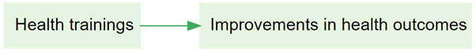

# "Barebones" causal mapping 

In the first part of this Guide we have dealt only with undifferentiated links which simply say "C causally influences/influenced E" or more precisely "Source S claims/believes that C causally influences/influenced E". We call this "barebones style" causal mapping. There is nothing more to this kind of causal map than links between factors. No other features are used. 

Barebones-style mapping can be interpreted in two different ways:

- As in QuIP, to show causal influences between past events. It is an open question to what extent these causal claims can be generalised. It is possible to parse a link from C to E as saying not only that C is something which has the causal power to influence E but also that in some sense C happened and did in fact influence E, i.e. made a difference to it. 

- To show only causal influences between factors, without recording what did or does happen.  

In Part 1 of this Guide we did in fact also introduce an additional convention, hierarchical coding, in which the ";" separator is used to encode the idea that C; D can be read "D, an example of C" and that at a suitable level of abstraction we can approximate C; D as C.

## Combining opposites

This section presents a simple and powerful way of dealing with "negative" factors such as `poor health` which are in some sense the opposite of existing "positive" factors such as `good health`. 

In some kinds of causal mapping and systems diagramming, more sophisticated approaches are used in which the factors are considered to be variables and the links between them can have positive or negative strength. The approach we present here is a simpler alternative.

Here is an example of quite barefoot QuIP-style coding in which we have not used strength at all. Nevertheless there are the beginnings of some ideas about (and issues with) polarity: for example, we have `fit`and `not fit`. 

We've all done this kind of coding, with classic examples being coding for both employment and unemployment or for both health and illness. This could for example be two different stories about two different people; or it could be different aspects of or periods within one person’s life.

This barefoot style on its own is unsatisfactory. We haven't told the app that being fit is represented with a somehow positive and somehow negative factor. So can't join them up. We can’t compare the way that being fit leads to happiness and on the other hand not being fit leads to unhappiness (and to visiting the doctor). **We can’t for example deduce that running might make visits to the doctor less likely.** Also, if we produce a table or do other analyses focused on healthy habits, we might miss data on the closely related unhealthy habits. 

The first step forwards is to follow this convention:

>To signal that two factors are *opposites* we formalise the idea we already instinctively used in the above example, where we used the word "not" for one of each pair. Formally, we will code them in the form "~Y" and "Y".  The `~` may appear at the start of a factor label. This already ensures that when we search for "Y" we will also find "~ Y". 
>
>In the Edit Multiple Factors panel, these two factors will be listed next to each other - the alphabetical listing will ignore the `~`. 

We talk about *opposites* rather than positive/negative or plus/minus because that frees us from any implications about valence or sentiment: smoking is the opposite of not smoking, health is the opposite of not health / ill health / illness. 

Where there is some kind of valence or sentiment involved, we do suggest using the `~` sign for the negative member of the pair. But it wouldn't make any difference to the app.

So the same map would look like this, using `~` instead of `not`.

Non-hierarchical coding with opposites is easy:

- Eating vegetables
- ~Eating vegetables
- Smoking
- ~Smoking

When you press "combine opposites", 

            

the app tries to combine any pairs of factors which are opposites. It looks at all the factors which begin with a ~ and it, taking off the ~ where there was one. But it only does this if there is in fact such an opposite already coded in the file as currently filtered, otherwise there wouldn't be any point. 

So now there are for example two factors combined into the "fit" factor and two into the "happy" factor. The "not" factors have their incoming and outgoing links preserved, but when a factor is flipped to match up with its opposite, the part of the link next to that factor are now coloured pink. So the lower link from fit to happy is pink because the factor at each end of the link has been flipped from "~Y" form to "Y" form; the influence factor was originally *not fit* and the consequence factor was originally *not happy*. So there is no danger of thinking that this is really just another case of the other link, i.e. of fitness leading to happiness. 

So, a link has two polarities: a *from* polarity and a *to* polarity. From a quantitative point of view, the *strength* of the link is their product (if the signs are the same, it’s a plus, if they are not, it’s a minus). So both arrows from fit to happy have "plus" strength, but they are not the same because one is in a sense a negative example of the other. 

This lower link from fit to happy has the same "plus" strength as the one above it but it does not represent the same information. In fact, **no information is lost when you press the "combine opposites" button; you can still always read off the original map from it.** 

But there is more: the border colour reflects the overall polarity of the factor. The more *plus* incoming and outgoing arrows there are, the greener it is, and the more *minus* arrows there are, the redder it is. If the balance is equal, the border is light grey. If a factor has a red border, that means that at least mostly, its *opposite* was mentioned. So in this example, happy has a grey border because it was mentioned once and its opposite was mentioned once. Fit has a slightly pink border because it has one incoming and one outgoing plusses, and one incoming and two outgoing minuses. 

The total of the numbers on the arrows (here all the numbers are 1 so they are not shown) into and out of a factor is its citation count. But now we have additional information and its citation count is also equal to the number of times it was mentioned in plus form and the number of times it was mentioned in the opposite form.  

## Opposites coding within a hierarchy

When using hierarchical coding, the sign "~" may appear at the start of a factor label *and/or at the start of any component in a factor label*. 

Here is a similar story, now coded hierarchically. In this example, we only see `~` at the beginning of the factors, not yet within them.

When you press "combine opposites", the app tries to combine any pairs of factors which are opposites. It looks at all the factors which begin with a ~ and *flips each component*, taking off the ~ where there was one, and inserting one where there was not. But again it only does this if there is in fact such an opposite already coded in the file as currently filtered, otherwise there wouldn't be any point, because there is nothing to combine. 

Here is the same example, but also "zoomed out" to the top level.

A quantitative social scientist might solve this problem by flipping the polarity of the negative examples, coding them as positive but using minus strengths for the connections. So smoking influences good health but with a minus strength. However this always seems somehow unsatisfactory and is complicated to do. It is particularly unsatisfactory when *both* ends of the arrow are flipped in this way so that we code the influence of being unfit on being unhappy as a green arrow from fitness to health!

By default in print view, links in the same bundle, i.e. with the same from and two factors, are no longer always displayed as one, with the frequency noted as a label. If we were using the quantitative approach, some of the links in the bundle may have minus rather than plus strength, etc, and we would have to somehow form some kind of average to arrive at an overall strength score, which is not at all satisfactory. Now, the links are only counted together if they have the same *from* and *to* polarities. So there can be up to four different links from one factor to another in Print view. 

We are deliberately **not** falling Into the trap of somehow trying to aggregate the different *strengths* to say for example "there are 6 plus links from advocacy to compliance and 1 minus link so this is like 5 plus links because 6 - 1 = 5". We don’t have evidence for an aggregated strength; we have aggregated evidence for a strength. Aggregating different pieces of *evidence* for links with different strengths is not the same as aggregating links with different strengths. So our more conservative approach preserves information.

It’s also possible that someone says "I know this intervention works not only because the intervention made me happier but also because I saw the people who didn’t get it and they are definitely not happier as a result". In this case, we might code both arrows, intervention ➜ happy and not intervention ➜ not happy.

## Opposites coding within components of a hierarchy

Sometimes we need to use the `~` sign within the components of a hierarchy.

- ~Healthy habits; ~eating vegetables

is the opposite of 

- Healthy habits; eating vegetables

Not eating vegetables, which is an example of unhealthy behaviour, is the opposite of eating vegetables, an example of healthy behaviour.

- ~Healthy habits; smoking

is the opposite of 

- Healthy habits; ~smoking

Smoking, which is an example of unhealthy behaviour, is the opposite of not smoking, an example of healthy behaviour.

So here we add one more causal claim to our above example, at the bottom:

The healthy habit of not smoking leads to being fit.

So the app correctly detects that not smoking is the opposite of smoking:

The two arrows at bottom left (one all green, one all pink) show that there is one example of this particular healthy habit leading to fitness, and the complementary example in which the opposite of this habit leads to the opposite of fitness.

Zoomed out to the top level:

The app makes it easy to code opposites; while coding, when you have loaded any factor into either of the boxes, pressing the "flip" button above will flip the factor into its opposite.

## Graded factors: differences of degree

With coding of opposites we decided to not do any parametric coding e.g. by applying some quantity to the *links* but instead to capture the idea in the factor labels and, where necessary, do some tricks to make the app itself to combine opposite factors. We can use the same idea to capture *gradation* in a barebones way, given that we rarely have any kind of very comparable or numerical information in causal mapping. 

Suppose that usually training leads to increased skills and then we have one piece of information that the training did lead to increased skills but not by very much. Then following the way we introduced the `~` sign, we *could* use a qualifying sign like, say, `@` in front of the factor label: training held → @skills increased. However, we recommend **coding gradations by using hierarchical coding**: 

training held --> skills increased; small. 

After all, a small skills increase is still a kind of skills increase.

## Philosophical discursion: coding with propositions

On the one hand, with the app we want people to be able to code using their own philosophy and we just provide a broad range of compatible tools. But it's also good to have a recommended style and today we are talking about that.

The most important task is also to help depict the causal stories that people are actually telling us in a way which is intuitively readable in the overall map and in filtered maps and reports. 

Nearly all causal mapping uses, in some sense, variables. And the thinking behind causal map as an app comes from this tradition. Although we softened the idea to talk about semi quantitative variables, which are just in some sense, "more" or "less", but cannot usually be numerically measured. Nevertheless, when you have variables, then the links between them are in some sense functions, telling you how the level of the variable at the far end of the arrow is controlled by the variable at the start of it. For example, increasing or decreasing. And, indeed, with the app as it is now, we can do that by coding as strength between minus one and plus one on the arrow. And this is a perfectly workable way to do coding. And to some extent, the app also uses that information for synthesis and visualisation.

You can also call this "parametric" coding: a parameter is some kind of number on each arrow, which tells you how strong it is. 

We also have the ability to put something like qualitative parameters or hashtags on the arrows. These are simply ways to enable us to filter certain arrows or sets of arrows into or out of a map. But they're definitely not numerical, so you can't do any kind of calculation with them.

However, we've moved to a still more primitive or barebones way of understanding what we already do in most QuIP coding
which we think better reflects what people actually say and is not parametric at all, i.e. the boxes are not any kind of variable not even semi quantitative variables, but propositions in the sense of declarative statements like "sold cow" or "income increased". These are simply short sentences, which can be true or false. So our usual causal claim, will be between
two propositions or sentences. This way, we don't need to make any kind of distinction between factors which 
code true/false events like "the law is passed" and factors which are somehow semi quantitative like "amount of income", because we collapse both into simple propositions. So for example, "new tax law passed --> had less income", both of which are true/false propositions. This approach would seem to be just stupidly easy. And it carries a lot less logical baggage with it. So we don't need to worry about the type or nature of the factors or the type or nature of the links between them. Because the links are simply uninterpreted. And just mean, causally influenced, nothing else. This way, a causal map is nothing but structural and encodes only the information about what influences what in some way or other. (It may also be closer to the way we think in terms of the theory of cognitive schemata but that is another story...).

Probably 90% of claims within a set of relatively wide ranging QuIP interviews can be coded, and in fact are coded, this propositional way, without any further ado, no need to rethink "got more cash" as "level of cash".

The problem of course, comes when we get factors which in this way are coded differently, but somehow seems to relate to the same thing. A classic example would be "income increased" and "income decreased"

(There is a related issue about the extent that these are referring to the same thing, for example, are we talking about one household here or several households or a whole country or whatever, and if each respondent is talking about their own household, can we merge this information, etc ....)

With a strength-based way of variable based way of coding, we can encode them with a single variable and differing strengths.
Whereas with propositional coding, it might somehow be a common variable but it's coded with two different labels. And we had no formal way of connecting increased income with decreased income. 

(We can imagine almost a social history of measurement and the social construction of variables in the sense of Wittgenstein's
language games at the beginning of the Philosophical Investigations, where people use propositions like "income decreased" and "income increased" without worrying about it, and then when it comes to maybe making financial plans for the future to realise that we have to have some kind of arithmetic which enables us to combine these ideas in a more formal way.)

The point is that in causal mapping of the kind that we do, these occasions are relatively rare. And most of the time we can make do with the propositional approach which is just simpler and faster and more natural in most cases.

There could be much more focused QuIP protocols designed by academics to tease out whether people think X is necessary for Y or only sufficient, etc, but we aren't addressing that here.

So in short, with propositional coding, Decreased Income is coded as ~Increased Income and you can have your cake and eat it: sometimes view this as a separate factor, but when you want you can flip it and combine it with Increased Income, and the app will remember what you flipped when doing summaries etc, e.g. colouring the links differently.

Of course, it isn't just oppositely named factors like income increased in income decreased: a big challenge in causal coding is also differences of degree. And also the claim of zero influence. 

### Zero influences.

We still have no way to encode a zero influence.

  

