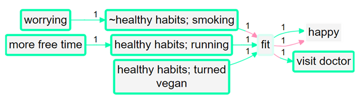
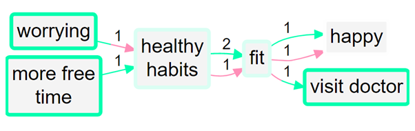

# “Barebones” causal mapping 

In the first part of this Guide we have dealt only with undifferentiated links which simply say “C causally influences/influenced E” or more precisely “Source S claims/believes that C causally influences/influenced E”. We call this “barebones style” causal mapping. There is nothing more to this kind of causal map than links between factors. No other features are used. 

Barebones-style mapping can be interpreted in two different ways:

- As in QuIP, to show causal influences between past events. It is an open question to what extent these causal claims can be generalised. It is possible to parse a link from C to E as saying not only that C is something which has the causal power to influence E but also that in some sense C happened and did in fact influence E, i.e. made a difference to it. 

- To show only causal influences between factors, without recording what did or does happen.  

## Hierarchical / nested coding

In Part 1 e did in fact also introduce an additional convention, hierarchical coding, in which the “;” separator is used to encode the idea that C; D can be read “D, an example of C” and that at a suitable level of abstraction we can approximate C; D as C.

## Combining opposites

This section is work in progress on a simple and powerful way of dealing with “negative” factors and minus influences. 

Here is an example of quite barefoot QuIP-style coding in which we have not used strength at all. Nevertheless there are the beginnings of some ideas about (and issues with) polarity: for example, we have fit and not fit. 

  

I think we've all done this kind of coding, with classic examples being coding for both employment and unemployment or for both health and illness. This could for example be two different stories about two different people; or it could be different aspects of or periods within one person’s life.

This barefoot style on its own is unsatisfactory. The app doesn't know that being fit is represented with a somehow positive and somehow negative factor. It can't join them up. We can’t compare the way that being fit leads to happiness and on the other hand not being fit leads to unhappiness (and to visiting the doctor). **We can’t for example deduce that turning vegan might make visits to the doctor less likely.** Also, if we produce a table or do other analyses focused on healthy habits, we might miss data on the closely related unhealthy habits. (Although the very convention of writing opposites in the form “not Y” as suggested here will help avoid this without any other tricks, as “not Y” will come up in a search for “Y”.)

In this example, we have carefully used the special word “not” to mark out three factors which have explicit (positive) opposites in the same map, in the expectation that they might somehow be combined. 

That’s what this section is about: how might they be combined? 

Note, we are still discussing whether to use not or ~ for this special character:

not healthy habits  

or 

~healthy habits

… we use them interchangeably here. 

The special word “not” (or “~”) may appear at the start of a factor label or at the start of any component in a factor label. This word could be defined by the user – some might prefer a more abstract word or symbol like “X”. Sometimes we have to be a bit clever by inventing formulations like not many jobs versus many jobs. When I say in fact I believe *many existing QuIP studies were already coded in this style without realising it*, I’m taking on board that they probably didn’t actually use this “not” formulation in exactly this form, or not often, but that they could easily and transparently be retyped so that they do, and would still seem fairly natural and “barefoot”. 

(Note that in this example we have also used a little bit of nesting to note the fact that turning vegan and running as well as smoking are health-related habits, but the first two are positive examples of it and the latter is a negative example of it. The “opposites” ideas set out here apply whether or not you used nested coding style; they are particularly powerful when you do but are still very useful without it.) 

When we zoom out the map looks like this:

We have managed to combine the healthy habits into one, but they are still not connected to the unhealthy habits.

A quantitative social scientist might solve this problem by flipping the polarity of the negative examples, coding them as positive but using minus strengths for the connections. So smoking influences good health but with a minus strength. However this always seems somehow unsatisfactory and is complicated to do. It is particularly unsatisfactory when *both* ends of the arrow are flipped in this way so that we code the influence of poor coping on poor health as a plus arrow from coping to health!

The solution presented here can be seen when we just click the “Combine opposites” button. 

            

What happens then is this:

  

Factors expressed in the form “not Y” are combined where possible with factors in the form “Y”. So now there are for example two factors combined into the “fit” factor and two into the “happy” factor. The "not" factors have their incoming and outgoing links preserved, but when a factor is flipped to match up with its opposite, the part of the link next to that factor are now coloured pink. So the lower link from fit to happy is pink because the factor at each end of the link has been flipped from "not Y" form to "Y" form. The 1 means that there is only one such link in this bundle; and the influence factor was originally not fit and the consequence factor was originally not happy. So there is no danger of thinking that this is really just another case of the other link, i.e. of fitness leading to happiness. 

So, a link has two polarities: a *from* polarity and a *to* polarity. Its *strength* is their product (if the signs are the same, it’s a plus, if they are not, it’s a minus). So both arrows from fit to happy have "plus" strength, but they are not the same because one is in a sense a negative example of the other. 

This lower link from fit to happy has the same “plus” strength as the one above it but it does not represent the same information. In fact, **no information is lost when you press the “combine opposites” button; you can still always read off the original map from it.** 

But there is more: the border colour reflects the overall polarity of the factor. The more *plus* incoming and outgoing arrows there are, the greener it is, and the more *minus* arrows there are, the redder it is. If the balance is equal, the border is light grey. If a factor has a red border, that means that at least mostly, its *opposite* was mentioned. So in this example, happy has a grey border because it was mentioned once and its opposite was mentioned once. Fit has a grey border because it has two incoming and one outgoing plusses, and one incoming and two outgoing minuses. 

The total of the numbers on the arrows into and out of a factor is its citation count. But now we have additional information and its citation count is also equal to the number of times it was mentioned in plus form and the number of times it was mentioned in the opposite form. So if we get a big negative net score for employment, there was a lot of talk about unemployment, which we formulated as not employment. 

As this map also uses nested coding, we notice that not healthy habits; smoking has been flipped into healthy habits; not smoking. Not smoking is indeed a healthy habit; and its opposite is mentioned in this story. Hence, it has a red border. 

Here is what this nested map looks like when you also set the zoom level to 1:   

It’s a nice simplification. Those three healthy habits have been collapsed into one factor, which is a bit greenish because it was mentioned more often in its plus form than its minus form (incoming: one + and one -, but outgoing, two + and only one -).

You can see that by default in print view, links in the same bundle, i.e. with the same from and two factors, are no longer always displayed as one, with the frequency noted as a label. (This is obviously a bad idea when some of the links in the bundle may have minus rather than plus strength, etc). Now, the links are only counted together if they have the same *from* and *to* polarities. So there can be up to four different links from one factor to another in Print view. 

We musn’t confuse sentiment or desirability with polarity. Here, worrying is maybe a bad thing but it is shown green, because we haven’t taken the trouble to formulate it as something like not peacefulness. We could do that, but we aren’t forced to. We can use these "not" formulations just if we see there is an opposite idea somewhere else in the map and we want to let the app combine the two for us, in particular in order to be able to make those important and obvious, if tentative, deductions (like, maybe turning vegan leads to less visits to the doctor) which escape us otherwise. If we don’t choose to do this, or even if we miss the obvious opportunity to do so, nothing bad will happen.

 

We are deliberately **not** falling Into the trap of somehow trying to aggregate the different *strengths* to say for example "hey there are 6 plus links from advocacy to compliance and 1 minus link so this is like 5 plus links because 6 - 1 = 5". We don’t have evidence for an aggregated strength; we have aggregated evidence for a strength. Aggregating different pieces of *evidence* for links with different strengths is not the same as aggregating links with different strengths.

 

It’s also possible that someone says “I know this intervention works not only because the intervention made me happier but also because I saw the people who didn’t get it and they are definitely not happier as a result”. In this case, we might code both arrows, intervention ➜ happy and not intervention ➜ not happy.

It’s remarkable here that this “overall polarity” of a factor – was it mentioned more in its positive form than in its negative form – also in a way gives us the kind of information we previously discussed in terms of "actualisation". It is still possible however that we might want to explicitly code actualisation, or the lack of it, for example we might have a whole study which only deals with theoretical information (in which case we might set the actualisation to zero everywhere) or we might have a normal evaluation study in which we occasionally have to code causal claims which are not based on any specific evidence but are merely cited as theoretically true (in which case, we might set the actualisation to zero just for these specific claims). 

### 🖥 How to combine opposites in the app?

The Combine Opposites button is part of the Simplify panel, and the Print view responds to it. 

To make it easier to create a factor which is exactly the opposite of an existing factor, you can select the existing factor in either dropdown when coding, and then press the 

We have not yet clarified how to best make this work for the tables and for Quantity of Evidence.

 

 

 

## Actualisation

In causal maps, sometimes it is enough that your links simply mean that “this influences/influenced that”, but sometimes you need richer ways to capture the relationship between causal factors. 

- Actualisation: rather than simply noting its existence, we also record the fact that this causal connection **actually happened.**

In the simplest version of QuIP coding (Copestake et al., 2019) you don’t need to think about these concepts, so you can either **skip this section**, or read it to understand how simple approaches fit into a more general framework.

 

There are two traditions of causal mapping, each of which has an undifferentiated (yet different) interpretation o

*Floods, which damage crops, didn’t come so had no influence on crops (Actualisation =0)*

*Floods, which are usually good for crops, came but it turns out they have no influence on these new varieties; no influence on crops (Strength =0)*

 

Remember that using multiplication implies, in particular, these rules:

●    Anything × NA = NA

●    Anything (apart from NA) × 0 = 0

The examples below include a quote, a suggested causal connection with factors in italics, and suggested strength and actualisation codes, where the default of Increasing would **not** be used.

“Illegal surface mining in forest reserves is really driving deforestation a lot”

Illegal surface mining ➜ Forests thrive

Strength=Decreasing (-1)

Actualisation=Increasing (1) DEFAULT

The *negative* *strength* (*decreasing*) indicates that mining makes forests thrive *less*, negating the positive nature of the factor label. 

"The Task Force is like a revenue collector, but a few of the forestry staff want to extort money from these people. I understand their challenges, but we tell them to do the right thing by observing the laws, but sometimes they flout the laws."

Gov: corruption/patronage ➜ Gov: Thorough enforcement of regulations

Strength=Decreasing (-1)

Actualisation=Small Increasing (.5)

The *strength* is negative (*Decreasing*) because corruption means ***less\*** thorough enforcement. However, the respondent says this is only true ‘sometimes’, so the *actualisation* – the extent to which this actually happened is small, therefore we use Small Increasing. 

