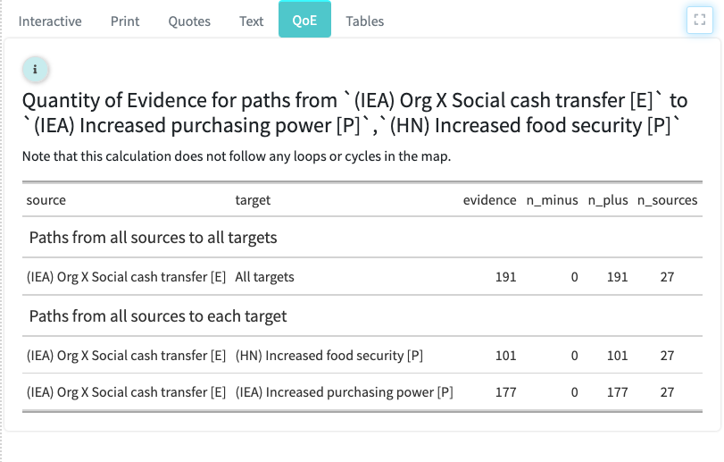

# Quantifying causal evidence

## Summary{.hi} 

In the app, in the Quantity of Evidence / Robustness of Argument panel

This tab appears when "Trace" is switched on in the Search and Filter Factors panel. 

It calculates how much evidence there is for the causal path(s) from the factors identified in the From box to the factors identified in the To box. It identifies how many pieces of evidence (individual mentions of individual links) would have to be deleted so that there is no longer any path from the From factors to the To factors. A larger number means more evidence; more pieces would have to be deleted until we gave up the hypothesis that the From factors influence the To factors at all. 

This number is shown in the "Evidence" column. A large number does *not* necessarily mean that this path is *strong* in the sense that the From factors have a *large* effect on the To factors. It says there is plenty of evidence for the path, *whatever its strength*.

Subtotals are provided for each From factor; it can be useful to compare the amount of evidence for the impact of each From factor.

## Problem

**How to summarise, given a heap of causal information about what causes what, the \*quantity\* of evidence that one particular factor influences another particular factor?** 

Conventional approaches calculate the influence on the Outcome of tweaking the Driver, which follows standard definitions of Impact and is the right way to do it when you have quantitative variables.

One of the pioneers of causal mapping, Toulmin, was interested in the structure of arguments and asked what makes an argument plausible or reasonable (Toulmin, 1979). 

 

 

We arrive at a map like this simply by drawing an arrow for every evidenced causal claim that driver D causally influences outcome O. For each arrow, we have for example a separate sentence or paragraph in a document or interview transcript. In this case it is easy to count the evidence: there are three pieces of evidence that D causally influences O. 

To be sure it is interesting that two pieces of evidence come from one source, and one piece comes from another; we don’t want to lose sight of this fact, it might be important, but nevertheless the overall number three is important too. 

In this example we have no further important information to distinguish the “how” or “why” of each causal claim. If there had been further important information about, say, the mechanism or route in each case, then we would have captured this by including additional causal factors, for example additional influences or intervening stages. 

In real life, the situation is normally more complicated. An evaluator is usually confronted with a heap or web of fragments of argument about how a driver might influence an outcome. The point of this paper is to extend our simple intuition above (“there are three pieces of evidence”) about how to *count the quantity of evidence* to cases with intervening causal factors as in the next diagram.

 

*A causal evidence map in which the quantity of evidence that Our Driver influences Outcome = 6, and quantity of evidence that Some Other Driver influences Outcome = 1.*

Sometimes you can just glance at a map like this and see for example there are many lines straight from a driver to an outcome, and we can say “obviously there is a lot of evidence that the driver influences the outcome”. In this case, we can even say “obviously there is a lot more evidence that our intervention can causally influence the outcome than that other driver can”. But how can we formalise this, how can we “count” threads of evidence which may pass through multiple intermediate factors? How do we count the paths, especially when there are many of them and we can’t just “look and see”? (And later we will see that even in simple cases with just a few links, when some links may have a negative or “minus” influence, our ability to “just see” the answer is even more limited.)

 

*A causal evidence map in which quantity of evidence that Driver influences Outcome = 1.*

Here we propose the metric “quantity of evidence”, which can be thought of as the resilience of the web of arguments: what is the minimum number of causal claims you would have to *delete* in order to break any possible argument that D influences O? If your whole argument rests on a single link from K to L, even though you have many pieces of evidence from Driver to K and from L to Outcome, your argument would break if just that one link failed – hence, the quantity of evidence is just 1. 

It turns out that this number is the same as asking “how many completely separate paths (i.e. paths which don’t share any stretches at all) could we construct from D to O?”.

The rest of this section is quite technical and can be skipped.

## Prior strategies

The problem of how to combine (sets of) causal claims has been addressed many times. Pose normative questions (how should/could groups make decisions?) and descriptive questions (how do groups actually make decisions). 

As far as we know, all solutions have been based on the idea of calculating values of the factors by propagation along the links. 

(B. Chaib-Draa & Desharnais, 1998; Brahim Chaib-Draa, 2002), based on the work of Zhang, (W.-R. Zhang, Chen, & Bezdek, 1989; W. R. Zhang, 1994) shows a way to combine different sets of claims using NPN logic. Factors take one of eight values like “neutral or negative” (Nadkarni & Shenoy, 2001) use Bayesian networks which as noted by Chaib-Draa are not suited to maps which include loops or cycles. 

## Definitions

We note that a first attempt to quantify amount of evidence would be simply to count all the different possible paths, i.e. (above) Driver ➜ B ➜ K ➜ L ➜ P ➜ Outcome, Driver ➜ C ➜ K ➜ L ➜ P ➜ Outcome, etc etc. In the above case, counting like this, there would be 3×4 = 12 paths. Yet it is easy to see that just one cut between K and L will break any and all the arguments, so 12 seems too many. 

**A better solution is proposed here based on the network property "maximum flow rate". It is intuitive, and easy to understand and calculate.** 

Note, we are not aiming here to draw any conclusions about the *strength* of the influence which the driver has on the outcome but about the *quantity* of evidence that there is *some* influence. 

Also, everything we say here comes with the caveat “all other things being equal”: we are dealing only with the role played by the bare existence or non-existence of causal claims and their number, without regard to other, surely relevant issues like sources of bias, or context, etc.

This is in fact the situation we are mostly in with the Qualitative Impact Protocol (QuI: a simple pile of causal claims from relatively homogenous sources with little other information which might influence which claim to prefer.

Before looking at the solution, we’ll need to make a surprising distinction: QuIP maps, and some Causal Map maps, and Axelrod’s original maps, are mostly not causal maps but maps of *causal evidence,* or *causal evidence maps*.

## Definition of causal map

A **causal map** (CM) is defined as usual: a network formed by a set of directed edges aka **links** between pairs of nodes aka (causal) **factors**. Usual network conventions apply:

\-     each factor appears only once; 

\-     there are no isolated factors with no links;

\-     we only allow *one* link between any pair of factors. (If there are different mechanisms at work, we prefer to have the additional causal factors which govern these distinct mechanisms explicitly included in the map.)

Semantics: an edge D ➜ O means “D causally influences O”.

There are many possible kinds of causal map. Special cases would include SEMs, some project theories of change, FCM and others.

## Definition of causal evidence map

A **causal evidence map** (CEM) is a set of directed edges aka links between pairs of nodes aka (causal) factors; each link has the property “source ID” and may have additional properties.

Semantics: an edge D ➜ O means “**source S claims** that D causally influences O”.

 

A causal evidence map based on evidence from two sources.

Axelrod’s original maps (Axelrod, 1976) are CEMs. His interest is in studying the decision processes of political leaders, usually just single sources; sometimes he calls them “concept maps” but also “causal maps”.

## CM vs CEM

A CEM has two possible tasks: 

1)   Simply to report what people think about what causes what. 

2)   To help us (perhaps) draw conclusions about what causes what, which can conveniently be expresses as a causal map with the same or similar structure. One of the main tasks of a programme evaluator – or a judge – is to make the leap from CEM to CM: from “Expert source S told me that D ➜ O” to, with caveats, "D ➜ O". 

So the most interesting task is the second: a CEM helps us draw conclusions about a closely related CM. 

QuIP is explicitly involved in both these tasks.

## Multiple links / number of mentions

We have specified that CMs are not allowed to have more than one link D ➜ O. For CEMs on the other hand, it is *usual* to include several links between pairs of factors, in order to encode the fact that different sources mentioned that link.

We will trivially extend CEMs with a **convention**:

\-     a map with n links D ➜ O is equivalent to the same map in which the n links are replaced by a single link with the additional property “Number of mentions” = n

In visual displays, often the number n is displayed on the link. So the diagram above can be converted to this:

 

## Solution

Now we can suggest a solution to the problem above.

### Base case

All other things being equal, we can formalise our intuition about the quantity of evidence provided by CEMS like this:

\-     **any non-zero number of links** from D ➜ O in a CEM **is** **some kind of evidence** that indeed D actually influences O – from a Bayesian perspective, some information is better than no information

\-     **more links mean more evidence**, 

\-     and (all other things being equal), given a CEM with n links from D ➜ O and m links from F ➜ O, if n>m we would say that the **evidence is stronger** that D influences O than that F influences O. Note this is *not the same as saying that we have evidence that D to O is a stronger influence*; we haven’t even introduced a notation for strength of influence. Quantity of evidence for an influence is not the same as evidence for the strength of an influence.

In practice, all things never are quite equal, and it is the job of the human evaluator to review this kind of evidence to see which, if any, conclusions about real-world causality can be drawn on the basis of a causal evidence map. 

Following these intuitions, we can define **quantity of evidence** for D ➜ O given a simple CEM consisting only of D, O, and n links between them as simply n.

 

A causal evidence map; quantity of evidence that D ➜ O is 3.

### Problem: extend this simple case to maps with intervening factors between D and O.

### Useful reporting metrics

\-     Overall quantity of evidence for the paths from all drivers to all outcomes

\-     Individual quantity of evidence from each driver to all outcomes

\-     Comparison of quantities of evidence from a pair of drivers (or sets of drivers) to all outcomes

\-     Individual quantity of evidence from all drivers to each outcome

 

 

 

**
**

 

### Extension: weighting

It is also possible to extend the semantics such that *Quantity of evidence / Number of mentions* can also be used to confer a weighting, such that for example claims from some particular sources, for example focus groups or experts, are immediately encoded with QE =2, opening also the possibility of non-integer (but still positive) QE like .5. 

