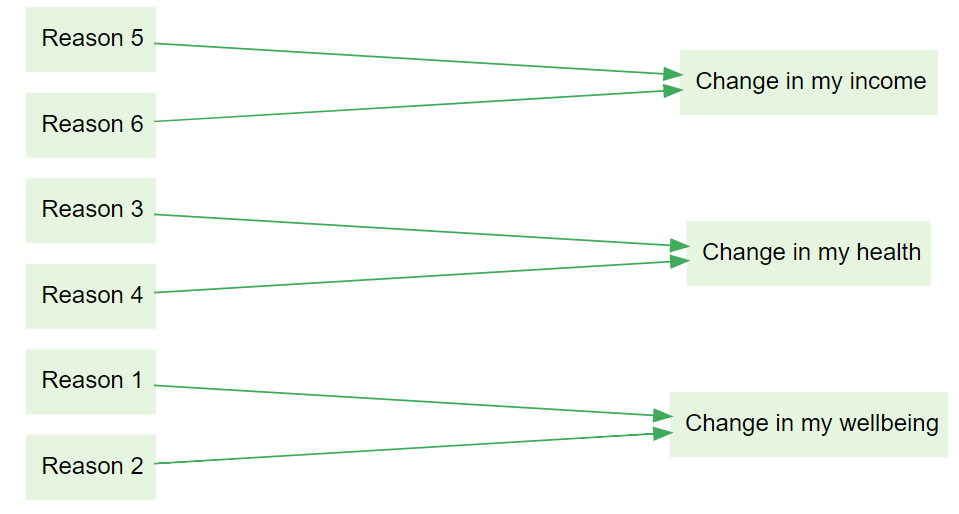
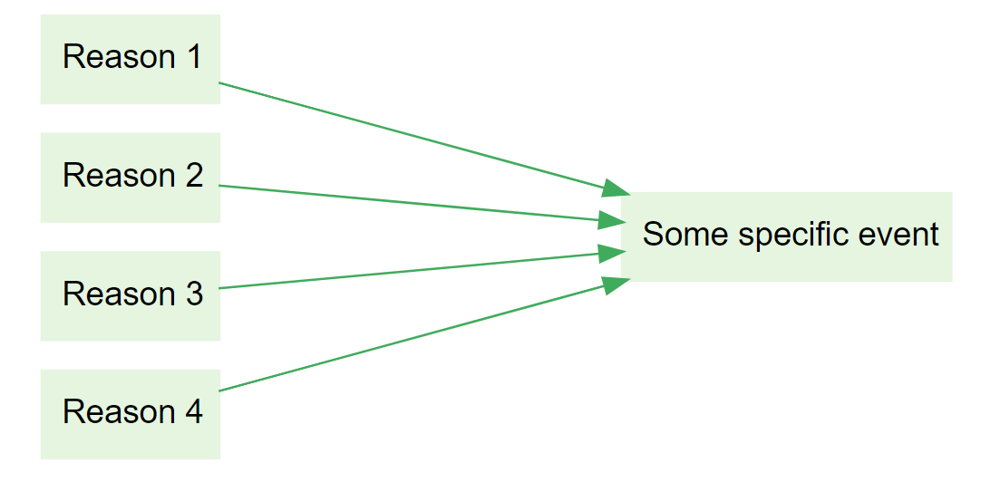
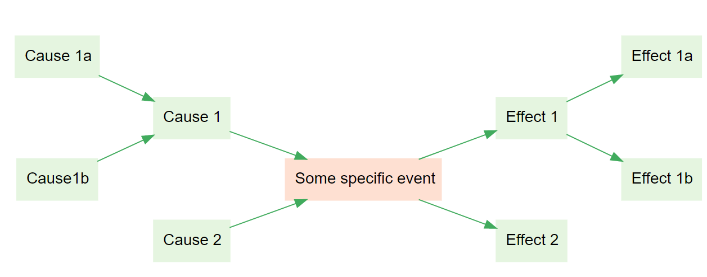
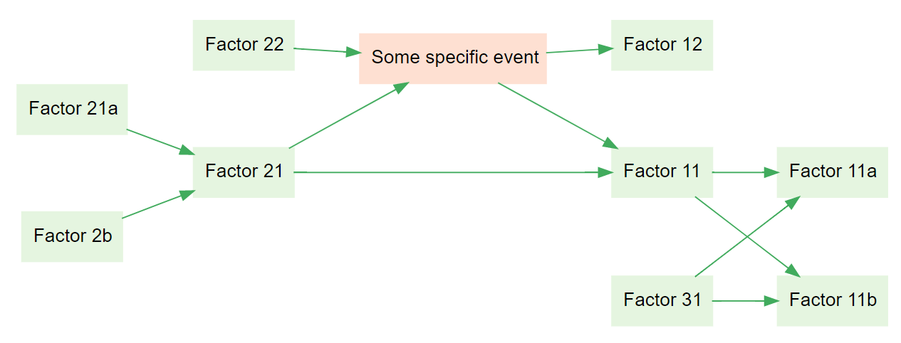

# 📚 Spotlight: Different kinds of question chaining, with QuIP and ParEvo as illustrations

We can build a causal map by just asking people, separately or together, for causal statements around a theme.

But there are many advantages in doing this more systematically -- to make sure we get the right information, and to make sure we have data which we can interpret.

discusses two methods - constructing causal links between a pre-determined set of causal factors using pair comparisons, and instructing respondents to draw a free-form causal map.

One way to build up a causal map systematically is "question chaining". For example we can ask respondents about the causes of an event, and then the causes of those causes, and so on.

## Four options with Fixed versus Variable question chaining

+----------+----------------------------------------------------------------------------------------------------------------------------------------------------------------------------------------------------------------------+------------------------------------------------------------------------------------------------------------------------------------------------------------------------------------------------------------------------------------------------------+
|          | Backwards                                                                                                                                                                                                            | Forwards                                                                                                                                                                                                                                             |
+==========+======================================================================================================================================================================================================================+======================================================================================================================================================================================================================================================+
| Fixed    | Please give causes/reasons for event or situation X; then give causes/reasons for those causes/reasons, etc. (example: -- what were the causes of / reasons for Brexit, etc.)                                        | Please give consequences of event or situation X; then give consequences of those consequences, etc. (example: [**ParEvo**](http://parevo.org) -- read this sentence describing the situation in the USA now, then suggest consequences of it, etc.) |
+----------+----------------------------------------------------------------------------------------------------------------------------------------------------------------------------------------------------------------------+------------------------------------------------------------------------------------------------------------------------------------------------------------------------------------------------------------------------------------------------------+
| Variable | Please name one or more X's, then proceed as above (example: [**QuIP**](https://bathsdr.org/about-the-quip/) -- name one or more changes in your life/wellbeing, and one by one give causes/reasons for those, etc.) | Please name one or more X's, then proceed as above (example: name one or more features of the current situation, and one by one give consequences of those, etc.)                                                                                    |
+----------+----------------------------------------------------------------------------------------------------------------------------------------------------------------------------------------------------------------------+------------------------------------------------------------------------------------------------------------------------------------------------------------------------------------------------------------------------------------------------------+
|          |                                                                                                                                                                                                                      |                                                                                                                                                                                                                                                      |
+----------+----------------------------------------------------------------------------------------------------------------------------------------------------------------------------------------------------------------------+------------------------------------------------------------------------------------------------------------------------------------------------------------------------------------------------------------------------------------------------------+

Causal mapping in the future is often used when constructing scenarios.

The distinction between Fixed and Variable options is subtle but important. In both, the respondent may offer multiple causal claims in the first step; the difference is that in Fixed questioning, these claims all involve event X, whereas in Variable questioning, the initial claims are not causally linked. This means that the causal maps look different: Variable maps can have more than one focal event.

In each case, the precise wording makes a difference as to whether respondents are able to answer the questions in the way we intended, and to how we are able to interpret and make deductions with the resulting maps.

When forward-chaining, we can, for example, ask for

-   consequences,
-   likely consequences,
-   the most important possible consequences in your opinion, etc.

When backward-chaining, we can, for example, ask for

-   reasons,
-   causes,
-   the most important contributory factors in your opinion, etc.

## Single versus multiple

The rows in the table above actually make a double distinction: Fixed chaining usually begins from just **single** events, and open chaining usually elicits multiple. We could also cover multiple closed events by asking about each one in sequence, but this does not seem to happen often in practice. And while Variable chaining usually begins **multiple** chains "out of the box", we can insist on just one if we want to.

## Future in past, past in future

We can also ask for (hypothetical) causal factors leading up to a future or hypothetical event. This is often used when constructing a theory of change: "What Y needs to happen for X to happen? What needs to happen for Y to happen?"

Again, the wording of our prompts is crucial: perhaps we are looking specifically for necessary conditions, or sufficient conditions?

Similarly we can ask for (counterfactual) causal factors following from a past or hypothetical past event. "What Y would have happened if X had happened? What would have happened if Y had happened?"

## Closed vs open questions

The examples above all assume that respondents are invited to produce their own factors in each step. It is also possible to allow them only to select from a pre-determined list. [@hodgkinson2004]

## Going both ways: bi-directional chaining

Finally, we can combine backwards and forwards chaining into bi-directional chaining, of which there is a weak and a strong variant.

In the weak variant, we ask separately for causes of causes, and for effects of effects. The resulting causal map has a very specific structure: two hierarchies, joined only at the focus event or events.

In the strong variant, we can ask also for effects of causes of causes, and for causes of effects. This can result in any arbitrary structure.

## Evaluation

It's possible to ask respondents to evaluate the factors at any point, for example to ask them if they see something as beneficial or positive. However, it's most usual to ask only for evaluations of the temporarily latest factor(s) - so, when back-chaining, to ask for an evaluation of the focus event(s), as in QuIP, and when forward-chaining to ask for an evaluation of the terminal events, as in ParEvo. This is parsimonious as one can, in each case, arguably derive an evaluation of the preceding factors by following the causal links in reverse direction. However it's maybe also not enough, as Simone Ginsburg points out and as discussed [here](https://journals.sfu.ca/jmde/index.php/jmde_1/article/view/563).
