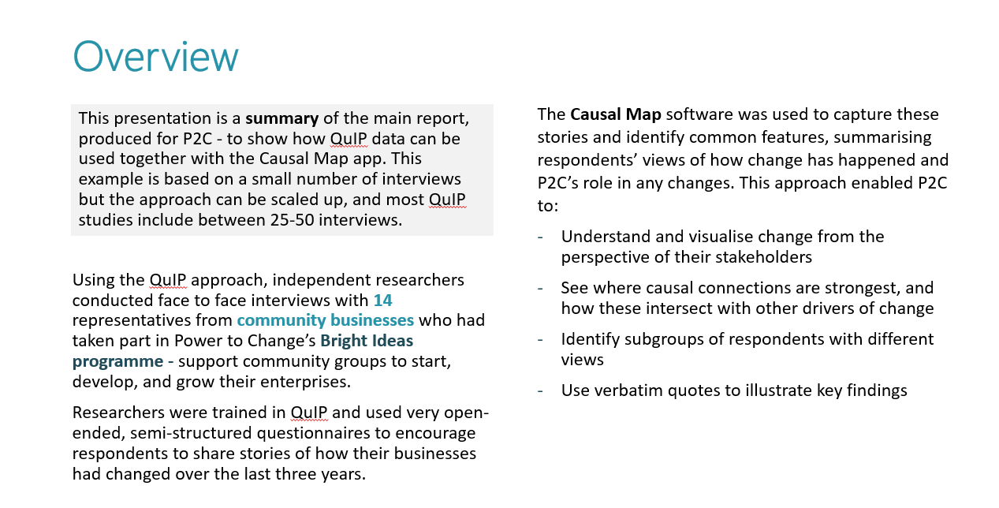
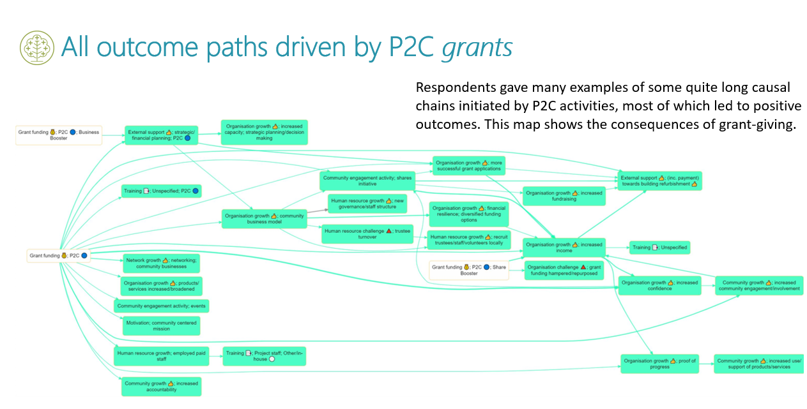
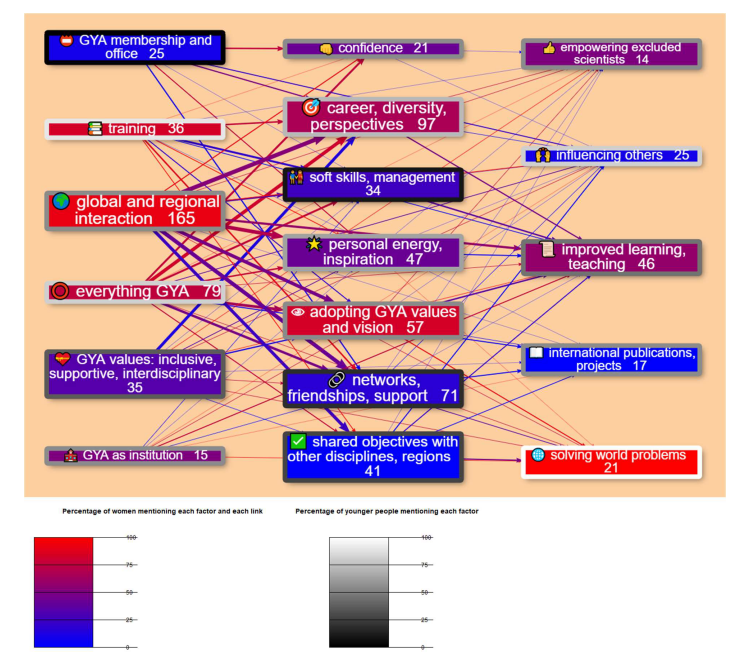
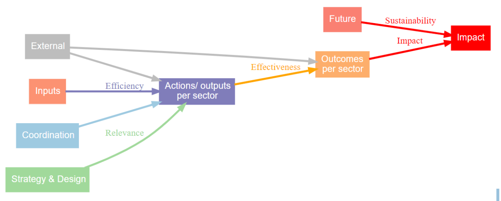
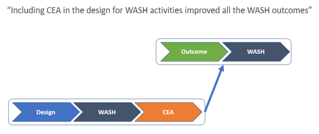
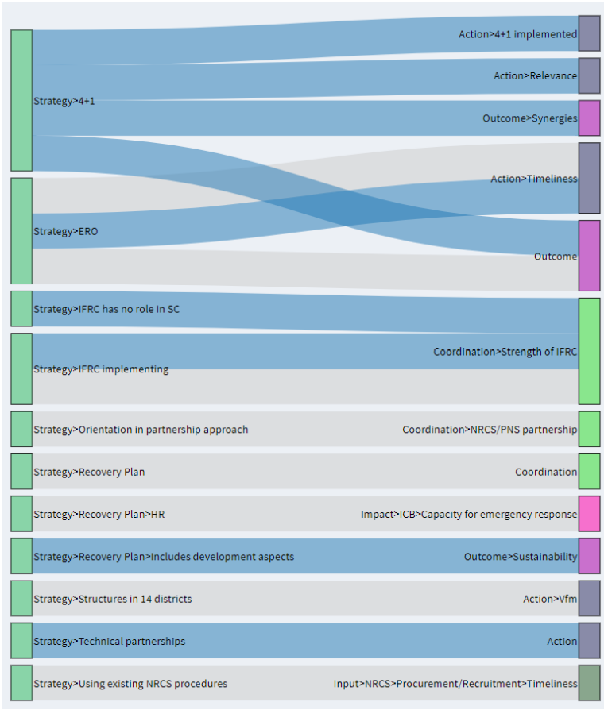

# (PART) Showcase {-}

# 💻 Showcase: how the Causal Map app has been used{#showcase}

## Triple-Line

Forthcoming.

## VOSCUR

Forthcoming.

## Power to Change

[Here](https://drive.google.com/file/d/18OIi1FzLR3YX9FWiSEkqKnNDJyKQXX78/view) is a brief presentation showcasing a recent project conducted by Bath SDR for Power to Change using Causal Map. 

Two of the slides: 

Overview slide

Path tracing

## Global Young Academy: Tracing the paths of GYA’s impact

Oct-Dec 2018. Impact of academic support, Anamaria Golemac Powell & Steve Powell. 

[Short report](https://globalyoungacademy.net/wp-content/uploads/2019/04/GYA-Impact-Analysis-2018_Final.pdf)

[Full report](https://globalyoungacademy.net/wp-content/uploads/2019/04/GYA-Impact-Analyisis-2018-Technical-Appendix.pdf)

This report used a very early version of Causal Map. 

The Global Young Academy supports young scientists around the world to connect with 
other young scientists, develop their careers and work towards solving global problems 
with science. We asked over 100 people, who had been supported by GYA or were 
otherwise involved in the programme, to tell us stories about positive changes which had 
happened because of GYA activities. We used an online survey. 

We analysed the stories looking for examples of where people had said that  𝐵  leads to  𝐶  - 
for example, where someone said “I loved the regional meetings because they helped me 
widen my professional network”. Then all the  𝐵 s (like, Global and regional interaction) and 
all the  𝐶 s (like networks, friendships, support) were grouped into themes, which are the 
boxes in the diagram below: a Theory of Change for GYA. All the individual stories linking  𝐵 s and  𝐶 s are synthesised into one story using a pre-defined set of analysis steps.  

The factors which people mentioned sort themselves into three layers, reading from left-to-
right: GYA inputs, individual impacts and broader impacts. So taken together, people told 
us about a range of GYA inputs which led mainly to a range of impacts on individuals. These 
impacts on individuals also led to some broader impacts like “improved learning & 
teaching” on the right-hand-side. People also quite frequently mentioned direct links from 
GYA inputs to these broader impacts. The diagram reveals a lot of insights, like these: 

- People, especially women, reported that GYA activities, especially global and regional 
interaction like attending conferences, had many positive personal influences like 
establishing support networks with other young scientists. 

- At the heart of the theory of change is that young scientists themselves adopt GYA’s 
values and vision, which enables them to go on to have broader impacts like improving 
teaching. 

- Women, especially younger women, most often mentioned “solving world problems” 
as a broader impact, while men often mentioned interdisciplinary interaction leading 
to international projects and publications. 

- Older people mentioned GYA membership and office-holding as important inputs, and 
most frequently mentioned how they had learned soft skills and in particular 
management skills through GYA participation, whereas younger people, especially 
women, mentioned training inputs and how they led to career opportunities.  

## IFRC Nepal Meta-evaluation

[Download the report](http://adore.ifrc.org/Download.aspx?FileId=313302) from the IFRC website.

This report, written by Steve Powell, used an early version of Causal Map. 

### Background

After the powerful earthquake which struck Nepal in April 2015, the International Red Cross Red and Crescent Movement ("the Movement"), among others, mobilized the full range of their resources to support the relief and recovery efforts, in line with Nepal government’s overall strategy, to support the Nepal Red Cross Society (NRCS) in leading the response. NRCS, IFRC and in-country Participating National Societies (PNSs) came to an agreement that individual partners will conduct their own final evaluations of individual projects, rather than a combined final evaluation. So it was proposed to also conduct a meta-evaluation of the individual final evaluations together with all other reviews and thematic studies conducted 2015 – 2019.  
This report presents the results of that meta-evaluation.

Overall top-level theory of change emerging from the documents

### Method

A central part of the report was a qualitative synthesis of the summaries of over 30 evaluative reports. The methodology is described in the section beginning on p. 22. The design was partially deductive because some main high-level causal factors like Actions and Outcomes were pre-determined, and partly inductive because many lower-level factors were identified within these high-level groups. 

The procedure was to read and analyse or “code” each of the main documents in turn. 
The focus was on the executive summary and conclusions sections of the primary 
documents, as these already represent an effort by the respective authors to summarise 
their own documents. The full text of the documents was considered mainly in order 
deepen understanding of the summaries.   

This qualitative procedure, known as “coding”, made use of qualitative text analysis 
software, Causal Map, software developed by Bath SDR and the evaluator, which is 
specialised for evaluations because it makes it possible to capture reports of causal 
connections. 

This coding approach was used in order to ensure that the reports were 
synthesised in a systematic and transparent way. 

The coding process: Important claims of causal contribution (e.g. “This WASH training 
element succeeded in raising hygiene awareness, but only amongst women”) in the main 
documents were highlighted and used to construct a theory of change or “causal map”. 
Each such piece of evidence was coded as a link showing how one factor (in the example, 
“the WASH training element”) influenced another (in the example, “raised hygiene 
awareness, but only amongst women”). Each link is associated with a specific verbatim 
quote from the evaluative reports along with the metadata e.g. report title, date, page 
number, etc. This metadata captures information on the context in which the quote is 
relevant. 

The final theory of change consists of a large number of arrows or links.  
Capturing information about causal contribution in this way makes it possible to ask 
questions about the influences on a particular factor, and in turn what it influenced, 
combining information from different reports. 

Generic theory of change 
 
An initial, generic theory of change used as a starting point for the qualitative analysis.  
The coding process started out assuming a generic theory of change with the above, 
generic, form. It gained more specific detail as the analysis proceeded and more specific 
details emerged: the individual causal factors were organised hierarchically under the 
headings in the diagram as follows. 

#### Hierarchy 

Coding the reports as outlined above identified 470 causal factors mentioned in the 
reports, which is quite a large number. So a hierarchy of causal factors was created by 
breaking up these 470 into a smaller number of common, reusable components 
(“WASH”, “Design” etc).

Coding a quote from one of the main documents as a link between two causal factors. 

Rather  than  coding  this  statement:  “Including  CEA  in  the  design  for  WASH  activities 
improved all the WASH outcomes” as a link between two monolithic causal factors, it was 
coded as a link between two factors which are themselves made up of a number of more 
generic elements. 
 

A more efficient way to code a quote from one of the main documents as a link between 
two causal factors, each of which is hierarchically organised.  

For example, the first part of “Including CEA in the design for WASH activities improved all the WASH 
outcomes” is encoded as “Design>WASH>CEA” which is also part of a broader factor “Design>WASH” 
which is in turn part of the top-level factor “Design”. “Design>WASH>CEA” can be read “the CEA part of 
the WASH part of the Design process”. 

This hierarchy of factors was developed iteratively during the coding process, beginning 
with an initial hierarchy (just “Input” “Action” and “Outcome”), which was then modified 
to best fit the actual contents of the documents following the usual iterative approach 
applied in qualitative text analysis.

  

#### “Positive” links and “Other” links 

Sometimes the documents contained information about the strength and direction of the 
influence of one factor on another, e.g. a strong and negative change to factor C causes a 
small and positive change to factor E. More details of how this was captured are given in 
an Appendix on p. 76. For the purposes of reporting,, links are organised in just two 
groups: “positive” links and “other” links. “Positive” links are all those in which a normal, 
expected amount of one factor brings about a normal, positive change in another. All the 
other links are ones which are in some way different, less than optimal, or hypothetical. 

#### Causal link diagrams

A causal map showing the causal consequences of different aspects of programme Strategy.

Causal maps were displayed as Sankey Diagrams, which are not used in newer versions of Causal Map.

All the relevant causal claims were also provided as a long annex to the main report, grouped according to theme. 
