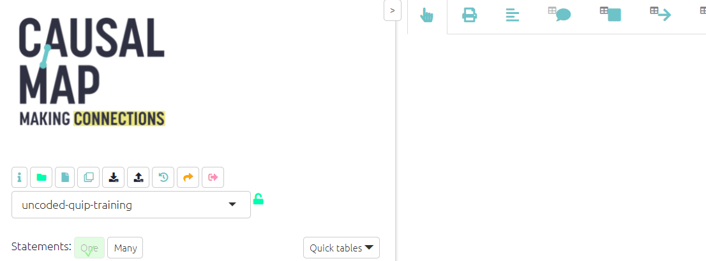
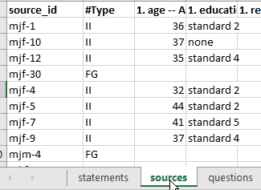
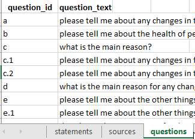
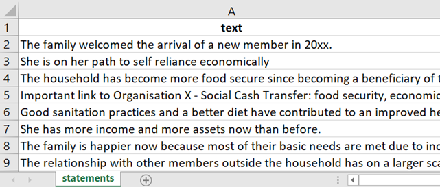
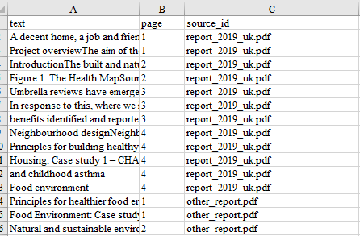

# Uploading your data{#ximport}

## Importing a simple, wide-format file{#upload-summary} 

There are many ways to import data into Causal Map. Perhaps the simplest way to upload your data is in wide format. This is the kind of data you might often get if you have been using Google Forms. 

In this format, you only need an Excel file with one tab; each row is all the data from one source. So many of the columns will probably be additional data like gender, etc.

Press the blue upload button.


- The app will read the first tab and will ignore other tabs in the Excel file.

- Each row is one source. 

- Columns beginning with $ are treated as statements. 

- Columns beginning with # are treated as important additional information.

So this means that if you want a column to be treated as a statement, i.e. you want to code the answers in Causal Map, add a `$` at the beginning of the column name. 

If you want a column to be treated as important additional data, i.e. you want the information to be easily identified for crosstabulation and other analyses in Causal Map, add a `#` at the beginning of the column name. 

### Adding additional cases with wide-format files

You can start coding your data even if you do not yet have all the cases/sources. When you get more data, simply add them to the bottom of the original file and upload again. You don't need to do "[roundtripping](#xroundtripping)". All your sources and statements will be overwritten but your coding (links and statements) will be untouched. The questions table will also be untouched. If you want to add information about your questions, for example adding question text as well as question id, you can use [roundtripping](#xroundtripping). 


## Standard format

Causal Map has a standard format for storing data which can be uploaded and downloaded as an Excel (xlsx) file. 

Uploading data in Causal Map standard format is simply done. Click the upload icon, browse your computer and find the xlsx file you want to use. The app will import any tabs called "factors", "links", "statements", "sources" or "questions" and will ignore other tabs. 


{width=650}


It is important that your file is in the right format to make it compatible with the app and the following section will show you how to format your file. 

The video below shows you how to format and upload a set of statements for coding to the Causal Map App.

```{r,echo=F}
knitr::include_url("https://player.vimeo.com/video/637121851")
```

And click [here](https://causalmap.app/wp-content/uploads/2022/03/template-upload-2-2.xlsx) to download the excel template. 

### Formatting a Standard Format file: The basics {#formattingyourfile}

```{r,echo=F}
knitr::include_url("https://player.vimeo.com/video/604138709")
```

When uploading data for coding the only data you **need** to upload to the app is a table of statements as an xlsx file. Your file must have a header row with the names of the fields; the name of the column with the actual responses must be `text`. 

All tab names and column names should be lower-case.

{width=650}


Additionally (optionally), you will usually have a column in the statements table called `source id` and a corresponding tab called `sources` with at least one column called `source_id` with corresponding values, and additional columns giving more information about your sources.

{width=650}

Additionally (optionally), you may have a column in the statements table called `question id` . If you want, this question_id can already include the question text, e.g. "q1: tell us about your life". But usually it is more convenient to just use a code like "q1" and also include a corresponding tab in your Excel file called `questions` with at least one column called `question_id` with corresponding values, and an additional column `question_text` with the full text, as well as any other information about your questions, e.g. domain or questionnaire section. 

{width=650}

### Starting from a Word document

You can create a table from a Microsoft Word document. 

Each paragraph in your Word document will become one statement, so make sure your Word document is already structured so this will work for you. Delete any double paragraph breaks in Word (i.e. delete any empty paragraphs). If you want some short paragraphs to appear together as one longer statement, delete the paragraph breaks between them.

Then

- Copy all the text from your document
- Create a fresh spreadsheet file in Excel (or LibreOffice Calc or similar) and select cell A2
- Paste your text.
- Type the word “text” as column header in cell A1.
- Check the statements are the way you want them. You can ignore any formatting, pictures etc which might also have been pasted in because these will disappear in the next step.

The statements are the texts which appear one by one, for you to read and code. Each statement is one row in your file.

{width=650}

If you want to import interviews which are several pages each, you should break each interview into several statements. Ideally a statement consists of between one and five paragraphs – enough to fit on the left-hand side panel when it is displayed there. Usually your text breaks up naturally into sections, for example the interviews might be responses to a number of questions, so your statements might consist of one or a few paragraphs for each question.

We strongly recommend that you don’t try to import statements which are longer than 500 words, as it is harder to code very long statements.

Your statements file must have at least one column with the text of the statements and the header for this column must be “text.” Other columns will be treated as additional data.

### Uploading from PDFs

You can make a basic statements table from a set of PDF files using our [free utility](https://causalmap.shinyapps.io/pdf2excel/)  which will save you a lot of time. You can upload all your files at once and get an Excel file of the right format for uploading into Causal Map. 

This works well on simple PDF files but may miss text which is in boxes and columns.  As an alternative you can export a PDF to Excel (one by one) [here ](https://www.adobe.com/uk/acrobat/online/pdf-to-excel.html). The resulting file is also full of pictures etc but does seem to contain all of the text, although in many columns. 80% of the time it identifies suitably large chunks of text, but sometimes you get very small fragments. 

We provide another our [free utility](https://causalmap.shinyapps.io/pdf2excel/)  (Tool 2) which batch converts any number of these Adobe Excel files into an Excel file which you can upload to Causal Map.

### Making a basic statements table by hand

If you want to import longer documents which are several pages each, you should break each document into many chunks or "statements". Ideally a statement consists of between one and five paragraphs – enough to fit on the left-hand side of the Code & View tab when it is displayed there. 

Make a fresh spreadsheet file in Excel (or LibreOffice Calc or similar) 

- Type the word “text” as column header in cell A1.
- Select cell A2
- Paste your text below in the A column, with between 1 sentence and 9 paragraphs in each cell. Note that if you want several paragraphs together in one cell, be careful when pasting.
- Check the statements are the way you want them. You can ignore any formatting, pictures etc which might also have been pasted in because these will disappear in the next step.
- Just the column "text" is enough, but optionally use the other columns for other metadata you might need, like this:



The statements are the texts which appear one by one in the left-hand panel, for you to read and code. Each statement is one row in your file.

The (optional) column `source_id` is special, because it gives you an easy way to provide additional information about each source (e.g. year and country of publication) rather than having to copy this information into your this main statements file.

