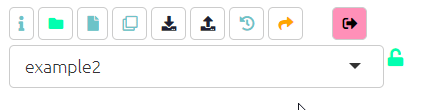

# Making your own copy of a file

The app creates an uncoded example file for you. You can find it in the dropdown menu, it has a name like **example-file-uncoded-youremailaddress**. 

You can also make your own copy of another file which has been shared with you.


```{r,echo=F}
knitr::include_url("https://player.vimeo.com/video/641927229")
```
Copying a file in Causal Map is easily done. Simply load the file you want to copy using the dropdown menu. Then click the 'Save As' button on the top left of your screen. 

{width=650}

You can then append something to the end of the filename to make it yours:

{width=650}

Click the 'Save' button. This window will then close and your copy of the file will load up. You can now make changes to this new file. 

The other buttons help you with these tasks:

- Restoring a previous version of your file
- [Uploading your data ](#ximport)
- [Managing the current file](#xtop-menu-advanced), for example to share it with others.

