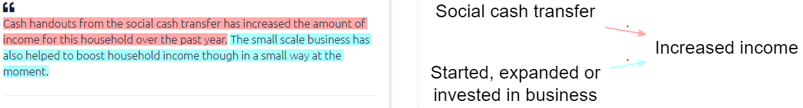
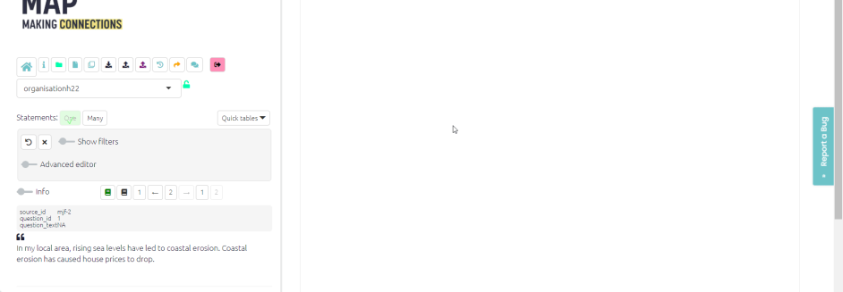

#  The Coding Panel: creating factors and links{#xcoding-panel}


##  Creating links in the app

```{r,echo=F}
knitr::include_url("https://player.vimeo.com/video/604099226")
```
To code a causal link, 

- With your mouse, highlight a piece of text within the statement which makes a causal claim.

- Watch how that passage is copied for you into the “Quote” window below. (Usually you don't need to think about his window: you can edit the text if you really need to but it has to remain an exact quote of one part of the text or you will get a warning.) 
- Start to type the name of the influence factors at the **start** of the link(s) which you are going to make, in the first drop-down menu.
- If there is an existing factor which matches what you want, you can select select it.
- Otherwise you will create a new factor with the contents of what you have typed; finish what you have typed with a comma or a tab character if you want to continue to select or create another factor.
- If you want to create more than one link, you can select or create additional factors in the same box (as shown in the video below).
- When you have finished, press Enter.
- Repeat the process in the other box to specify the factors at the **end** of the link (or ends of the links).
- Press the green Save button which is now active.
- The link is created in the Map window, colour-coded with the quote which is now highlighted on the left. If you mouse over the highlighted quote, the link in the map is activated.
- When you have finished coding one statement, click the right arrow in the statement navigator to code the next statement.



For more information on how to edit an existing link [see here](#xedit-factor-and-links1).


### About the factor label dropdown menus

By creating links, you also create the names of your factors.

In Causal Map, a factor *is* its label. Once you create a label, there is nothing else to add.

Factor names which contain semicolons **;**. get special treatment as they separate the different parts of hierarchical labels.

After beginning to create links between factors, already-coded factors will appear in the dropdown menus in the to and from factor boxes. For added convenience. The most frequently coded factors will appear at the top of this list
