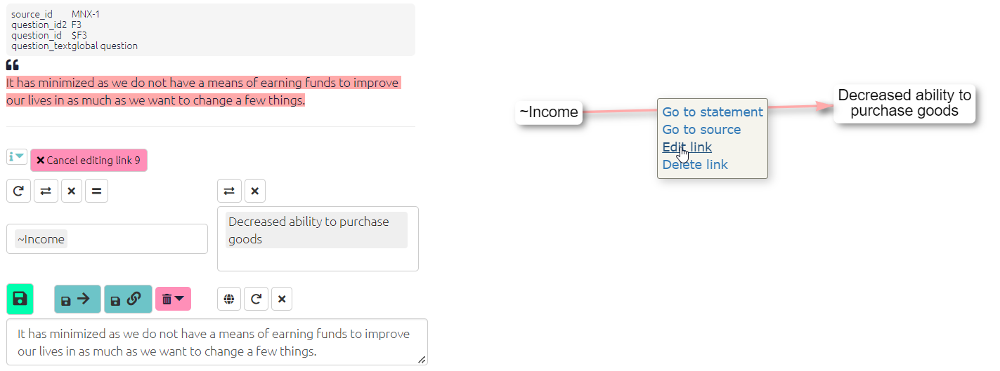
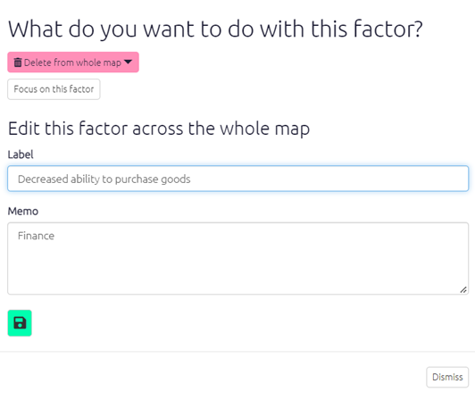

# Editing factors and links (basic){#xedit-factor-and-links1}

It is likely that you will need to regularly review and edit your links, and there are various ways to do this in the app. You can also delete factors and links in the same way, however you cannot delete factors or links when certain [filters](#xapplyingfilters) are applied such as `combine opposites` and `zoom` as these filters represent multiple factors as one factor label.

**Editing links in the interactive tab**

Click on the link you want to change in the [interactive view](#xinteractive-view). Make any adjustments in the left panel, e.g. change the influence factor (in the first box), and/or the consequence factor (in the second box). You can change the quoted text just by re-highlighting the correct passage in the statement panel above in the same way that you made the original highlight. Press the green Save button to finish editing.

{width=650}

**Editing factors in the interactive tab**

To edit your factor labels in the [interactive view](#xinteractive-view), just click on the factor and then ‘edit factor’ to open the edit panel. Using this panel you can change the text of the individual factor or add a [memo](#xmemos).

{width=650}

You can also edit multiple factors using the [tables](#xall-tables) and the [factor editor tab](#xfactor-editor).
