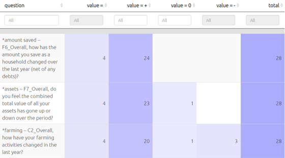
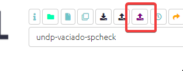
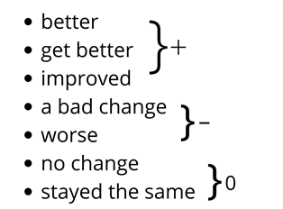
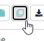
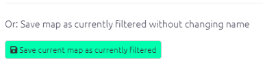
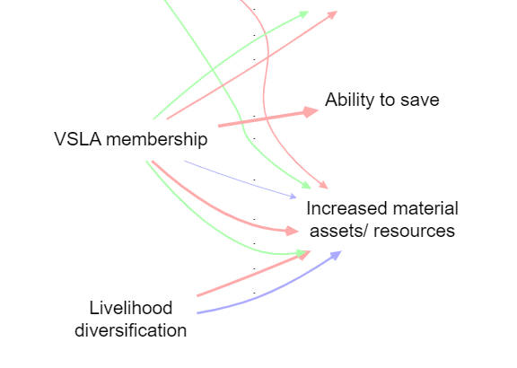
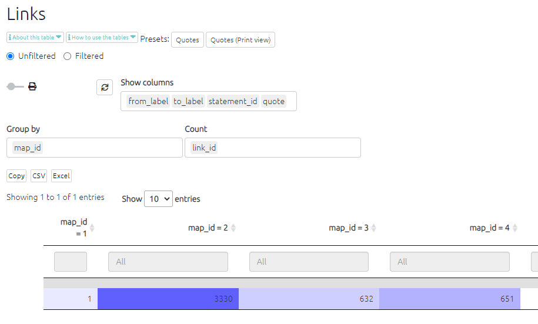

# Importing your data: special cases

## Importing from other software

We are aware of the initiative to make qualitative coding software interoperable, [https://www.qdasoftware.org/products-project-exchange/](https://www.qdasoftware.org/products-project-exchange/). Causal Map has quite a different model and at the moment we don’t provide this, but would do if there is a lot of interest.

You can always export all your data at any time using the buttons in the File tab.

### Exporting for import into kumu.io

tbc

### Exporting for import into NodeXL

tbc

## Importing existing causal coding

You might already have causal information, for example in the form of node and edge lists, which you want to import. This is possible in Causal Map. You simply provide an Excel xlsx file with a single tab called `links`, containing just two columns called `from_label` and `to_label` which contain the names of your factors.

## Uploading closed question blocks

If you give the app a single set of closed responses like better, worse then it can make tables like below.

{width=650}

It will recode a fixed set of words into + positive, - negative and 0 neutral. 

This approach only makes sense if you have one larger set of questions with the same set of fixed reply options.

You supply this data in the form of user-defined fields in the Sources table, whose names contain a *. 

You could still, if you want, import a whole bunch of different closed questions with different answer categories as custom fields in the Sources table. So just as you can have gender as a field, you could have "answer to closed question about how often do you go hungry (never/sometimes/often)" as a field. This means you could ask the app to only show the maps of the women, or the people who often go hungry, or the women who often go hungry. The point of the closed questions feature is to organise and provide the answers to a whole block of questions together in one place, to make analsying the data easier.

## QuIP-specific: uploading hybrid format data (admin only){#ximport-hybrid}

 

This format is used by BathSDR for QuIP projects. This format has many rows, one for each answer, and includes the statements as one kind of answer; you can import statements and additional data from the same fieldwork file.  

The app will only read the first tab in the Excel file, whatever its name. This tab must have a header row with the names of the fields:

- `text`, containing the answers
- `source_id`, containing the respondent ID
- `question_code`, containing the question ID
- `question_text`, containing the question text

(Actually the names of the columns does not matter, only the order.)

This hybrid data is split on import into three tables: `statements` `sources` and `questions`, depending on the contents of the `question_code` column.  These question codes may include the following characters:

- A dollar `$` to be treated as a statement

- A star `*` to be treated as a closed question.

- A hash `#` to be treated as important additional data.

Plus, the question_code may end with the characters "rank" to mark "ranking organisation" data. [There may be a bug currently such that this data will also be imported only if they are not treated as statements, ie the code should not contain a `$`]

The three tables are produced as follows:

1) `statements` table: Every row in the hybrid table whose `question_code` includes a `$` will be treated as a statement: added as a *row* in the `statements` table.

2) `sources` table: Most rows in the hybrid table will also be treated as a metadata (e.g. the gender of the respondent): added as *columns* in the `sources` table, which has one row for each source and one column for each metadata field such as gender. Rows in the hybrid table are only **not** added to the sources table if they are purely statements: their `question_code` includes a `$` and they are not closed question data, i.e. their `question_code` does not include a `*`.  
3) `questions` table: this lists all the unique questions, with the columns `question_code` and `question_text` and a new `question_id` which will be constructed from the question code together with the question text, e.g. "A1_Do you live alone". This means that any special characters in the question codes column will also be included in the question id column. 

You can mix the special characters in the question codes, so e.g.

> $*# A1

... will be treated as 

- a statement 
- *and* as additional data about the sources, in particular as a closed question (part of a block of such questions) 
- *and* as *important* additional data to be shown e.g. in the info panel.

Note that all the columns of the `sources` table contain metadata about your sources and can for example be used to create filters (e.g. show me a map which only contains statements from people who live alone). Data whose `question_code` contains a # will also be shown in a few additional key place in the app such as the info panel.

Closed question block data, and ranked organisation data, is stored in the app in the `sources` table: as additional columns of information about each source. 

#### QuIP recodes for closed questions - live link

Using this [table](https://www.dropbox.com/s/spiacrl67lqwvc9/quip-recodes.xlsx?dl=0) (which includes spanish) the app recodes your data into + positive, - negative and 0 neutral. 

For example:

This data will be displayed in the Tables panel if you select “closed questions.”

## *Appending* hybrid data

Suppose you uploaded hybrid data from file F, and already did some coding, then you receive more data in file G, also in hybrid format.

Find the original file F on your computer (don' t download from the app!). Paste the data from file G below the existing data in file F, save it as file H, and upload this again. Your existing coding should not be affected; the links and factors you already created will remain.

Caveat: you can't combine roundtripping and appending hybrid data. If you have tweaked or added to your data from file F by roundtripping (downloading the data from the app then uploading again), any changes to statements, sources or questions will be lost if you later try to append data using this hybrid button. So if you need to tweak your data (statements, sources or questions), either:

- wait until you have completed uploading using the hybrid button and only then tweak with roundtripping
- or, manually tweak the old and new data in file H

## Merging files

You want to merge files "foxtrot", "golf "and "hotel" into one. What you are going to do is create a blank file and then use the merge mapfile command to merge in the file foxtrot, and save the map as currently filtered (i.e. including all the contents of foxtrot which arrive via the filter), and then repeat for the others.

1) Create a new file under a new name e.g. "my-merged-file"

2) Type this in the Advanced Editor:
   - `merge mapfile path=foxtrot`

3) Press Save in the Advanced Editor

4) Save the file as currently filtered: 
   - Press Save As: 
   - Then press: 

5) You now have a file my-merged-file which has as its contents the file foxtrot.

6) Repeat steps 2-4 exactly as above, but with the command `merge mapfile path=golf`. Your file my-merged-file will now contain both files, and all the tables will have a column `map_id` in the links table, which distinguishes the files, with the value 2 for foxtrot and 3 for golf.

7) Repeat steps 2-4 exactly as above, but with the command `merge mapfile path=hotel`. Your file my-merged-file will now contain both files, and all the tables will have a column `map_id` in the links table which distinguishes the files, with the value 2 for foxtrot, 3 for golf and 4 for hotel.

8) If you want, you can then visualise the different links like this (in this case, the files already had mostly common factors):

   

   The filters here were:

   `bundle links field=map_id
   scale links value=count:link_id
   color links value=unique: map_id lo=#ffaaaa mid=#aaffaa hi=#aaaaff`

You can verify the number of imported links like this:

If you wish, you can [roundtrip](#xroundtripping) the file to add a column called, say, `original map` in the links table next to the column `map_id` which contains names rather than numbers to make it easier to remember what is what. In any case you can use the `map_id` (or `original_map`) fields to filter and/or format the map however you like
