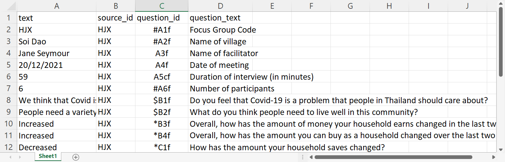
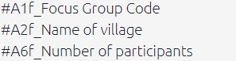

# Importing your data: special cases{#ximport-other}

## Importing from other software

We are aware of the initiative to make qualitative coding software interoperable, [https://www.qdasoftware.org/products-project-exchange/](https://www.qdasoftware.org/products-project-exchange/). Causal Map has quite a different model and at the moment we don’t provide this, but would do if there is a lot of interest.

You can always export all your data at any time using the buttons in the File tab.

### Exporting for import into kumu.io

tbc

### Exporting for import into NodeXL

tbc

## Importing existing causal coding

You might already have causal information, for example in the form of node and edge lists, which you want to import. This is possible in Causal Map. You simply provide an Excel xlsx file with a single tab called `links`, containing just two columns called `from_label` and `to_label` which contain the names of your factors.


## Uploading closed question blocks

If you give the app a single set of closed responses like better, worse then it can make tables like below.

{width=650}

It will recode a fixed set of words into + positive, - negative and 0 neutral. 

This approach only makes sense if you have one larger set of questions with the same set of fixed reply options.

You supply this data in the form of user-defined fields in the Sources table, whose names contain a *. 

You could still, if you want, import a whole bunch of different closed questions with different answer categories as custom fields in the Sources table. So just as you can have gender as a field, you could have "answer to closed question about how often do you go hungry (never/sometimes/often)" as a field. This means you could ask the app to only show the maps of the women, or the people who often go hungry, or the women who often go hungry. The point of the closed questions feature is to organise and provide the answers to a whole block of questions together in one place, to make analsying the data easier.

### QuIP-specific: Uploading hybrid format data (admin only){#ximport-quip}

```{r,echo=F}
knitr::include_url("https://player.vimeo.com/video/664879474")

```

This section is specifically about importing from a QuIP-style spreadsheet. This format has many rows, one for each answer, and includes the statements as one kind of answer; you can import statements and additional data from the same fieldwork file. The main differences to a normal import are:

- Rows whose question code does not include a “$” will be imported only as additional data, not as statements.
- A new question ID will be constructed from the question code together with the question text.

Your xslx file must have just four columns, with column headers in this order:

- `text`, containing the answers
- `source_id`, containing the respondent ID
- `question_id`, containing the question ID
- `question_text`, containing the question text

(Actually the names of the columns does not matter, only the order.)

Your Question IDs may include the following characters:

- A dollar `$` to be treated as a statement.

- A star `*` to be treated as a closed question.

- A hash `#` to be treated as important additional data.


Otherwise your question will be treated as unimportant additional data. Also it is worth noting that all the columns of the `sources` table contain metadata about your sources and can for example be used to create filters (e.g. show me a map which only contains statements from people who live alone). Data whose `question_code` contains a `#` will also be shown in a few additional key place in the app such as the info panel.

You can mix these, so e.g.

`#$* Do you have a house?`

Will be treated as a statement and as closed question (part of a block) and as important additional data. {width=650}

All important additional data, as indicated by the `#` in the question_id, can be found under the [info toggle](#xadditional-information) in your left-hand side panel.

 {width=650}

Closed questions, as indicated by the `*` in the question_id, are imported into the [closed questions table](#xthe-closed-question-blocks-table) and the [sources table](#xthe-sources-table) which you can apply the closed questions preset to.

{width=650}

Plus, the question_code may end with the characters "rank" to mark "ranking organisation" data. [There may be a bug currently such that this data will also be imported only if they are not treated as statements, ie the code should not contain a `$`].

To upload the QuIP-style spreadsheet click on the purple upload button on the right-hand-side panel.

{width=650}

#### QuIP recodes for closed questions - live link

Using this [table](https://www.dropbox.com/s/spiacrl67lqwvc9/quip-recodes.xlsx?dl=0) (which includes spanish) the app recodes your data into + positive, - negative and 0 neutral. 

For example:

{width=650}

This data will be displayed in the Tables panel if you select “closed questions.”


## *Appending* hybrid data

Suppose you uploaded hybrid data from file F, and already did some coding, then you receive more data in file G, also in hybrid format.

Find the original file F on your computer (don' t download from the app!). Paste the data from file G below the existing data in file F, save it as file H, and upload this again. Your existing coding should not be affected; the links and factors you already created will remain.

Caveat: you can't combine roundtripping and appending hybrid data. If you have tweaked or added to your data from file F by roundtripping (downloading the data from the app then uploading again), any changes to statements, sources or questions will be lost if you later try to append data using this hybrid button. So if you need to tweak your data (statements, sources or questions), either:

- wait until you have completed uploading using the hybrid button and only then tweak with roundtripping
- or, manually tweak the old and new data in file H

