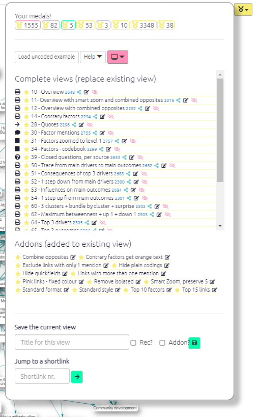

#  The Dashboard{#xdashboard}

The Dashboard appears on the right as the app loads. You can also reach the dashboard by pressing the 🏅 icon on the right, or with the key combination Alt+q (Windows/Linux) or option+q (Mac). 

The Dashboard lists views of the current file saved by you or other users. 

Each view usually:

- applies a particular **filter**, e.g. "show me only causal claims made by women".
- and/or it may take you to a particular **tab** on the right hand side -- the Print map, one of the Tables, etc., including, in the case of tables, the way the table is set up as well. A view also saves the name of the current file.

To load one of the views, just click on the item. 

You can also go to a view if you know its unique number. So to go to view 369, type 369 into this box

 and click the green arrow button.

(Maps which have been downloaded as an image often have a unique number like this in the bottom left-hand corner. )
