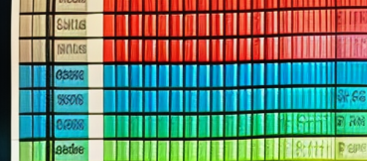
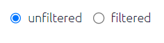
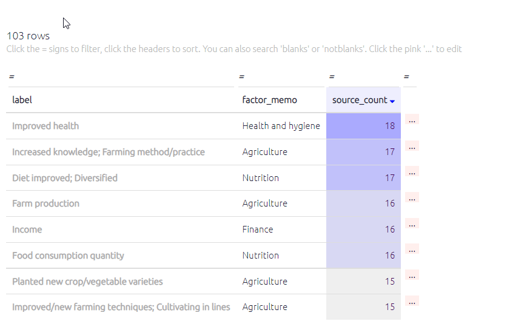
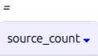

#  Tables{#xtables-basic}

{width=650}

## Features common to all the tables{#tables_common}

### Main controls

Each table has a set of controls, which are the same across nearly all the tables.

When the table is set to "Filtered", the tables respond to any filters you have applied in the left-hand panel of the app, just as the interactive maps do. The table shows data corresponding to the map as it is currently displayed.

If you want to see all the data in one table for the unfiltered map, switch this toggle to Unfiltered.

### Search

You can search / filter the whole table by clicking on the equals sign at the top of a column. To search numerical volumes you can type in the value you are searching for or you can use `>` and `<` to search for values less than or greater than a set number.

{width=650}

### Sorting

You can sort the whole table by any column by clicking on the appropriate header:

