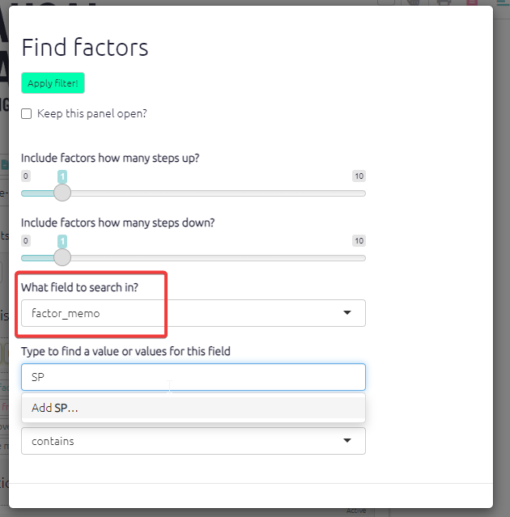

# The Factors table{#xthe-factors-table}

The factors table presents the factors applied during coding. There are columns for label, factor memo, and columns for any other fields you have provided, maybe "domain" for instance. The app also calculates some additional fields like:

- `betweenness` (how central is the factor in the map?)
- `in_degree` (how many links come in to this factor?)
- `out_degree` (how many links come out of this factor?)

This table is an overview which can help us to understand which factors are reported most frequently, and to view and understand metadata like memos. As usual, this table responds to any filters you have applied on the left-hand side and can be additionally sorted and filtered.

The factors table has two presets:

- The `codebook` preset which lists all factors used in the file without any metrics, this is useful for reports.
- `Top factors` shows you the factor label and source count so you can easily see which factors were most mentioned.

As with all tables, you can create your own table. For example, sometimes it can be useful to break down hierarchical labels into first, second, third levels and so on. By clicking adding levels in the columns box you can view a break down of factors' hierarchies. 

{width=650}

## Factor memos{#xfactormemos}

You can include a lot of information about your factors directly in the factor label, especially using [flags](#xflags). But sometimes you want to store information separately from the label, perhaps because you are not interested in ever seeing this information displayed in maps. For example, you might want to record who created this factor -- you or a colleague.

Factor memos are an important part of your Codebook. They appear:

- when you hover in interactive view 
- in the sidebar in the factor editor 
- in the factors table.

You can create and edit the memos from interactive view:

{width=650}

... or from the factors table.

You can find factors with particular memos in the factors table or using filters:

