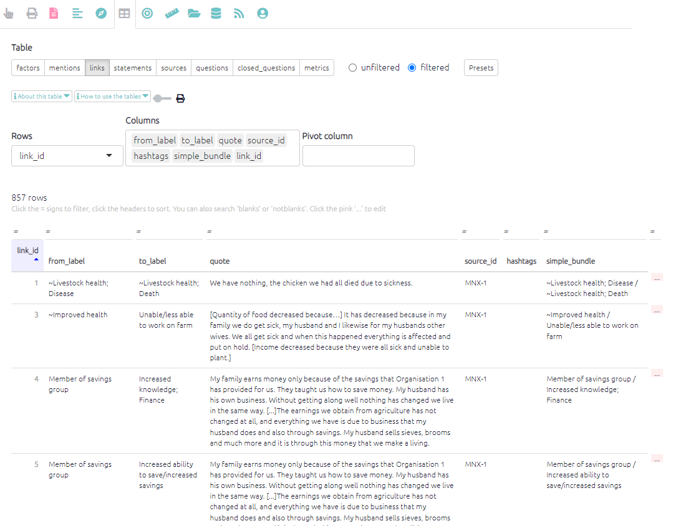

# The Links Table{#xthe-links-table}

This table counts factors differently to [the mentions table](#xthe-mentions-table) as it counts links rather than individual factor mentions. Each row represents one link and has columns for that link’s influence factor and consequence factor, as well as many other columns. This table is also linked to the [statements](#xthe-statements-table) and [sources](#xthe-sources-table) tables. Use this table to show the links between factor labels. Information like the related quote is also available in this table. 

This table has three available presets:

- `Links (basic)` as shown below, which gives you information about each individual link

- `Frequent bundles` which shows the source_frequency for each link bundle
- `Hashtags` which shows the hashtags used and their source_frequency

{width=650}

### Fields

There are many fields you can use as columns or rows, such as:

- `simple_bundle`. Shows the whole link, both the influence and consequence factor.
- `from`. Contains numbers which match the factor_ids of the factors.
- `to`. Contains numbers which match the factor_ids of the factors.
- `statement_id`. Contains numbers which match the statement_ids of the statements.
- `link_memo`. For making notes about a link as you code.
- `hashtags`. [Re-usable tags](#xhashtags) which are usually common across several links, for example #hypothetical or #certain or #check.

