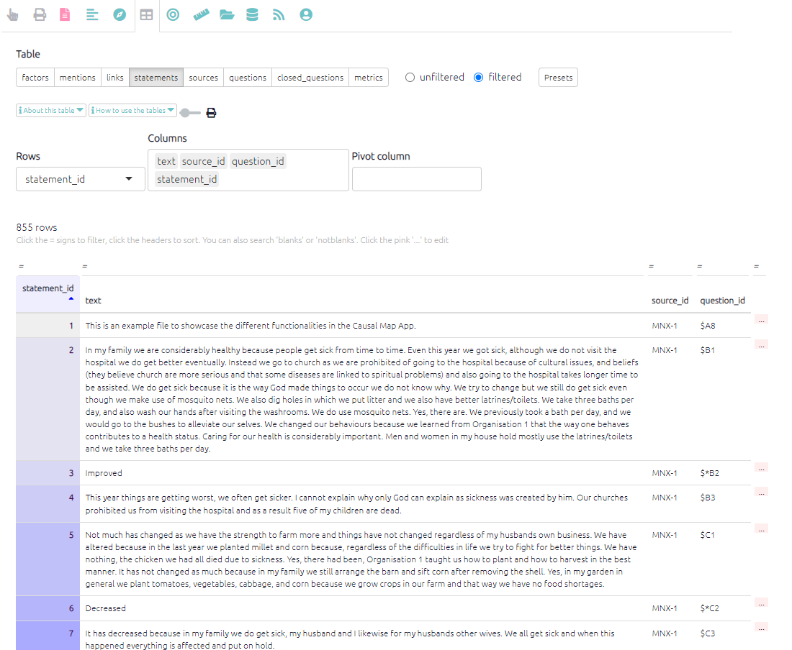

# The Statements Table {#xthe-statements-table}

This table makes searching for a specific statement easy. By clicking on a row in this table you will jump straight to the statement, meaning you can edit the associated factors in the left-hand-side panel. This table shows you all the statements in your map file. You can use the search bars to look for statements by their id or by a word/phrase in the text.

There are two presets for this table:

- `Statements (basic)` this will automatically load when you click on this tab and displays statement id, text, source_id and question id

- `Statements metadata` this preset gives you more information about who said which statement and shows you household code, name of province , village , age as well as the fields listed above. If your metadata fields are called something different just add them to the columns box to display them.

{width=650}

  

Remember the print view button may come in handy to view your table as plain text. 

### Fields

- `statement_id`. A running number from 1 upwards. 
- `source_id`. A code which matches the field `source_id` in the `sources` table.
- `question_id`. A code which matches the field `question_id` in the `questions` table.
- `statement_memo`.  For making notes about a statement as you code.

