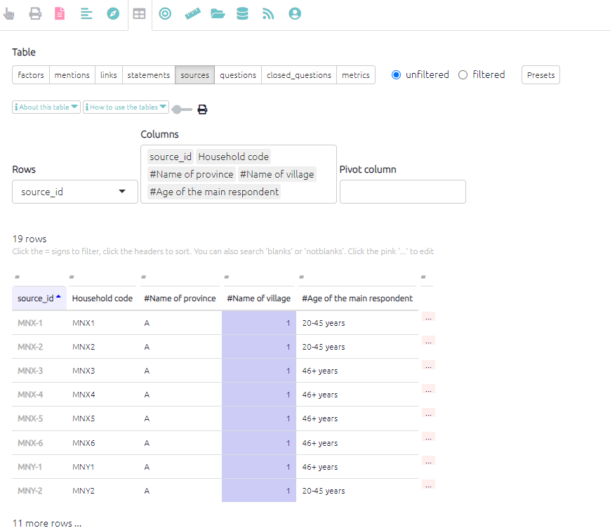

# The Sources Table

The sources table, when there are no filters applied or when viewing the preset filter `Sources (basic)`, simply lists all of the respondents and any additional data collected about them (sex, age, location, education). As with all the tables when filters are applied, the table will only present the relevant sources/respondents. If you are searching and filtering for a specific factor, this table will update and only show sources who reported that factor.

This table can be useful to check that all the sources have been imported into the app correctly. The table also provides a summary of the respondents which can be useful for presenting respondent demographics in the report, either in the sampling section or as an appendix.

{width=650}

### Fields

There are many fields you can use as columns or rows, such as:

- `source_id`. A code which matches the field `source_id` in the `statements` table.
- `source_memo`.  For making notes about a source as you code.
- Any other fields which you have imported.
