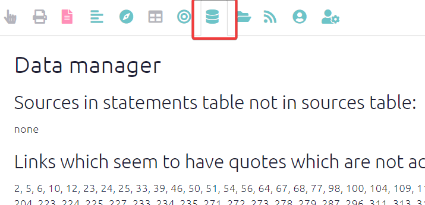
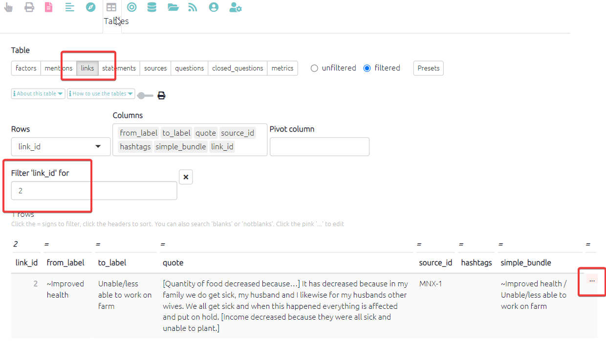

# Data manager {#xdata-manager}

{width=650}

Is your data all uploaded correctly? Does it all make sense? Try the Data Manager tab.

It is good to check this page to ensure your data is in the correct place, especially after you have [uploaded your data](#ximport).

### Sources in statements table not in sources table:

You need to check your sources table to see that there is a row for each one of these IDs You have statements which are supposed to come from these sources but you need to add information about these sources. Fix this by [roundtripping](#xroundtripping):  simply fill in the missing `source_id`s.

### Links which seem to have quotes which are not actually contained in the corresponding statements:

Quotes associated with each link should always be verbatim sections of the original statements. Sometimes they can lose this association, for example if you accidentally edited a quote to make it different from the original statement. You should check these link IDs. **Fix this by clicking on the link ids**, or by searching for the corresponding IDs like this, and then edit the link by clicking the pink "`...`" at the end of the row:

### Missing sources in statements table:

The `source_id` field in the statements table is blank for one or more statements. Fix this by [roundtripping](#xroundtripping):  simply fill in the missing `source_id`s. 

### Sources in sources table not in statements table:

You have sources listed in your sources table which have no statements associated with them (there are no statements with the corresponding source IDs). 

### Statements in links table not in statements table:

The `statement_id` field in the links table is blank for one or more links. Fix this by [roundtripping](#xroundtripping):  simply fill in the missing `statement_id`s.

