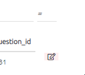
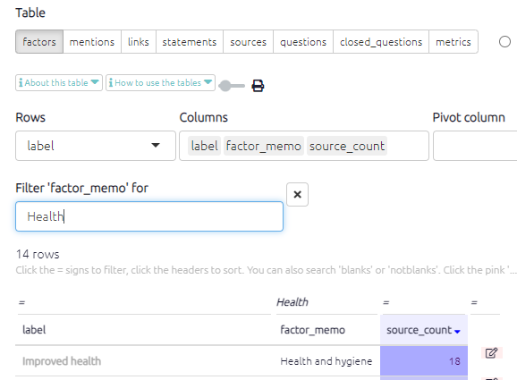
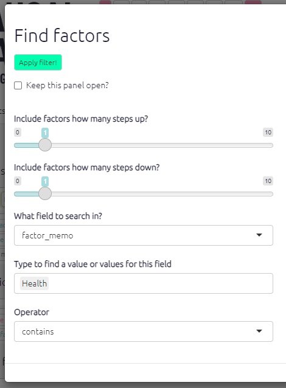

# Memos in Causal Map{#xmemos}

Using memos is an important part of qualitative data analysis.

In Causal Map, you can create, view and edit memos for just about everything:

- The [whole file](#xfile-memo)
- Statements
- Sources
- Questions
- Factors
- Links

Memos for the **whole file** can be viewed and edited from the [file sharing dialog](#xfile-memo)

Memos for **statements, sources and links** can be viewed and edited from the [memos panel](#xmemos-panel).

Memos for **factors and links as well as statements, sources and links** can be viewed from the [corresponding tables](#xtables-basic), and edited using the pink pencil icon at the right of each row:

Memos for **factors and links** can be viewed and edited from the [interactive map](#xinteractive-view).

Memos for **links** can be viewed and edited while you are coding or editing a link.

You can use information and/or hashtags in any kind of memo to filter your tables, like this:

You can use information and/or hashtags in any kind of memo to filter your maps, like this:

