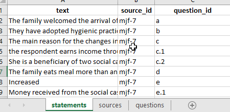
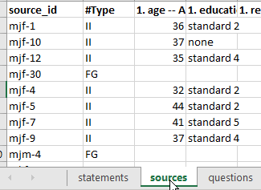
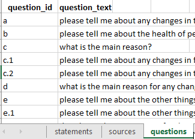
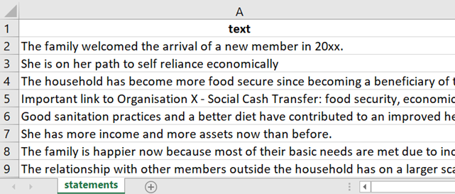

# Uploading your data{#ximport}

This page tells you how to get your data into the right format for uploading to Causal Map. There are different formats to choose from: pick the one which is most convenient for you.

## 🧪Text documents including Word and PDFs{#ximport2excel}

If your data is in the form of several word processing documents like Word .docx or .odt, or plain text documents or even PDFs,  you can  upload all of them at once.. 

Preparing your files: In doc, docx and text files you can separate text into statements by inserting lines containing just '--' where you want to separate statements. Otherwise, doc and docx files will be broken into paragraphs and pdf files will be broken into pages.

Uploading like this does not retain information about page numbers in PDFs. If you need to get the page numbers of each statement when importing PDFs, try [another free utility](https://causalmap.shinyapps.io/pdf2excel/)  (Tool 2) which imports PDFs only but does provide page numbers as an additional column.


### Problems importing PDFS?

This upload  option  may miss text in PDFs which is in boxes and columns.  As an alternative you can export a PDF to Excel (one by one) [here ](https://www.adobe.com/uk/acrobat/online/pdf-to-excel.html). The resulting file is also full of pictures etc but does seem to contain all of the text, although in many columns. 80% of the time it identifies suitably large chunks of text, but sometimes you get very small fragments. 

We provide another our [free utility](https://causalmap.shinyapps.io/pdf2excel/)  (Tool 3) which batch converts any number of these Adobe Excel files into an Excel file which you can then upload to Causal Map.


## Importing a simple wide-format file{#xupload-google} 

This is the kind of data you  get if you have been using Google Forms or ODK. 

In this format, you only need an Excel file with one tab; each row is all the data from one source. Many of the columns will probably be additional data like gender, etc.

Check your data:

- The app will read the first tab and will ignore other tabs in the Excel file.

- Each row is one source. 

Rename your columns: 

- Columns beginning with $ are treated as statements. 

- Columns beginning with # are treated as important additional information.

So this means that if you want a column to be treated as a statement, i.e. you want to code the answers in Causal Map, add a `$` at the beginning of the column name. 

If you want a column to be treated as important additional data, i.e. you want the information to be easily identified for crosstabulation and other analyses in Causal Map, add a `#` at the beginning of the column name. 

### Adding additional cases with wide-format files

You can start coding your data even if you do not yet have all the cases/sources. When you get more data, simply add them to the bottom of the original file and upload again. You don't need to do "[roundtripping](#xroundtripping)". All your sources and statements will be overwritten but your coding (links and statements) will be untouched. The questions table will also be untouched. If you want to add information about your questions, for example adding question text as well as question id, you can use [roundtripping](#xroundtripping). 

## Standard format{#xupload-standard-format}

Causal Map has a standard format for storing data which can be uploaded and downloaded as an Excel (xlsx) file. 

That means you can upload your data the first time using this format, and it is also the format you might later use to add more data or to add data about your sources or questions.

The video below shows you how to format and upload a set of statements for coding to the Causal Map App.

```{r,echo=F}
knitr::include_url("https://player.vimeo.com/video/637121851")
```

You might find it easier to start from the  [Excel template](https://drive.google.com/uc?export=download&id=126fAfkJSbUXkqHp_OkE3af2vdxhMjRy-). 


The app will import any worksheets in your file called "statements" (required), "sources" (optional) or "questions" (optional), and also, if you need them "factors" and "links" and will ignore other worksheets. 

### Formatting a Standard Format file: The basics {#formattingyourfile}

```{r,echo=F}
knitr::include_url("https://player.vimeo.com/video/604138709")
```

When uploading data for coding the only data you **need** to upload to the app is a table of statements as an xlsx file. Your file must have a header row with the names of the fields; the name of the column with the actual responses must be `text`. 

All work names and column names should be lower-case.

{width=650}


Additionally (optionally), you will usually have a column in the statements table called `source_id` and a corresponding tab called `sources` with at least one column called `source_id` containing each source id, with one row for each source, and additional columns giving more information about your sources.

{width=650}

Additionally (optionally), you may have a column in the statements table called `question_id` . If you want, this question_id can already include the question text, e.g. "q1: tell us about your life". But usually it is more convenient to just use a code like "q1" and also include a corresponding tab in your Excel file called `questions` with at least one column called `question_id` with corresponding values, and an additional column `question_text` with the full text, as well as any other information about your questions, e.g. domain or questionnaire section. 

{width=650}

### Pasting data from a Word document into Excel

You can create a standard format statements table from a Microsoft Word document. However if your data is mainly in the form of Word, PDF or other text documents, you may find it easier to [upload them directly](#ximport-text).

Each paragraph in your Word document will become one statement, so make sure your Word document is already structured so this will work for you. Delete any double paragraph breaks in Word (i.e. delete any empty paragraphs). If you want some short paragraphs to appear together as one longer statement, delete the paragraph breaks between them.

Then

- Copy all the text from your document
- Create a fresh spreadsheet file in Excel (or LibreOffice Calc or similar) and select cell A2
- Paste your text.
- Type the word “text” as column header in cell A1.
- Check the statements are the way you want them. You can ignore any formatting, pictures etc which might also have been pasted in because these will disappear in the next step.

The statements are the texts which appear one by one, for you to read and code. Each statement is one row in your file.

{width=650}

If you want to import interviews which are several pages each, you should break each interview into several statements. Ideally a statement consists of between one and five paragraphs – enough to fit on the left-hand side panel when it is displayed there. Usually your text breaks up naturally into sections, for example the interviews might be responses to a number of questions, so your statements might consist of one or a few paragraphs for each question.

We strongly recommend that you don’t try to import statements which are longer than 500 words, as it is harder to code very long statements.

Your statements file must have at least one column with the text of the statements and the header for this column must be “text.” Other columns will be treated as additional data.

### Making a basic statements table by hand

If you want to import longer documents which are several pages each, you should break each document into many chunks or "statements". Ideally a statement consists of between one and five paragraphs – enough to fit on the left-hand side of the Code & View tab when it is displayed there. 

Make a fresh spreadsheet file in Excel (or LibreOffice Calc or similar) 

- Type the word “text” as column header in cell A1.
- Select cell A2
- Paste your text below in the A column, with between 1 sentence and 9 paragraphs in each cell. Note that if you want several paragraphs together in one cell, be careful when pasting.
- Check the statements are the way you want them. You can ignore any formatting, pictures etc which might also have been pasted in because these will disappear in the next step.
- Just the column "text" is enough, but optionally use the other columns for other metadata you might need, like this:


The statements are the texts which appear one by one in the left-hand panel, for you to read and code. Each statement is one row in your file.

The (optional) column `source_id` is special, because it gives you an easy way to provide additional information about each source (e.g. year and country of publication) rather than having to copy this information into your this main statements file.

## QuIP-specific: Uploading hybrid format data{#ximport-quip}

```{r,echo=F}
knitr::include_url("https://player.vimeo.com/video/664879474")

```

This section is specifically about importing from a QuIP-style spreadsheet. 

[Here](https://docs.google.com/spreadsheets/d/1Er6m9XpkP4WcszaiLbmv_xFsc7V1d8H5?rtpof=true&authuser=hello%40causalmap.app&usp=drive_fs) is an example file.

This format has many rows, one for each answer, and includes the statements as one kind of answer; you can import statements and additional data from the same fieldwork file. The main differences to a normal import are:

- Rows whose question code does not include a “$” will be imported only as additional data, not as statements.
- A new question ID will be constructed from the question code together with the question text.

Your xslx file must have just four columns, with column headers in this order:

- `text`, containing the answers
- `source_id`, containing the respondent ID
- `question_id`, containing the question ID
- `question_text`, containing the question text

(Actually the names of the columns do not matter, only the order.)

Your Question IDs may include the following characters:

- A dollar `$` to be treated as a statement.

- A star `*` to be treated as a closed question.

- A hash `#` to be treated as important additional data.


Otherwise your question will be treated as unimportant additional data. Also it is worth noting that all the columns of the `sources` table contain metadata about your sources and can for example be used to create filters (e.g. show me a map which only contains statements from people who live alone). Data whose `question_code` contains a `#` will also be shown in a few additional key place in the app such as the info panel.

You can mix these, so e.g.

`#$* Do you have a house?`

Will be treated as a statement and as closed question (part of a block) and as important additional data. {width=650}

All important additional data, as indicated by the `#` in the question_id, can be found under the [info toggle](#xadditional-information) in your left-hand side panel.

 {width=650}

Closed questions, as indicated by the `*` in the question_id, are imported into the [closed questions table](#xthe-closed-question-blocks-table) and the [sources table](#xthe-sources-table) which you can apply the closed questions preset to.

{width=650}

Plus, the question_code may end with the characters "rank" to mark "ranking organisation" data. [There may be a bug currently such that this data will also be imported only if they are not treated as statements, ie the code should not contain a `$`].

To upload the QuIP-style spreadsheet click on the purple upload button on the right-hand-side panel.


### *Appending* hybrid data

Suppose you uploaded hybrid data from file F, and already did some coding, then you receive more data in file G, also in hybrid format.

Find the original file F on your computer (don' t download from the app!). Paste the data from file G below the existing data in file F, save it as file H, and upload this again. Your existing coding should not be affected; the links and factors you already created will remain.

Caveat: you can't combine roundtripping and appending hybrid data. If you have tweaked or added to your data from file F by roundtripping (downloading the data from the app then uploading again), any changes to statements, sources or questions will be lost if you later try to append data using this hybrid button. So if you need to tweak your data (statements, sources or questions), either:

- wait until you have completed uploading using the hybrid button and only then tweak with roundtripping
- or, manually tweak the old and new data in file H.

### Uploading closed question blocks

This kind of data is common in QuIP studies, which are normally uploaded using BSDR hybrid format. But as it only invovles adding columns to your sources table, it is possible to used closed question blocks in other kinds of study imported in other ways. 

If you give the app a single set of closed responses like better, worse then it can make tables like below.

{width=650}

It will recode a fixed set of words into + positive, - negative and 0 neutral. 

This approach only makes sense if you have one larger set of questions with the same set of fixed reply options.

You supply this data in the form of user-defined fields in the Sources table, whose names contain a *. 

You could still, if you want, import a whole bunch of different closed questions with different answer categories as custom fields in the Sources table. So just as you can have gender as a field, you could have "answer to closed question about how often do you go hungry (never/sometimes/often)" as a field. This means you could ask the app to only show the maps of the women, or the people who often go hungry, or the women who often go hungry. The point of the closed questions feature is to organise and provide the answers to a whole block of questions together in one place, to make analsying the data easier.

#### QuIP recodes for closed questions - live link

Using this [table](https://www.dropbox.com/s/spiacrl67lqwvc9/quip-recodes.xlsx?dl=0) (which includes spanish) the app recodes your data into + positive, - negative and 0 neutral. 

For example:


This data will be displayed in the Tables panel if you select “closed questions.”

