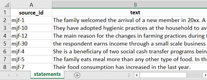
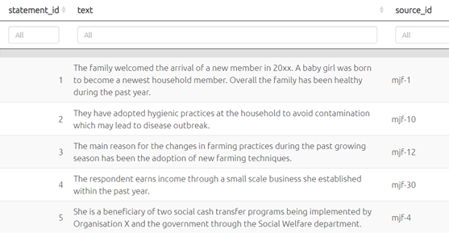
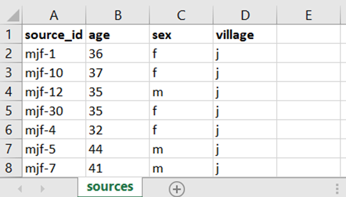
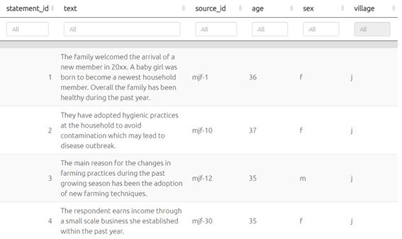

# Uploading additional data{#import-additional-data}

You nearly always have additional information, often about the source, for example about the respondent who provided the information, or about the context of the information e.g. what was the question asked or the name of the interviewer. 

Additional data is just any additional fields related to each statement. You can include them when you do your [initial upload](#ximport), or later. 

### Providing additional data as additional fields in the statements table.

If you want, you can provide all of these fields **as part of your statements table** when you import your data. 

Just remember that the app understands only text and numerical fields so it will treat dates and currency as ordinary numbers. So think about what information the app actually needs from you e.g. it probably doesn't need to know the population of the village your respondent is from. 

When you upload the data, the app also adds a `statement_id` field, numbering the statements to help keep track of them.

However, providing your additional data in this way means that you have to repeat a lot of data, as you will need to provide, for example, the gender and age etc of each respondent for every single statement they made. It is better to import additional data about your sources (and questions) **using separate tables**, as in the next section.

### Uploading using separate source and question tables

Often it isn’t convenient to provide all the data in one table at the same time. For example you might have one table just with the statements and the respondents (say, there are 20 statements per respondent and 10 respondents, so a total of 200 statements), and another table with 20 rows giving information about each respondent, say with just the field “Village” or maybe with more fields. The app can help you combine this data with the statements. Here is an example.

 

If you upload this table ...

{width=650}

... the app will link these sources to the sources via the `source_id` field in the statements table. 

{width=650}

If you had additional information about the `sources`, like this ...

{width=650}

... you can upload this data by [uploading a file in the normal way](#upload-summary) . The app will then add this data to your file, as shown below. The procedure is the same for uploading additional information about your questions, for example question text, or questionnaire section. The app then merges the new information so it is available in [the statements](#xthe-statements-table) table and elsewhere.

{width=650}

However, remember that any data you upload will [overwrite the existing data](#import-general-principles) -- so if you only want to update your sources data, make sure you delete any other tabs in the file you upload to leave only the `sources` tab.

 

