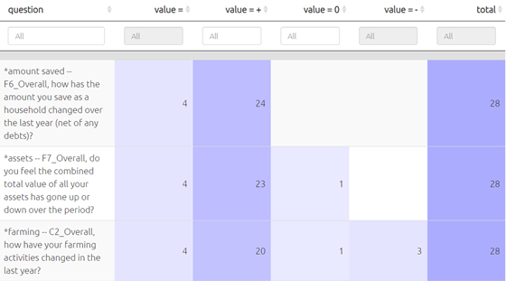

# Uploading additional data like age, gender{#import-additional-data}

You often have additional information to upload, as well as the actual statements you want to code. Often this additabout the source, for example about the respondent who provided the information, or about the context of the information e.g. what was the question asked or the name of the interviewer. 

Additional data is just any additional fields related to each statement. 

You can include them when you do your [initial upload](#ximport), or later, using round-tripping. 

- When you upload in [Standard Format](#ximport2excel), you provide additional data fields like gender as  *columns* in the `sources` worksheet alongside your `statements` worksheet.

- When you upload in [Wide format](#xupload-google), you provide additional data fields like gender as additional *columns* in the file you upload.

- When you upload in [Hybrid format](#ximport-quip), you provide additional data fields like gender as additional *rows* in the file you upload. 

- When you upload [Text files](#ximport2excel), the only additional data you can only provide is the ID of question and/or respondent. You will probably want to later add more information about these respondents using round-tripping.

Whatever format you use to upload your data, you can always continue to add data including additional data like age, gender etc using [roundtripping](#xroundtripping). However, remember that any data you upload will [overwrite the existing data](#import-general-principles) -- so if you only want to update your sources data, make sure you delete any other worksheet in the file you upload to leave only the `sources` worksheet.

## Uploading closed question blocks

This kind of data is common in QuIP studies, which are normally uploaded using the hybrid format. [Here](#hybrid-closed) are instructions for uploading closed question data in hybrid format. 

In Causal Map, closed question data is just another kind of additional data about your sources. So it is possible to use closed question blocks when you import your data in other ways. 

As the answer to a closed question like "how often do you go hungry (never/sometimes/often)" is just another field, this means you could ask the app to only show the maps of the women, or the people who often go hungry, or the women who often go hungry. 

The point of the closed questions feature, which looks for columns in your sources table whose names contain a `*`, is first to recode [a fixed set of words (like better, worse)](https://drive.google.com/open?id=1GBhxQhV5SKHLdb8B_iHcCqT2RvWl44tQ&authuser=hello%40causalmap.app&usp=drive_fs) into + positive, - negative and 0 neutral, and second to organise and provide the answers to a whole block of questions together in one place, to [make analysing the data easier](#xclosed-table).

This picture shows how a single set of closed responses (like "better", "same" and "worse") are displayed in tables like the one below.

{width=650}

This approach only makes sense if you have one larger set of questions with the same set of fixed reply options.

To upload closed question blocks:

**Hybrid format:** follow [these](#hybrid-closed) instructions. 

**Wide format **: simply make sure that the relevant column names contain a `*`.

**Text format:** use [round-tripping](#xroundtripping): simply download your file as Excel, add columns to your Sources table whose names contain a *, and upload again. 

**Standard format:** You supply this data simply by adding additional columns to your Sources table whose names contain a *.  You can supply this data when you initially upload your data or later, by [round-tripping](#xroundtripping).

 

