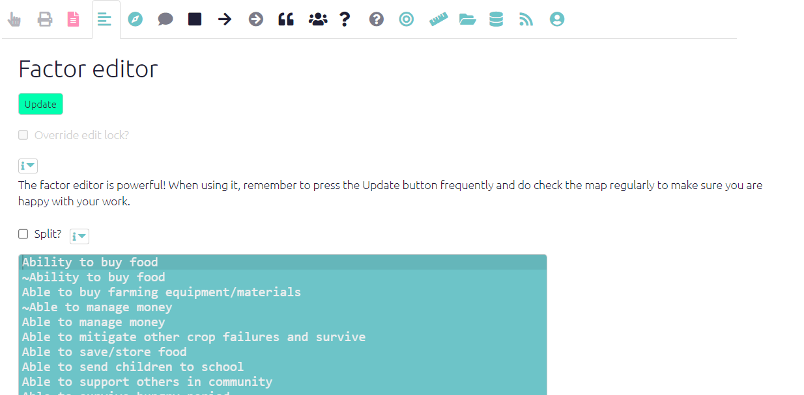
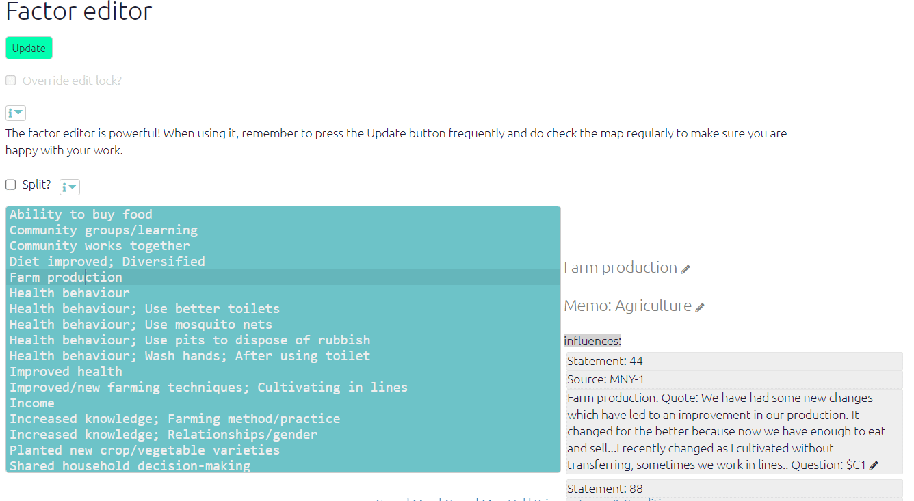

# The Factor Editor{#xfactor-editor}

## Summary

The Factor Editor is a great way to:

- edit your factor labels in bulk
- combine several factors into one

Use the Split checkbox to edit only the factors you can see in the map as currently filtered, and leave untouched any other instances of the same factors in the rest of the map. 

Use the sidebar to: 
  - see and edit your factor memos 
  - see and edit every link to and from each factor

## Editing factor labels in the Factor Editor

The Factor Editor shows the label of every factor in the map as currently filtered, one row for each factor.

So for example if you are applying no filters and viewing the entire map, the label of every factor will be displayed.

To edit one or more factor labels, click inside the editor and retype the factor labels however you want. 

Then hit Update.

::: {.rmdcaution}

You can rewrite parts of labels or entire labels any way you want, but you can't delete or add lines.

:::

{width=650}

::: {.rmdcaution}

Editing factors in the factor editor is **disabled** when you use any of these filters:

- combine opposites 
- zoom factors
- remove brackets

With these filters, any changes you made would be ambiguous. So the app makes it impossible to make edits and the save button should be inactive

:::

**TIP**: press Ctrl F (Cmd F on Mac) to find or Ctrl H (Cmd alt F on Mac) to replace.

**TIP**: Even if you are not using [hierarchical coding](#xhierarchical), formulate your factor labels so that some common themes come *first*. So rather than <u>Eating fruit (Good nutrition)</u> write, say <u>Good nutrition - eating fruit</u>. The Factor Editor will then help you by keeping similar labels together. 

**TIP**: The Factor Editor is especially useful with [hierarchical coding]({#xhierarchical-coding}) because *related labels are displayed together*.

**TIP**: Use [hashtags](#xhashtags) like “Problem!” or “#innovation”, unique words which are easy to search for, to make it easy to find particular kinds of factor within the editor and elsewhere.

## Merging your factors

You have two or more factors which are more or less the same and you want to combine the?

- pick the best version, tweak it if necessary, and then copy the whole line into your clipboard
- go to one of the other versions, and replace the label (the whole line) with the label you copied, **taking care not to delete or add lines**
- repeat with any other similar lines, so that all the similar labels are now exactly the same.
- press Update!
- … these factors with the common label will all be combined into one

## Split-recoding existing factors: Use the **Split** checkbox.{#split-recoding}

Usually when you rename your factors, **the names change everywhere** - every time this factor appears anywhere in your file. 

But maybe you don't want this!

Suppose you have coded both “I bought a cow”“ and "I bought a sheep” as <u>bought livestock</u> and then you change your mind.

Suppose there is just one statement about buying cows.

You can't just go back to this statement and recode <u>bought livestock</u> as  <u>bought a cow</u>, because then the *other* quote (“I bought a sheep”) would also be recoded as <u>bought cow</u>, which isn't what you want.

This is what the Split button is for. If you switch on “Split” and retype <u>bought livestock</u> back to <u>bought cow</u>. and then press Update, only the instance of <u>bought livestock</u> in the current filter (which you can see in the current map) is recoded back to <u>bought cow</u>.

If you switch on “Split”, each factor you rename will be split into a new factor (with the new name which is used only for the links in the current view/filter), *and the original factor is unchanged*. 

The Split checkbox applies to whatever is in the current view - so you can use it to split-recode factors just within one statement, but also to split-recode factors in any filter.

So for example maybe you have used  <u>more work</u> for both men and women and you want to recode it just for statements from all the men, not the women. Then you can apply a filter to show only statements from all the women, and use Split recode. 

## Advanced editing tips

- Go to the next mention of a selected word/sentence: **Ctrl K,or Cmd G on Mac**. Add SHIFT to these shortcuts to find the *previous* mention.
- The app will help you consistently type words you have already used with autocomplete. Or just ignore the autocomplete if you want.
- Multicursor: Ctr alt Up/Down: edit multiple lines at once. This is **incredibly useful** if you want to bulk edit many labels at once.
  - Add next occurrence of selected word/sentence to multi-selection: **Ctrl-Alt-Right,or Cmd-Option-Right on Mac**. Use **Ctrl-Alt-Left / Cmd-Option-Left** to add *previous* occurrence.

## The factor editor sidebar{#xfactor-editor-sidebar}

The factor editor also has a sidebar, which shows more details for the factor currently under the cursor:

- The label (click on it to:
  - edit the factor memo 
  - focus on the factor
  - delete the factor)

- The memo, if there is one (click on it to edit or add a memo)

- Lists of influence and consequence factors, with source and statement ids
  - When hovering over the influence or consequence factors, see the whole original text from the corresponding statement
  - Click on these boxes to edit the corresponding links directly
  
- Note that the sidebar does show you for each factor in the current filter ALL the links / quotes relating to it, even ones which are not in the current filter. This is so you can make a decision about eg changing factor labels which takes into account all the uses of the factor.

   {width=650}

  If you use emojis in your factor labels, especially emojis with skin colours, you may find it difficult to find the right place in the editor. Tip: put the emojis at the end of the label if possible.
