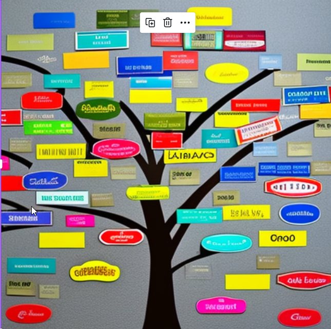
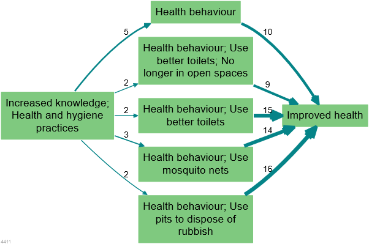
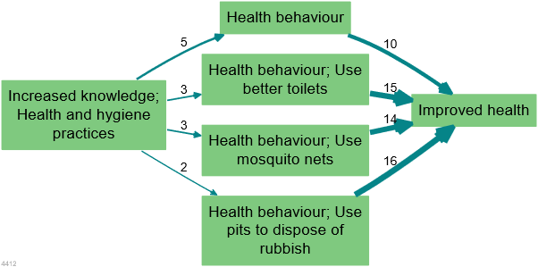
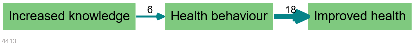

# 📚 Simplifying causal maps with hierarchical coding{#xsimplifying-with-hierarchical}

{width=650}

 (See also the [next section](#xhierarchical-coding) for how to implement these ideas in the Causal Map app.)

## Summary

You can use the special separator `;` to create nested factor labels, like this:

<u>New intervention; midwife training ➜ Healthy behaviour; hand washing</u>

We can read this separator as “in particular” or “for example”:

*New intervention, in particular the midwife training*,

Or we can read it in reverse like this:

*The midwife training, which is an example of / part of the new intervention*

Factor labels can be nested to any number of levels, e.g.

<u>New intervention; midwife training; hand washing instructions</u>

The higher level factors can, within the same coding scheme, themselves be used for coding.

So as well as creating links to and from <u>New intervention; midwife training; hand washing instructions</u>, you can always also use <u>New intervention; midwife training</u> and <u>New intervention</u> as factors too.

e.g. we could code “this whole new intervention has also led to happier health providers” like this:

<u>New intervention ➜ Happier health providers</u>

We can “zoom out” of a causal map containing nested factors to show a simpler, higher-level structure as a summary. This is done by applying an algorithm which re-routes links to and from the lower-level factors into their higher-level parents. 

So then, loosely yet informatively and with certain caveats, accepting a loss of detail but affirming that the overall meaning is not distorted, this algorithm can deduce for us, from the first example above, the following causal map:

New intervention ➜ Healthy behaviour

Usually each higher-level factor will each be a summary of *many* *different* lower-level factors.

## Introduction

An analyst coding text to create a causal map is confronted with the same challenge as any qualitative researcher: identifying recurring themes in such a way as to help a larger picture emerge, while retaining important detail. Expressing factor labels in a hierarchical fashion can help solve this problem. But hierarchical labelling also enables a particular strength of causal mapping: it lets us “zoom out” to view a whole causal map from a higher-level perspective, merging causally similar concepts to give a simpler map with far fewer components. Formally, the process of zooming out produces a map which logically *follows* *from*, is *implied by*, the original map. This chapter also introduces a smarter way to “zoom out” from a causal map, and explains how these features are implemented in the Causal Map app.

When conducting qualitative coding of any text, there is always a tension between wanting to keep the detail (e.g. hand washing) but also to code in such a way that general themes emerge (e.g. health behaviour). One way to do this is to organise the codes into a hierarchical structure, so that “Hand washing” is nested as part of “Health behaviour”. This can be done (see e.g. Dedoose, saturateapp.com) by using labels in which the hierarchy is directly expressed, for example “Hand washing; health behaviour” – using semi-colons or some other convenient character to separate the levels of the hierarchy. 

This approach is convenient for several reasons:

- A search for “Health behaviour” will find <u>Health behaviour; Hand washing</u> as well as <u>Health behaviour; vaccinating children</u> and other combinations.

- It can be arbitrarily extended to any number of levels, e.g. <u>Health behaviour; Hand washing; Before meals</u>

- Related items appear next to each other when they are listed alphabetically 

- The hierarchical structure does not require that the analyst (whether using paper-and-pencil or software) maintains a separate set of “parent” codes; the higher-level codes are simply whatever is visible before the semi-colons. Higher-level codes can be created and changed on the fly without having to open a separate codebook or software interface. 

- It is possible to code directly at higher levels, for example using the code <u>Health behaviour</u> where no more details are given. 

When reading a nested factor label aloud, the semi-colons could be substituted with “… and in particular ….”, e.g. “Health behaviour, and in particular Hand washing, and in particular Before meals”. 

The way factor (labels) emerge during causal mapping is just a special case of the way codes emerge in any qualitative coding process, and nested coding is useful in ordinary qualitative data analysis as well as in causal mapping. However, hierarchical coding in causal mapping is particularly exciting because it allows us to do things like simplify a causal map to give a higher-level version of it with far fewer components. 

## A factor can't belong to two different hierarchies

One limitation to this way of expressing the hierarchy as part of the factor label is that you can’t make one factor belong to two different higher-level concepts. For example, you could understand a particular midwife training both as causally part of a new intervention but also perhaps as causally part of an institution’s in-service training programme or an individual’s workload, but you can’t code it as both “New intervention; midwife training” and “In-service training; midwife training” at the same time.  

This limitation is because of the meaning of the semicolon: the ; in "Y; X" means that this label can be replaced as needed with just “Y” , accepting a loss of detail but affirming that the overall causal story is not essentially distorted. If a hierarchical label had more than one parent, we wouldn’t know which parent to "roll up" the factor into.

If you find yourself wanting to put a factor into more than one hierarchy, try using [quickfields](#xquickfields) or [hashtags](#xhashtags) instead.

## Zooming out

  {width=650}

 

Assuming we have a causal map which has used hierarchical coding, as in the small map shown above, how do we take advantage of this coding to “zoom out”? 

If we define the "level" of a factor as the number of semicolons in its label plus 1, here is the same map, zoomed out to level 2 (i.e. a maximum of one semi-colon per factor). 

 {width=650}

Here is the same map, zoomed out to level 1 (i.e. there are no semi-colons at all).

{width=650}

**A warning**: causal mapping as described here is a *qualitative* process. While zooming in and out can be very useful, it should never be used mechanically. 

### Zooming out is like making deductions with the ; separator

A causal map coded using a hierarchical separator can be "zoomed out" given a specific interpretation of the **;** separator, as follows.

If we know 

New intervention; midwife training ➜ Healthy behaviour; hand washing

then, loosely yet informatively and with certain caveats, accepting a loss of detail but affirming that the overall meaning is not distorted, we can deduce:

New intervention ➜ Healthy behaviour; hand washing

and

New intervention; midwife training ➜ Healthy behaviour

and even

New intervention ➜ Healthy behaviour

This actually reflects the dilemma of the analyst often referred to as *granularity*: with how much detail should I code the beginning (or the end) of this causal story? Expressing a factor as <u>Health behaviour; Hand washing; Before meals</u> shows that this is indeed to be understood as a kind of health behaviour, although of course not the whole of it. By using this approach, the analyst says: if you are just looking for the global picture, I am happy for this factor to be understood as <u>Health behaviour</u>. 

When factors are nested like this within one another as part of a hierarchy, it is possible to give an overview and ‘zoom out’ of the detailed data. This helps to simplify some of the analysis, enabling the user to focus on the links between the top-level groups rather than all the details. It follows that two factors like “Y; X” and “Y; Z” are *causally similar enough to one another to merge into Y* at a more general level. 

Expressing a factor in a form like "Y; X" **means** it can be replaced as needed with just “Y”, accepting a loss of detail but affirming that the overall meaning is not essentially distorted. If you wouldn’t be happy to accept this replacement, don’t use the “;” to code this factor.

## Semi-quantitative formulations work best

We already saw that causal mapping often works best when the factors are semi-quantitative. The hierarchical approach also works best when the higher-level factors are themselves labelled such that also they are *semi-quantitative*, *causal* factors which could be used on their own – in a way which themes or categories [see here](#formulating-labels-semi-quantitative-factors) could not. Good examples would be:

- <u>Social problems</u>

- <u>Social problems; Unemployment</u>

- <u>Social problems; Addiction</u>

- <u>Psychosocial stressors</u>

- <u>Psychosocial stressors; Fear of job losses</u>

- <u>Psychosocial stressors; Pre-existing mental health issues</u>

Here, “Social problems” and “Psychosocial stressors” are higher-level causal factors in their own right; they are not just themes or boxes to put factors into. 

So we might have:

“The problem of unemployment is a psychosocial stress for many”

Social problems; Unemployment ➜ Psychosocial stressors

 

“When people get stressed they often turn to drugs“

Psychosocial stressors ➜ Social problems; Addiction

 

These could be combined into this story:

Social problems; Unemployment ➜ Psychosocial stressors ➜ Social problems; Addiction

 

If we zoom out of the above story, we could focus in on the higher-level factors and in this case we would get a vicious cycle:

Social problems ➜ Psychosocial stressors ➜ Social problems

## Higher-level factors are *generalisations* 

Usually, we don’t use higher levels merely to organise factors into themes which are not causally relevant. 

<u>Health; vaccinations law is passed</u>

<u>Health; mortality rate</u>

These two items can be grouped into a *theme* “health” but can hardly be understood as special cases of a more general causal factor, so it would be a mistake to use the semi-colon. Instead, it would be more suitable to include the word “Health” just as a **hashtag**, without the semi-colon:

<u>Vaccinations law is passed #health</u>

<u>Mortality rate #health</u>

In other words, **causal factors in hierarchies should usually be semi-quantitative**.

### Don't mix desirability!

All the factors within one hierarchy should be desirable, or undesirable, but not both. 

Generally speaking, make sure that the **sentiment of a more detailed factor is interpretable in the same way as the factor higher up in the hierarchy**. Ideally *all* the detailed factors within a hierarchy should be broadly *desirable,* or all *undesirable*, but not both. For example, you don’t want to nest something undesirable into something desirable. E.g. you don’t want to formulate a factor like this: 

<u>Stakeholder capacity; Lack of skills</u>. 

Because capacity would normally be understood as something desirable, and lack of skills would not. If you zoom out to level 1, this factor will be counted as an instance of <u>Stakeholder capacity</u> which is surely not what you want.

Try to use [opposites coding](#xopposites) and the `~` symbol to reformulate as: 

<u>~Stakeholder capacity; ~Presence of skills</u>.

If you zoom out to level 1, this factor will *not* be counted as an instance of <u>Stakeholder capacity</u>.

### Using higher level factors for "Mixed bags"

In spite of what we just said, sometimes you find you *have* use higher-level factors just to group a mixed bag, like this:

<u>Politics; increase in populism</u>

<u>Politics; shift to the left</u>

<u>Politics; shift to the right</u>

<u>Politics; more engagement from younger voters.</u>

The higher-level factor <u>Politics</u> is not in any sense a generalisation of these very disparate factors. However, we can at least think of it as a ‘mixed bag’. If we roll the map containing these stories up to level 1, we’ll see this ‘mixed bag’ factor Politics as a cause and effect of other factors. It will be a bit hard to interpret, but we can live with it as long as we remember that it is a mixed bag rather than a semi-quantitative summary. 

## Hierarchical coding as a way of coping with a large number of factors

Usually analysts are faced with the quandary of either having too many factors which they lose track of, or merging them into a smaller number of factors and losing information. With hierachies, you can have your cake and eat it; it is similar to the process of recoding an unwieldy number of factors into a smaller number of less granular items, but with the advantage that the process is reversible; the information can be viewed from the new higher level but also viewed from the original, more granular level. For example, we can count that the higher-level factor component “Health behaviour” was mentioned ten times, while retaining the information about the individual mentions of its more granular components.

## Don't use a hierarchy when a hashtag will do

When the analyst wants to group certain factors into a theme (like “health”) which is not itself a causal factor, hierarchical coding should not be used. Instead, text hashtags like “#Environment” or “[Environment]” or just “Environment” can be used to create themes simply by adding the text hashtag to the factor label, e.g. 

<u>Soil loss (Environment)</u>

<u>Eco training courses for NGOs (Environment)</u>

or even a symbol:

<u>Soil loss 🌍</u>

<u>Eco training courses for NGOs 🌍</u>

We can still search and filter with text tags, even with icons, as long as they are unique. 

You can use hashtags in parallel with hierarchies:

<u>Training courses delivered; Eco training for NGOs 🌍</u>

## Re-usable factor components as hashtags

Sometimes your factors relate to each other in ways which are not just hierarchical. For example:

- <u>Activities completed; Training; Health</u>

- <u>Activities completed; Distribution; Health; First-aid kits</u>

- <u>Outcomes achieved; Health; First-aid skills</u>

These are three (hierarchical) factors in which “health” appears in different places, and at different levels of the hierarchy. 

This is not ideal, but sometimes it's just the best way to organise a tricky set of factors. 

In this example, "Health" appears only as a "component" of other factors. Although on its own it might look like a mere theme rather than a causal factor, it plays a role in differentiating the causal factors in which it participates, e.g. “Activities completed, in particular training, in particular on health”; and because "Health" is used across hierarchies, it can *also* be treated as a [hashtag](#xhashtags) and can be used as part of searches, lists and counts of factors, etc.

Isn’t that a contradiction? Didn’t we just say that “Health” is not to be used on its own as a factor because it is just a theme and is not expressed in a semi-quantitative way? No, because here the word “Health” does not function as only a theme but as a way of differentiating causal factors: all the actual factor labels in which it participates are correctly expressed in a semi-quantitative way. So <u>Activities completed; Training; Health</u> is intended as a causal factor about the extent of completion of activities, in particular training activities, and in particular health training activities.

