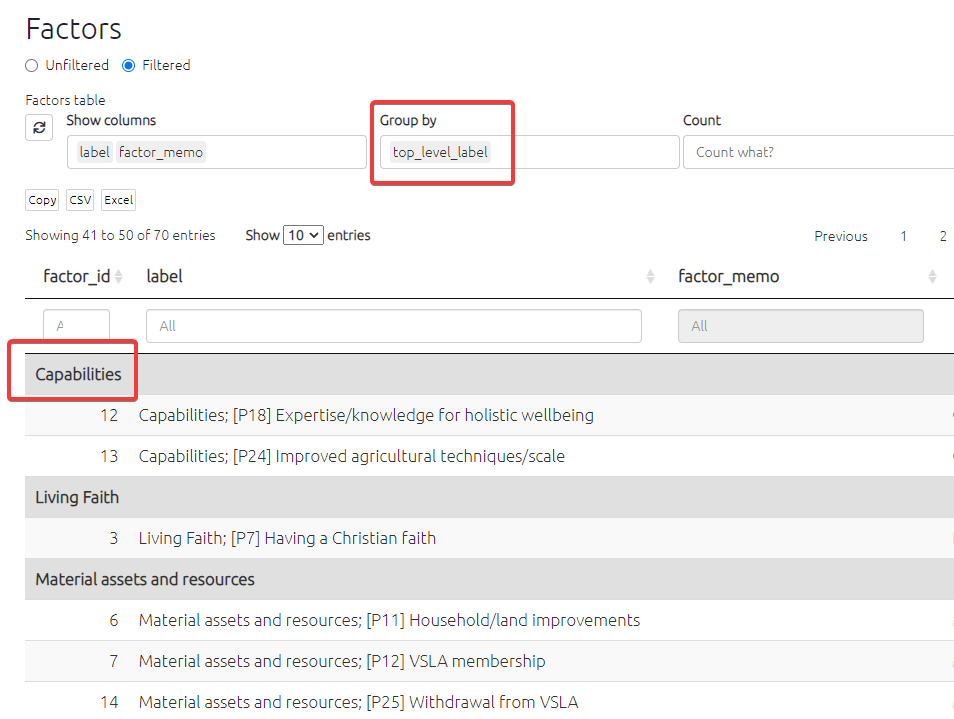
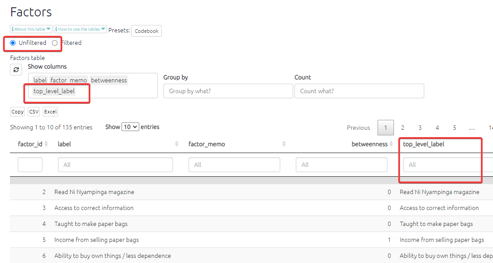

# Hierarchical factors in Causal Map{#xhierarchical-coding}

 (This section is about implementing hierarchical coding in the Causal Map app. See also the [previous section](#xsimplifying-with-hierarchical) on hierarchical coding in general.)

```{r,echo=F}

knitr::include_url("https://player.vimeo.com/video/683770170")

```

## Creating labels

Factors can optionally be expressed as part of a hierarchy by using semi-colons.

For readability, it is usual to leave a space after the semi-colon, but this makes no difference to the functionality.

## Relabelling

In Causal Map, the process of renaming the factors into this kind of hierarchical structure can be conveniently carried out in the [factor editor panel](#xfactor-editor) tab which is a simple text editor where you can edit anything you have created during coding. If you select factors, as in the image below, it will list the currently visible factor labels, sorted alphabetically.

Use `Ctrl F` or `Cmd F` (for Macs) to search.

Use `Crtl H` on PC to search and replace.

Use `Crtl Alt Up/Down` to edit multiple lines at once.

{width=650}

Here it is easy to “move” an (incorrectly labelled) factor 

<u>Health behaviour; understanding of germ theory</u>

to something like

<u>Health knowledge; understanding of germ theory</u>

or

<u>Real-world knowledge; health; understanding of germ theory</u>

simply by retyping it, without worrying about whether the corresponding higher-level path (“<u>Real-world knowledge; health</u>”) exists already.

This editor has many features such as global search and replace, and multiple cursors, which make it easy to rapidly edit many factor labels.

Using this panel you can also combine several factors into one and split one factor into several.

## Additional calculated fields

The app [adds some fields](#xcalculated-fields) for using hierarchies. One of them is `top_level_label` which gives just the top level for each factor. Here it is being used to group factors in terms by their top level component. 

{width=650}

## Additional functionality in the Create & Edit Links panel

Once you have created at least one hierarchical factor, i.e. one with a “;” in its label, the *influence factor* box and *consequence factor* box have some additional functionality to help you. 

- Now, when you start to type, the list of existing factors which you can choose from is extended to include existing factor components, even if they have not (yet) been coded as such. This means it is easier to add new detail to existing or implied higher-level factors.

### Quick tails{#xquick-tails}

{width=350}

  - Suppose you want to create a new factor “Health behaviour; wearing a mask” and you know there is an existing higher-level factor “Health behaviour”, you can select “Health behaviour” from the list and then just add “; wearing a mask” with a leading semi-colon. These two fragments will be combined into a new factor label. This is quicker and ensures you don’t end up with different spellings of the higher-level factors. 
  - This second component can itself have a semi-colon, so you can do this: `health behaviour`  `; hand washing; before meals` . 
  - Also you can do this multiple times: 
    `health behaviour`  `; washing hands;`  `; washing pots` . 
    This can be useful when you have to code a list of things which are all examples of some higher-level idea.
    This example will produce:
    `health behaviour; washing hands` and `health behaviour; washing pots` . 
  - It also works at deeper levels:
    `health behaviour; washing`  `; hands;`  `; pots` . 
    which will produce:
    `health behaviour; washing hands;`  `health behaviour; washing; pots` . 


## Search with nested factors

The same principle applies in the Search and Filter Factors box: you can see factors you have already used but also implied higher-level factors (like “Health behaviour”) and other factor components, beginning with a semi-colon (`;`). 

## How can I view just the factors where I have applied hierarchical coding?

Sometimes you only want to use hierarchical coding for a few of your factors. To view just those, you could create a mini map including just the factors which you have hierarchically coded (and one step up or down from them), by searching for `;` in the factor labels, but then zooming the factors out to just see the top level.


... which is equivalent to


## Viewing the top level labels

In the factors table, you can view your top level factors even when not applying filters.




## Simplifying (zooming out, and filtering out less frequent links and factors) in the app


**Why would I use this filter?**
An unfiltered causal map can be quite overwhelming to begin with as it is presenting all the causal links which have been coded, so this filter can be a good place to start. By filtering out links/factors which have only been mentioned once or twice, the map becomes more manageable, easier to make sense of, and displays only the most frequent stories of change/causal pathways. 
