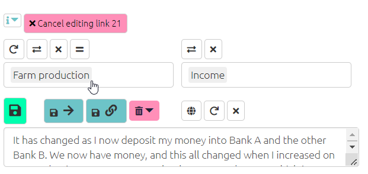

# Editing factors and links (2){#xedit-factor-and-links2}

See also [here](#xedit-factor-and-links1).

It is likely that you will need to regularly review and edit your links, and there are various ways to do this in the app. You can also delete factors and links in the same way, however you cannot delete factors or links when certain filters are applied such as `combine opposites` and `zoom` as these filters represent multiple factors as one factor label.

**Edit factors in the Factors table**

To edit factors in the edit factors table, click on the row containing the factor you would like to alter. This will open the edit panel, as shown above. You can use the search function at the top of the factors table to find the factor you want to change.

**Edit factors and links in the Links table**

In the links table you can edit links and factors by clicking on the row containing the text you want to edit, this will open a panel asking what you want to do with this link. By clicking ‘edit interactive’ in this panel you will be able to edit the link in the left-hand side panel, where you originally coded the statement.

{width=650}

You can also edit multiple factors using the [factor editor tab](#xfactor-editor).
