# 📚 Coding opposites

## Summary

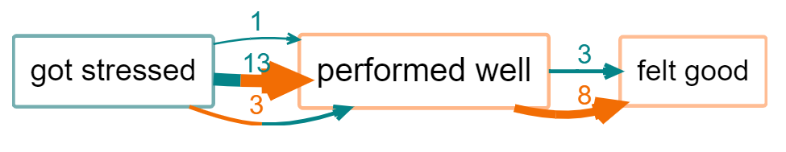{width=650}

13 people say they got stressed (the first section of the link is green) and therefore did not perform well (second section is red), another person said they also got stressed but performed well (both sections green) and 3 people said they did not get stressed and performed well. The border of the factor "performed well" is mostly red because most people mentioned *not* performing well.  

----

In the first part of this Guide we have dealt only with undifferentiated links which simply say "C causally influences/influenced E" or more precisely "Source S claims/believes that C causally influences/influenced E". We call this "barebones style" causal mapping. There is nothing more to this kind of causal map than links between factors. No other features are used. 

Barebones-style mapping can be interpreted in two different ways:

- As in QuIP, to show causal influences between past events. It is an open question to what extent these causal claims can be generalised. It is possible to parse a link from C to E as saying not only that C is something which has the causal power to influence E but also that in some sense C happened and did in fact influence E, i.e. made a difference to it. 

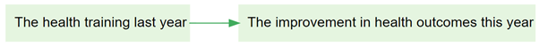

- To show only causal influences between factors, without recording what did or does happen.  


Earlier in this guide we have introduced an additional convention, [hierarchical coding](#xhierarchical-coding), in which the ";" separator is used to indicate that C; D can be read "D, an example of C".

## Combining opposites

Combining opposites is a simple and powerful way of dealing with "negative" factors such as `poor health` which are in some sense the opposite of existing "positive" factors such as `good health`. 

```{r,echo=F}
knitr::include_url("https://player.vimeo.com/video/636997200")
```

In some kinds of causal mapping and systems diagramming, more sophisticated approaches are used in which the factors are considered to be variables and the links between them can have positive or negative strength. The approach we present here is a simpler alternative.

Here is an example of quite barefoot QuIP-style coding in which we have not used strength at all. Nevertheless there are the beginnings of some ideas about (and issues with) polarity: for example, we have `fit`and `not fit`. 

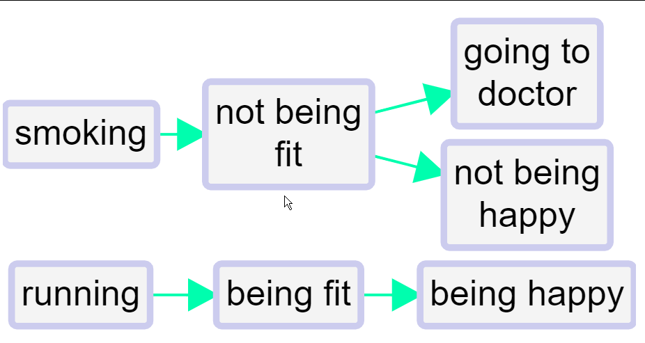{width=650}

We've all done this kind of coding, with classic examples being coding for both employment and unemployment or for both health and illness. This could for example be two different stories about two different people; or it could be different aspects of or periods within one person’s life.

This barefoot style on its own is unsatisfactory. We haven't told the app that being fit is represented with a somehow positive and somehow negative factor. So can't join them up. We can’t compare the way that being fit leads to happiness and on the other hand not being fit leads to unhappiness (and to visiting the doctor). **We can’t for example deduce that running might make visits to the doctor less likely.** Also, if we produce a table or do other analyses focused on healthy habits, we might miss data on the closely related unhealthy habits. 

The first step forwards is to follow this convention:

>To signal that two factors are *opposites* we formalise the idea we already instinctively used in the above example, where we used the word "not" for one of each pair. Formally, we will code them in the form "~Y" and "Y".  The `~` may appear at the start of a factor label. This already ensures that when we search for "Y" we will also find "~Y". 
>
>In the [factors-editor panel](#xfactor-editor), these two factors will be listed next to each other - the alphabetical listing will ignore the `~`. 

We talk about *opposites* rather than positive/negative or plus/minus because that frees us from any implications about valence or sentiment: smoking is the opposite of not smoking, health is the opposite of not health / ill health / illness. 

Where there is some kind of sentiment involved, we do suggest using the `~` sign for the negative member of the pair. But it wouldn't make any difference to the app.

So the same map would look like this, using `~` instead of `not`.

{width=650}

When you press "combine opposites",

​	            

the app combine any pairs of factors which are opposites. It looks at all the factors which begin with a `~` and takes off the `~` where there was one - a process which we call "flipping" the factor. But it only does this if there is already its opposite coded in the file as currently filtered, otherwise there wouldn't be any point i.e. `~running` will remain as such is you haven't coded `running`.


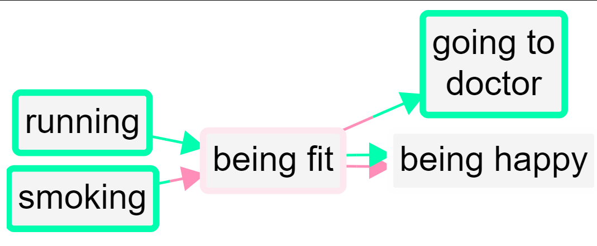

So now there are two factors combined into the "fit" factor and two into the "happy" factor. The "not" factors have their incoming and outgoing links preserved, but when a factor is flipped to match up with its opposite, the part of the link next to that factor is now coloured red. So the lower link from fit to happy is red because the factor at each end of the link has been flipped; the influence factor was originally *not fit* and the consequence factor was originally *not happy*.

So, a link has two polarities: a *from* polarity and a *to* polarity. From a quantitative point of view, the *strength* of the link is their product (if the signs are the same, it’s a plus, if they are not, it’s a minus). So both arrows from fit to happy have "plus" strength, but they are not the same because one is in a sense a negative example of the other. 

This lower link from fit to happy has the same "plus" strength as the one above it but it does not represent the same information. In fact, **no information is lost when you press the "combine opposites" button; you can still always read off the original map from it.** 

But there is more: the *border colour* can reflect the overall polarity of the factor: if there were many mentions of `~Fit` and only a few mentions of `Fit`, the border will be nearly red; if there were equal numbers the border will be white, and the more the positive mentions there were, the greener the border will be. 

If a factor has a red border, that means that at least mostly, its *opposite* was mentioned. So in this example, happy has a grey border because it was mentioned once and its opposite was mentioned once. `Fit` has a slightly red border because it has one incoming and one outgoing plusses, and one incoming and two outgoing minuses. 

However this reflects information which is actually already visible in the diagram. A second possibility is to use the same green-red scale to reflect the proportion of factors contributing to a factor which have been flipped: this information can not otherwise be deduced from the map. It becomes particularly relevant when coding opposites within a hierarchy, [see below](#xopposites-coding). However this colour scheme might be misinterpreted, as it is only affected by the number and polarity of factors which have been collapsed and not by the number of links.

The total of the numbers on the arrows (here all the numbers are 1 so they are not shown) into and out of a factor is its citation count. But now we have additional information and its citation count is also equal to the number of times it was mentioned in plus form and the number of times it was mentioned in the opposite form.  

### Two-tone links

In Print view, when combining opposites the links can be two-tone, with a different colour at each end.

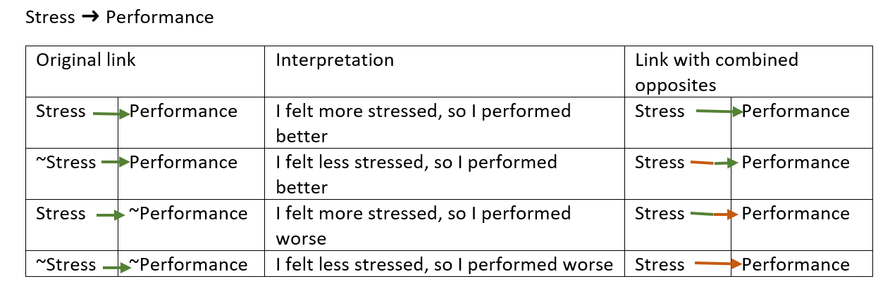{width=650}

In Interactive view, two-tone links are not possible. The first and last cases above are the same as in Print view, but in the second and third cases the links are grey.

With larger files you will often want to bundle the links between each pair of factors. When you combine opposites you will want to combine the links into so-called flipped bundles. There can be up to four flipped bundles between each pair of factors just like in the table above.

### Filtering

When you combine opposites, the app gives you additional combined fields (in the links and factors tables) which you can use to display and filter your maps in various ways. For example, you can keep only links in which come from or to *positively* formulated factors: `find links field=flipped_bundle value=FALSE|FALSE operator=equals` in your advanced editor or: 

{width=650}

## Opposites coding within a hierarchy{#xopposites-coding}

When using hierarchical coding, `~` may appear at the start of a factor label *and/or at the start of any component in a factor label*. 

Here is a similar story, now coded hierarchically. In this example, we only see `~` at the beginning of the factors, not yet within them.

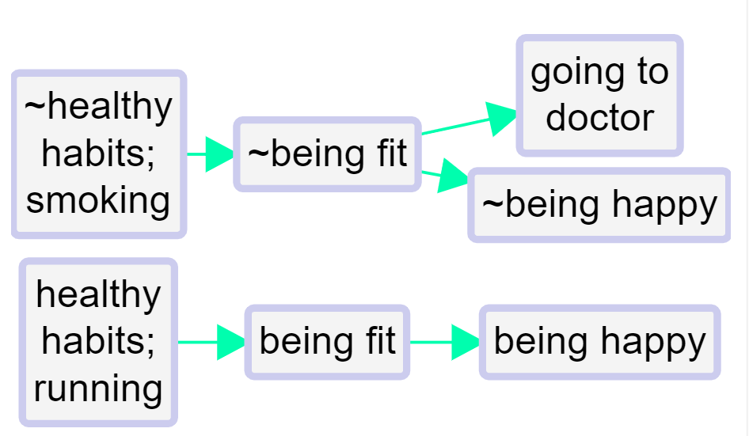{width=650}

When you press "combine opposites", the app tries to combine any pairs of factors which are opposites. It looks at all the factors which begin with a `~` and *flips each component*, taking off the `~ ` where there was one, and inserting one where there was not. 

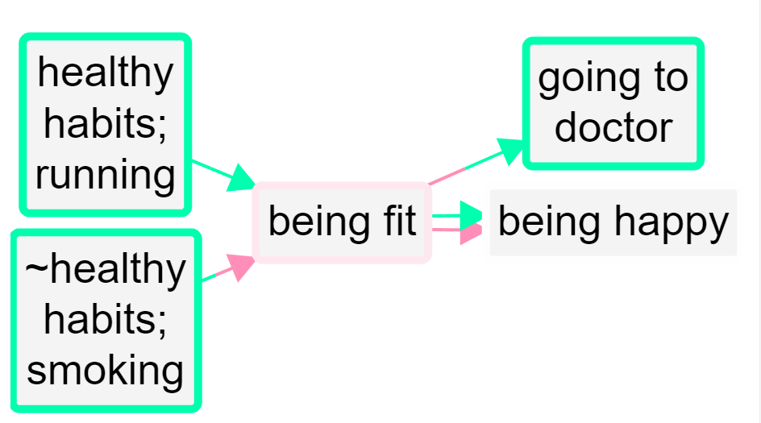{width=650}

Here is the same example, but also "zoomed out" to the top level.

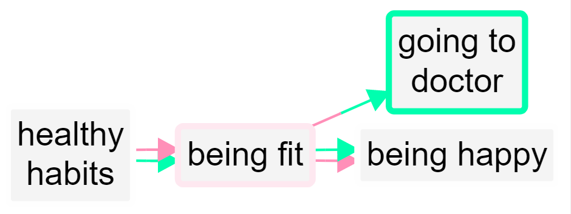{width=650}

A quantitative social scientist might solve this problem by flipping the polarity of the negative examples, coding them as positive but using minus strengths for the connections. So smoking influences good health but with a minus strength. However this always seems somehow unsatisfactory and is complicated to do. It is particularly unsatisfactory when *both* ends of the arrow are flipped in this way so that we code the influence of being unfit on being unhappy as a green arrow from fitness to health!

By default in print view, links in the same bundle, i.e. with the same from and two factors, are no longer always displayed as one, with the frequency noted as a label. If we were using the quantitative approach, some of the links in the bundle may have minus rather than plus strength, etc, and we would have to somehow form some kind of average to arrive at an overall strength score, which is not at all satisfactory. Now, the links are only counted together if they have the same *from* and *to* polarities. So there can be up to four different links from one factor to another in Print view. 

## Opposites coding within components of a hierarchy

Sometimes we need to use the `~` sign within the components of a hierarchy.

- ~Healthy habits; ~eating vegetables

is the opposite of 

- Healthy habits; eating vegetables

Not eating vegetables, which is an example of unhealthy behaviour, is the opposite of eating vegetables, an example of healthy behaviour.

- ~Healthy habits; smoking

is the opposite of 

- Healthy habits; ~smoking

Smoking, which is an example of unhealthy behaviour, is the opposite of not smoking, an example of healthy behaviour.

So here we add one more causal claim to our above example, at the bottom:

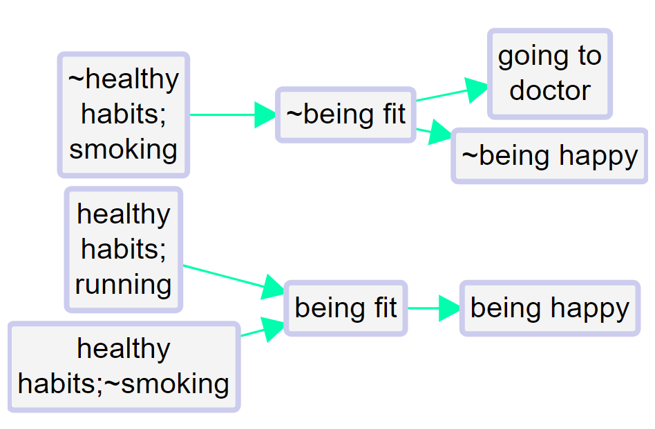{width=650}

The healthy habit of not smoking leads to being fit.

So the app correctly detects that not smoking is the opposite of smoking:

{width=650}

The two arrows at bottom left (one all green, one all red) show that there is one example of this particular healthy habit leading to fitness, and the complementary example in which the opposite of this habit leads to the opposite of fitness.

Zoomed out to the top level:

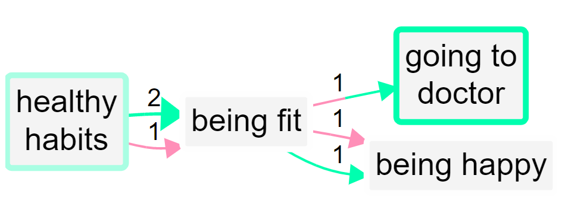{width=650}

The app makes it easy to code opposites; while coding, when you have loaded any factor into either of the boxes, pressing the "flip" button above will flip the factor into its opposite.


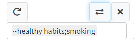{width=650}


## Unpacking opposites

Occasionally you might decide you'd prefer to view a file where you have used opposites coding but with ordinary-language labels like <u>unfit</u> rather than <u>~fit</u> - after all, it's easier to read. By all means, create another version of the file and manually recode your labels back again using the Factor Editor. Remember, you'll only want to recode factor labels which *start* with a `~`, not labels with a `~` elsewhere. We recommend in this case adding a * at the end of each such factor, so that someone viewing the file that this factor does have a conceptual opposite somewhere. 

In this case of course you won't be able to combine opposites any more. 
