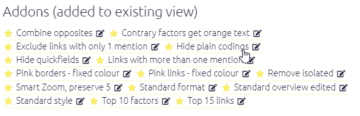
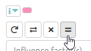
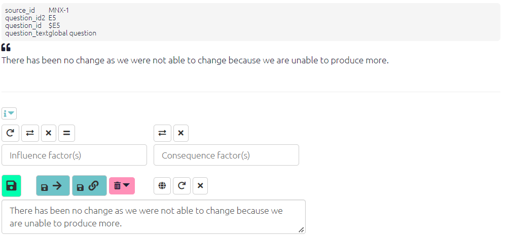

# 📚 Plain coding{#xplain_coding}

## Summary

Causal mapping doesn't usually deal with the kind of non-causal themes which are the focus of ordinary QDA (like in NVivo!). However sometimes it can be really useful to be able to simply note the presence of something without any causal connection. 

We call this "plain coding". You can use it for:

1. Noting the presence of something which is not mentioned as part of a causal link in the statement you are coding but does appear *elsewhere* as a causal factor as part of a causal link. 
2. ...Or noting the presence of something which is "nothing but" a theme and never appears in causal coding.

Causal Map makes this possible in a simple way: we define a "plain coding" as simply a link from a factor to itself with has the hashtag `#plain_coding`. 

Factors involved in plain codings (whether some of the time or all of the time) can of course still be involved in hierarchies and opposites coding just like any other factor.

So by default, plain codings will still appear in maps, as self-loops from the factor to itself, although it is possible to exclude such links by using this filter:

`find links field=hashtags value=#plain_coding operator=notcontains`

There is a shortcut button to apply this filter in the addons section in the dashboard.

It would also be possible to format this kind of link in a special way, e.g. by not showing any arrowheads.

Doing plain coding like this has the big advantage that factors coded with plain codings will still appear in the tables in the ordinary way, so for example the plain coding to (and from) the factor "increased income" will still count towards its source and citation counts. 

It also means that you can easily delete a plain coding from a map by clicking on the link.

The hashtag `#plain_coding` distinguishes plain codings from actual causal links where a factor indeed influences itself, for example if someone says that increased income led to even more increased income -- in this case the hashtag is not used. This hashtag can also be used together with other hashtags for the same link in the usual way.

## What the app does

This implementation of plain coding is unsophisticated and does not involve the underlying Causal Map Functions package at all.

There is just a little button for plain coding. 

- If you press it, it will toggle the hashtag `#plain_coding` (you could also edit the hashtag manually but why bother).
- When a coding you are going to make, or one which you are editing, has this special hashtag, the consequence factor selector is greyed out and always has the same contents as the influence factor.
- When doing plain coding, if you put more than one factor in the first factor dropdown, each factor will just get one link to itself (rather than links being created between all the factors).

{width=650}

## Future

Potentially it is possible then to use Causal Map to code some text entirely with plain codes. 

At the moment, you would have to still have to press the "plain coding" button every time you create a coding, but this could be also made into a default setting.

Should we introduce more functionality around the analysis and reporting of plain codings? Let us know at hello@causalmap.ap
