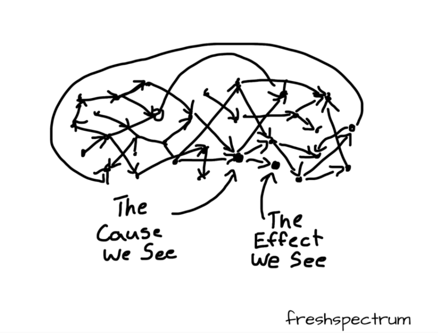

# 📚 Causal Mapping: Definitions

{width=650}

## What is a causal map? What is causal mapping?

A **causal map** is a diagram, a graphical structure, in which nodes (which we call "factors") are joined by directed edges or arrows (which we call "links"), so that a link from factor C to factor E means that, in some sense, someone claims that C causally influences E. Causal maps are used by many research and practitioner teams around the world in a range of disciplines, who employ a variety of methods to construct and interpret them. While one group of such methods is actually called “causal mapping”, there are many similar methods which go by a wide variety of names. 

At the same time, the term "**causal mapping**" is often used as a name for a specific kind of *data collection* method, along with suggestions for analysis. (However, it is possible to have a causal *map* without anyone having intentionally done any causal *mapping*, using information gathered for other purposes.) There are a vast variety of possibilities, with seemingly every author having their own suggestions, from individual interview (Ackermann & Eden, 2004) to reusing open-ended questionnaire questions (Jackson & Trochim, 2002). We distinguish two main kinds of causal mapping:

- Individual respondents are deliberately asked for information about causal links, for example via open questions at the end of a questionnaire or via a series of interviews in which people are directly asked questions of the form “what causes what?” or “what contributed to this event?” For example in QuIP, respondents are asked for causes of changes, and then for causes of the causes, etc. We call this **unmerged** causal mapping because the information from different sources is not yet merged into a single map. When analysing the data, we try to read what the different sources tell us, and bit by bit (“inductively”) try to identify the common elements in their narratives, such as “Health” and “Amount of exercise”. Different respondents will, of course, not always use exactly the same phrases and it is a really exciting and creative challenge to create and curate this list of causal factors: a special kind of *causal* qualitative data analysis. This is your job as causal mapping analyst. For example, if Mo says “Feeling good about the future is one thing that increases your wellbeing”, is this element “feeling good about the future” the same as “confidence in the future” which Sara mentioned? Should we encode them both as the same thing, and if so, what shall we call it? Positive view of future? Does that cover both cases? The Causal Map app is designed for this kind of causal mapping.

- A group of people are deliberately asked about causal links and this information is merged straight away into an overall picture, as a participatory process with the group (Penn & Barbrook-Johnson, 2019). We call this **merged** causal mapping because information from different sources is already combined into one map. The Causal Map app can be useful here too, but it is not its primary use case. 

## Summary

Causal maps are used by a wide range of research and practitioner teams around the world in a variety of disciplines, from management science to ecology and programme evaluation, who employ a number of methods to construct and interpret them. While one group of such methods is actually called "causal mapping", there are many similar methods which go by a wide variety of names. The aim of this section is to point out the similarities and highlight some of the differences, in the hope that bringing these various approaches into one big tent could increase mutual learning.

This definition *could* cover diagrams representing causal connections between variables which are measured in a strictly quantitative way and would therefore also include a wide variety of important approaches from Structural Equation Models (Bollen & Long, 1993) to the modern and general approaches to causation in statistics centred around Directed Acyclic Graphs (DAGs) and the work of Judea Pearl [@pearl2018]. However the phrase "causal mapping" is usually reserved for qualitative or merely semi-quantitative approaches and we will follow that restriction here, while noting that many ideas from these quantitative approaches have implications for their qualitative cousins (Powell, 2018).

This definition is still very wide, covering as it does applications as diverse as "Theories of Change" in programme evaluation and management, and systems modelling in ecology (Moon et al., 2019). The phrase "causal mapping" goes back at least to [@axelrod2015]), based in turn on Kelly's personal construct theory [@kellyPersonalConstructTheory1955]. The idea of wanting to understand the behaviour of actors in terms of internal 'maps' of the word which they carry around with them goes back further, to Kurt Lewin (Lewin, 1982) and the field theorists. Causal mapping in this sense, used widely in project management and political science, is loosely based on "concept mapping" and "cognitive mapping", and sometimes the three terms are used interchangeably, though the latter two are usually understood to be broader, including maps in which the links between factors are not necessarily causal and are therefore not causal maps.

Literature on the theory and practice of causal mapping includes a few canonical works like Axelrod [@axelrod2015]. Already by 1990 Anne Huff had edited a book presenting some of the wide variety of concept mapping approaches in use in the U.S. at the time (Huff, 1990), including causal maps and argument maps. However, literature on causal mapping tends to be dispersed between disciplines, such that causal mapping is "invented" once again in one discipline or another every few years.
