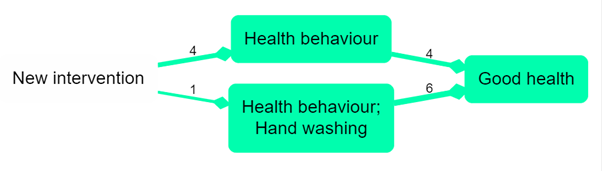

# Smart simplification

Smart simplification as described here would be an interesting algorithm; however it is not yet included in Causal Map.

{width=650} 

Assuming we have a causal map which has used nested coding, as in the small map shown above, how do we take advantage of this coding to “zoom out”? 

Here is the same map, zoomed out to level 1 (i.e. there are no semi-colons at all).

{width=650} 

A weakness of hierarchical zooming is already visible in the example, so simplification goes one step further. In many cases we may be happy to see all the factors “rolled up” to the top level but in the above example, “Health behaviour; hand washing” dominates. “Health behaviour” itself is only mentioned once in the raw data, and there is only one other mention of it as a higher-level component, in relation to vaccinations. What can we do about this? 

Another way to simplify a causal map is just to hide factors and/or links which are mentioned less frequently. Often it is hard to view a full causal map, especially because of the presence of very many of what we could call “tiddlers”: factors with just one or two mentions. But this is unsatisfactory because it throws away information. This won’t help us, but can we combine the two approaches?

A smarter approach is achievable with this simple algorithm: step by step, “roll up” the least frequent factor by one level, and stop when the desired level of generality has been reached, i.e. when the number of remaining factors is satisfactorily small. 

This is an improvement over zooming because it retains detail where it is necessary and removes it where it is not. It will roll up lots of infrequent, granular factors into their parents but only if they are infrequent; if you have a very granular factor like "health behaviour; hand washing" which actually has a lot of mentions, then it won't get rolled up. It will also completely remove infrequent top-level “tiddlers” which cannot be rolled up into anything else. It is also welcome because the process can be stopped at any desired stage to get just the right level of detail.

The above example can be rolled up to this:

 {width=650}

This is an improvement because it still has a small number of factors, retaining frequently-mentioned factors but wrapping up infrequently-mentioned detail into higher-level concepts. 

Not all causal information is always retained: Infrequent factors which are either already top-level, with no nesting, or which already “contain” a few rolled-up factors but are still infrequent, cannot be simplified further and will be hidden from the map. 
