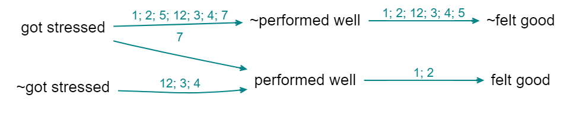

# More about coding opposites

## Reversible?

Combining opposites is not quite reversible: that there is more information in the combined map than in the uncombined map. 

[Above](causalmap.shinyapps.io/CM2test/?s=364) (the links are labelled with source ids), you don't know whether source 12 mentioned the whole route from "got stressed" to "felt good", whereas [below](causalmap.shinyapps.io/CM2test/?s=365) you can see that this is *not* the case. 

So, sometimes you might want to check the uncombined map. 

Combining opposites is a (mild) kind of simplification and every simplification is a potential [transitivity trap](#xtransitivity-trap). 

### Combining opposites and strengths

We are deliberately **not** falling Into the trap of somehow trying to aggregate the different *strengths* to say for example "there are 6 plus links from advocacy to compliance and 1 minus link so this is like 5 plus links because 6 - 1 = 5". We don’t have evidence for an aggregated strength; we have aggregated evidence for a strength. Aggregating different pieces of *evidence* for links with different strengths is not the same as aggregating links with different strengths. So our more conservative approach preserves information.

It’s also possible that someone says "I know this intervention works not only because the intervention made me happier but also because I saw the people who didn’t get it and they are definitely not happier as a result". In this case, we might code both arrows, intervention ➜ happy and not intervention ➜ not happy.

## Graded factors: differences of degree

With coding of opposites we decided to not do any parametric coding e.g. by applying some quantity to the *links* but instead to capture the idea in the factor labels and, where necessary, do some tricks to make the app itself to combine opposite factors. We can use the same idea to capture *gradation* in a barebones way, given that we rarely have any kind of very comparable or numerical information in causal mapping. 

Suppose that usually training leads to increased skills and then we have one piece of information that the training did lead to increased skills but not by very much. Then following the way we introduced the `~` sign, we *could* use a qualifying sign like, say, `@` in front of the factor label: training held → @skills increased. However, we recommend **coding gradations by using hierarchical coding**: 

training held --> skills increased; small. 

After all, a small skills increase is still a kind of skills increase.

## Philosophical discursion: coding with propositions

On the one hand, with the app we want people to be able to code using their own philosophy and we just provide a broad range of compatible tools. But it's also good to have a recommended style and today we are talking about that.

The most important task is also to help depict the causal stories that people are actually telling us in a way which is intuitively readable in the overall map and in filtered maps and reports. 

Nearly all causal mapping uses, in some sense, variables. And the thinking behind causal map as an app comes from this tradition. Although we softened the idea to talk about semi quantitative variables, which are just in some sense, "more" or "less", but cannot usually be numerically measured. Nevertheless, when you have variables, then the links between them are in some sense functions, telling you how the level of the variable at the far end of the arrow is controlled by the variable at the start of it. For example, increasing or decreasing. And, indeed, with the app as it is now, we can do that by coding as strength between minus one and plus one on the arrow. And this is a perfectly workable way to do coding. And to some extent, the app also uses that information for synthesis and visualisation.

You can also call this "parametric" coding: a parameter is some kind of number on each arrow, which tells you how strong it is. 

We also have the ability to put something like qualitative parameters or hashtags on the arrows. These are simply ways to enable us to filter certain arrows or sets of arrows into or out of a map. But they're definitely not numerical, so you can't do any kind of calculation with them.

However, we've moved to a still more primitive or barebones way of understanding what we already do in most QuIP coding
which we think better reflects what people actually say and is not parametric at all, i.e. the boxes are not any kind of variable not even semi quantitative variables, but propositions in the sense of declarative statements like "sold cow" or "income increased". These are simply short sentences, which can be true or false. So our usual causal claim, will be between
two propositions or sentences. This way, we don't need to make any kind of distinction between factors which 
code true/false events like "the law is passed" and factors which are somehow semi quantitative like "amount of income", because we collapse both into simple propositions. So for example, "new tax law passed --> had less income", both of which are true/false propositions. This approach would seem to be just stupidly easy. And it carries a lot less logical baggage with it. So we don't need to worry about the type or nature of the factors or the type or nature of the links between them. Because the links are simply uninterpreted. And just mean, causally influenced, nothing else. This way, a causal map is nothing but structural and encodes only the information about what influences what in some way or other. (It may also be closer to the way we think in terms of the theory of cognitive schemata but that is another story...).

Probably 90% of claims within a set of relatively wide ranging QuIP interviews can be coded, and in fact are coded, this propositional way, without any further ado, no need to rethink "got more cash" as "level of cash".

The problem of course, comes when we get factors which in this way are coded differently, but somehow seems to relate to the same thing. A classic example would be "income increased" and "income decreased"

(There is a related issue about the extent that these are referring to the same thing, for example, are we talking about one household here or several households or a whole country or whatever, and if each respondent is talking about their own household, can we merge this information, etc ....)

With a strength-based variable-based way of coding, we can encode them with a single variable and differing strengths.
Whereas with propositional coding, it might somehow be a common variable but it's coded with two different labels. And we had no formal way of connecting increased income with decreased income. 

(We can imagine almost a social history of measurement and the social construction of variables in the sense of Wittgenstein's
language games at the beginning of the Philosophical Investigations, where people use propositions like "income decreased" and "income increased" without worrying about it, and then when it comes to maybe making financial plans for the future to realise that we have to have some kind of arithmetic which enables us to combine these ideas in a more formal way.)

The point is that in causal mapping of the kind that we do, these occasions are relatively rare. And most of the time we can make do with the propositional approach which is just simpler and faster and more natural in most cases.

There could be much more focused QuIP protocols designed by academics to tease out whether people think X is necessary for Y or only sufficient, etc, but we aren't addressing that here.

So in short, with propositional coding, Decreased Income is coded as ~Increased Income and you can have your cake and eat it: sometimes view this as a separate factor, but when you want you can flip it and combine it with Increased Income, and the app will remember what you flipped when doing summaries etc, e.g. colouring the links differently.

Of course, it isn't just oppositely named factors like income increased in income decreased: a big challenge in causal coding is also differences of degree. And also the claim of zero influence. 

### Zero influences.

We still have no way to encode a zero influence.

