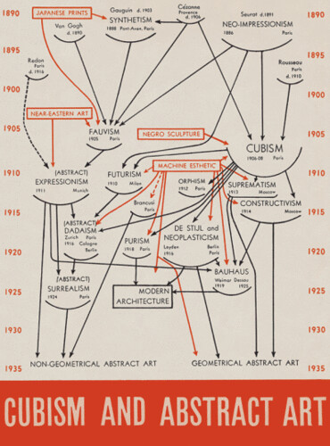

# 📚 Is one direction enough?

Alfred Barr’s famous diagram poses questions for those trying to plot causation, primarily whether one-directional arrows over-simplify relationships and seem to reduce stakeholders agency?

Barr elegantly organises the history of cubism and abstract art styles, artists and places are mapped and flow down through the years. Colours are used to clearly separate internal and external influences, whilst the size of the font reflects their historic relevance.

As Tufte (2006) highlights in his book "Beautiful Evidence" Barr made many interesting and, in some cases, controversial choices to fashion this map - such as the lack of arrow between Bauhaus and geometrical abstract art. Those used to causal mapping will be familiar with the multitude of decisions surrounding the creation of such a map. Barr's choice to have single direction arrows is a decision that has attracted attention and we find very intriguing.

**First, this map implies that the relationships are all one-way.** Expressionism influenced Dadaism but Dadaism did not influence Expressionism. Whereas, art movements are not confined to a set period of time; reality is more complex than that and movements are often interrelated and constantly evolving.  Perhaps the use of unidirectional arrows here makes art history less interesting than it really is?

**Second, and more fundamentally**, the single direction of the arrow can imply an active 'giver' and a passive 'receiver', which can be both problematic and inaccurate as Tufte points out, referring to Baxandall's "Patterns of Intention" (1985). In the case of Barr's map, this means suggesting that artists simply passively receive influence rather than actively learn from other schools of thought. Should we read an arrow as "Purism influenced Modern Architecture" or as **"modern architects extracted inspiration from Purism"?** This second objection cannot be solved by providing additional arrows in the reverse direction; it concerns the active versus passive interpretation of unidirectional arrows.

In international development contexts, theories of change often depict beneficiaries of programmes as passive agents. With unidirectional arrows, organisations often imply that beneficiaries *receive inputs* such as new skills whereas, as we all know, the success of this kind of activity depends equally on people attending and engaging with training. By acknowledging people's agency we can ensure a better understanding of programmes and respect for all stakeholders involved.

How do *your* maps frame the relationships between stakeholders?

(The causal diagram for this post is:

Us —>email from Gary Goertz —>Tufte's book —> Baxandall's argument,

or perhaps:

Us <— email from Gary Goertz <— Tufte's book <— Baxandall's argument.)