# Filters -- overview


```{r,echo=F}
knitr::include_url("https://player.vimeo.com/video/618270513")
```


## **Applying different filters**{#xapplyingfilters}

Filters simplify your graph to help you answer specific questions. You will often apply more than one of these filters in order, e.g. first select only specific factors and then make the most frequently mentioned factors larger.

- **Analysis filters**
  - **Exclusion filters**. These filters simply exclude links and/or factors from the map. So instead of seeing the entire unfiltered causal map, which can be quite bewildering, you see only part of it. For example:
    - show me only information given by women
    - show me only information from the first statement
    - show me only paths leading from <u>My intervention</u> to <u>My important outcomes</u>
    - show me only the most frequently mentioned factors.
  - **Simplification filters**. If you want to combine two similar factors, you will be using a simplification filter. These filters actually involve rerouting links, e.g. if you want to combine the factor <u>Ebola</u> into <u>Infectious diseases</u> the app will need to remove the factor <u>Ebola</u> and reroute all its links so they connect with <u>Infectious diseases</u> instead.
- **Conditional formatting** filters. You can format the links and factors in your map to reflect the data, e.g. you can make factors bigger if they were mentioned more often.
- **Simple formatting** filters. These are simply used to apply overall formatting, e.g. give all the factors a grey border. 


These filters apply powerful filters which change the structure of the unfiltered map. Each filter can be applied more than once and they can (to some extent) be moved up and down.

For example suppose you want to show only links from statements in which the word "women" appears in the `text` of the statement. So to apply a `find statements` filter, you click the button with that name. A dialog will appear, once you have filled in the panel, and you click `Apply filter`.

{width=650}

A new button with an explanation appears in the active bar. The corresponding button below it gets a green tick to show it is in use, but you can click it again to apply another, different statements filter, for example to find links from all statements in which "women" appears and which were mentioned by *men*:

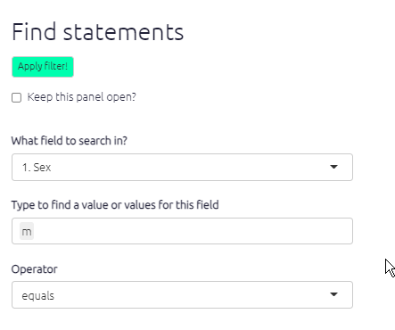{width=650}

In this case, you are searching not the `text` of the statement but the `sex` of the source who made this statement.

## Find factors

### Searching and filtering factors

To find factors which `contain` the word `Food` in their `label`, click `find factors` and type to select factors which you want to find.

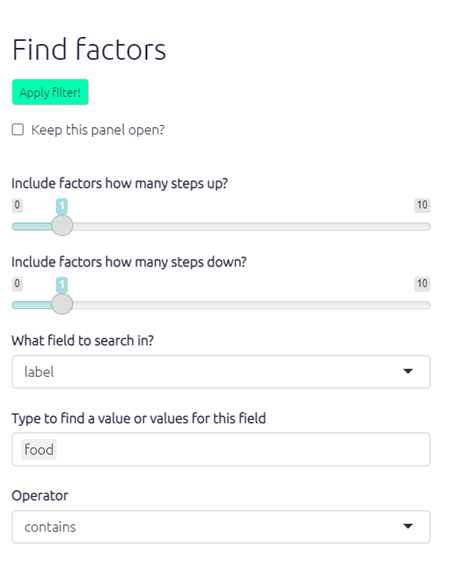{width=650}

- Select one or more pre-existing factors. Press `enter` to accept
- And/or just type fragments of text like `Food` which might match several factors; type a tab to complete

The map changes:.svg){width=650}

- All factors matched by the search are, by default, *highlighted*.
- Only the factors matched by the search and those upstream and downstream (left and right) of them are shown, as many steps as set by the `Upstream steps` and `Downstream steps` sliders.

For a more visual representation: The following examples demonstrate how applying different upstream and downstream step filters affect the causal pathways presented in the map.

**Searching for text ‘Flooding’** 

One step upstream – one step downstream:.svg){width=650}


One step upstream – zero steps downstream:

{width=650}

This analysis function is particularly useful for searching for important factors such as intervention activities or intended programme outcomes and can be used in conjunction with [hashtags](#xhashtags).

This also works when you include 0 steps upstream and 0 steps downstream:

{width=650}

## Find statements, find links {#xfind-statements-links}

These filters enable you to filter the causal map to factor in additional data or respondent/source characteristics.

As each statement is only from one source, filtering for all statements where, say,  gender = female is the same as filtering for all links where gender = female.

To use these filters, select a data field from the dropdown menu. 

- The options available will vary depend on the data you have collected, a typical additional data field might be respondent ID, age, or sex, for example. 
- You can select one or more values (e.g. several age groups or several respondents).
- If you are looking for a particular statement, which you know the id for, you can search for `statement_id` to view that statement. Or you can search for all statements with `statement_id` greater than, say, 100.
- **TIP**: As well as selecting pre-existing values for your search, you can also just type fragments of text which might match several values. So for example, if you are searching question numbers, and you have the questions e1, e3 and e5, instead of selecting all of them you can just type “e”: all the values where this text appears are included in the filter. But be careful that this does not match other values which you did not intend.
- **TIP**: You can use multiple filters all at the same time.


Once you’ve selected your field, then type/select the specific criteria you want to filter by (i.e. individual respondent, age category, male/female) into the Filter by… search box. Use the arrows to the right of the search box to toggle between the different options. You can add more than one value (e.g. several age groups or several respondents).

### Find links

There are a lot of useful filters specifically for links. For example, rather than using `select_links` to select the most frequent simple bundles of links, you can be more specific by choosing only simple bundles containing more than a certain number of original links. The field you need is called `simple_frequency`, i.e. the number of links in each simple bundle. So if there are only 74 links in the bundle of links between factor X and factor Y,  this bundle will not show up if you use the following filter:

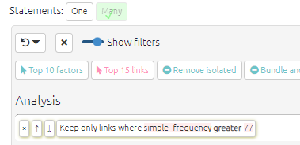

#### Find hashtags

You can filter for links which contain (or do not contain) a certain hashtag. Note that if a specific link contains more than one hashtag, e.g. `doubtful` and `future` you can just that specific link by selecting that specific combination of hashtags from the dropdown, e.g. `doubtful, future`. 

## Highlight only

Maybe you want to just highlight the factors or links you find, but not remove the others. You can do this with the advanced editor, adding `highlight_only=TRUE`:

`find factors value=risk operator=contains highlight_only=TRUE`

`color factors field=found lo=white hi=#7FC97F`

You can use any of the normal conditional formatting options, e.g. `color factors field=found lo=blue hi=red` - the hi colour will be used for factors which match the search, and the lo colour for those which do not. 

This is a useful way to highlight factors which have the opposites symbol `~`:

`find factors value=~ highlight_only=TRUE`

`color borders field=found`

At the moment you can't use this to colour factor background by one criterion and colour factor borders by another (because they both use the hidden field called `found`).

## Remove brackets

This filter hides any tags or other words written between different kinds of brackets. So instead of this:

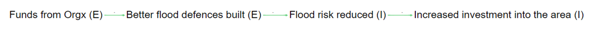{width=650}

you see this:

{width=650}

## Excluding factors, links, statements, sources and questions with `notcontains` and `notequals`


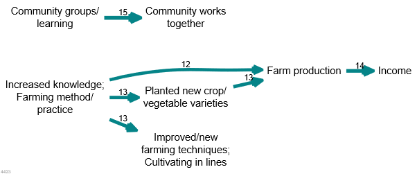{width=650}

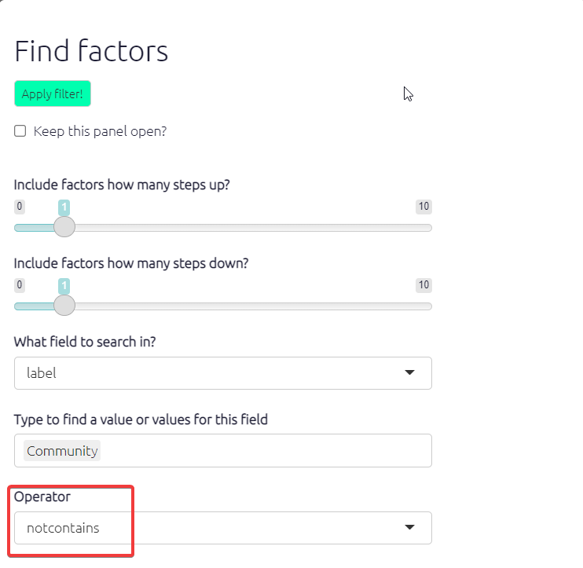{width=650}


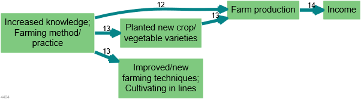{width=650}

Note how, logically enough, following a search for factors which do not contain a certain phrase, all the remaining factors have by default a coloured background.

You can exclude statements, sources etc in the same way. Or you could filter for all links which do not contain the hashtag `doubtful` with this filter:

`find links field=hashtags value=doubtful operator=notcontains`

## Trace paths

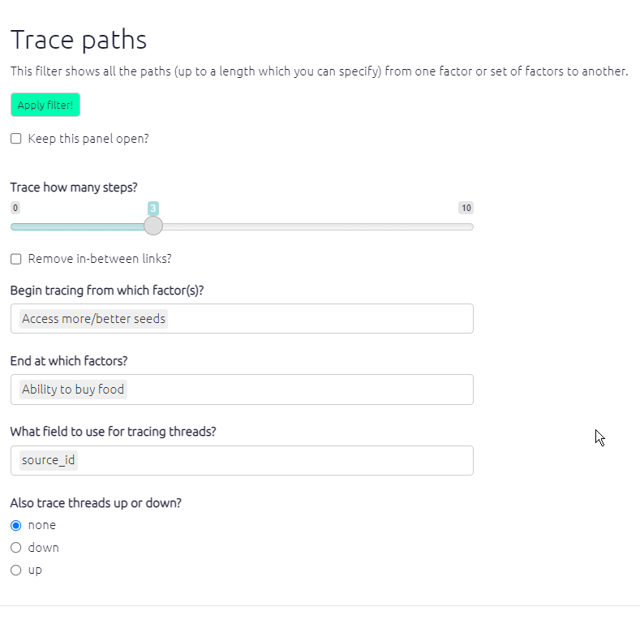

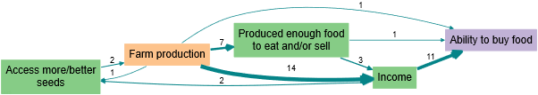{width=650}

4427

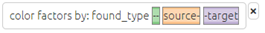{width=650}

This analysis function is a powerful tool which enables you to view full causal pathways and to interrogate the relationships between specific causal factors. 


## Bundle factors{#bundlefactors}

Bundling factors allows us to combine multiple factors into one box. This can be useful if we want to see the influences or consequences of factors with similar attributes. To use this function you just type in the search box what you want the factor label to contain and the app will bundle all the labels containing that text into one. Remember to use the exact spelling and case that is in the factor labels you want to combine. The below screenshot shows all factors including the words 'improved health' bundled into one factor label.

 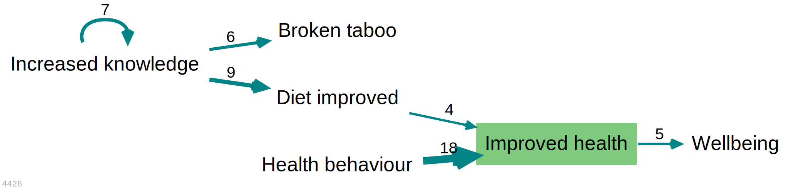{width=650}


## Combine opposites

Combining opposites formats factors so that opposites are displayed in one factor label. Negatives are identified by '~' and must have exactly the same phrasing as their counterpart. In Print view the links are automatically colour coded - red for the negative relationship and green for the positive, so you can clearly see the causal relations.

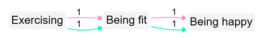{width=650}

## 🧪 Mutate factors or links: calculate new factor or link fields

This advanced filter is only available using the Advanced editor, but it is really useful.

This line 

`mutate factors new=big exp=frequency>2`

will create a new field in the factors table which is TRUE if the frequency of each factor is greater than 2. You can then use this new field to format your map, e.g.

`mutate factors new=big exp=frequency>2`
`color factors big`

You can read the first line as "create a new field called 'big' which is true if the frequency of the factor is greater than 2".

Or this line will pick out the people older than 60.

`mutate factors new=older exp=age>60`
`color factors big`

The syntax for the "exp" aka "expression" part of the line is almost anything you can use for the [mutate() function of the dplyr package]().

## 🧪 Pick factors or links

This advanced filter is only available using the Advanced editor, but it is really useful.

`find_factors` and `find_links` can be awkward to use when you want to select factors or links which fit a logical criterion like one which you created with `mutate_factors`  or `mutate_links`, see above.

This line 

`mutate factors new=big exp=frequency>2`

will create a new field in the factors table which is TRUE if the frequency of each factor is greater than 2. You can then use this new field to filter your map, e.g.

`mutate factors new=big exp=frequency>2`
`pick factors big`


## Filtering group by group

When you use an `equals` filter you are usually filtering for a particular group, for example all men or all statements from a particular district. In this case, "next" and "previous" buttons appear after the full-text description of the filter, as in the figure below. You can use these buttons to click from men to women, or to click through the districts. As in the example, you can use more than one such filter simultaneously. 


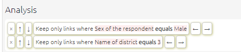

These "next" and "previous" buttons appear when using equals filters with links, factors or statements (except when filtering statements by statement_id, as in this special case the next and previous buttons are already visible in the statement navigation panel below).
