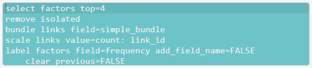
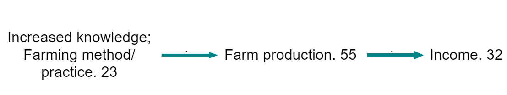
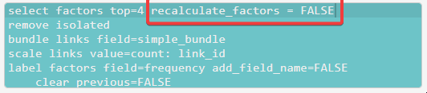
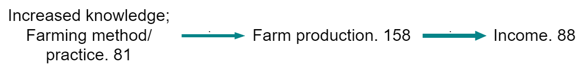
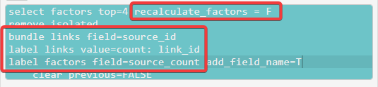
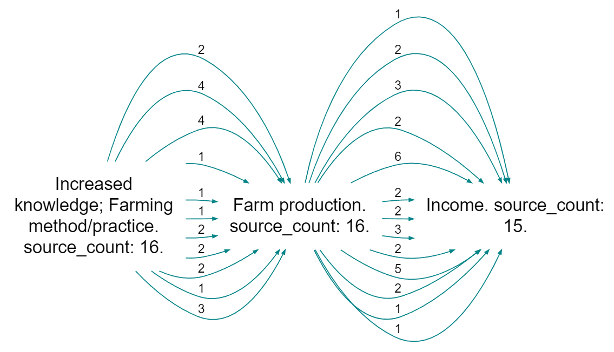

# What is the logic behind the Causal Map filters?

## Keeping it simple

It's easy to end up with complicated filters. It can get hard to explain to someone else (or even understand yourself) what is going on. Ideally you should have a clear model of what you are doing and be fairly consistent about it, and be able to explain and defend it. There is no difference on this point between qualitative and quantitative analyses.

## The order of the filters with calculated fields

We have changed the point in the chain of filters when [calculated fields](#xcalculated-fields) are calculated. Previously, factor frequency meant "the frequency as it was at the start of the chain". Now, it means "the frequency of the factors as they are now at this point in the chain of filters". The same applies to nearly all the calculated fields:

- from_label, 
- to_label, 
- simple_frequency, 
- simple_bundle
- simple_bundle
- to_label, 
- from_label, 
- betweenness, etc.

The exception is the fields necessary to display source continuity, which is another kettle of fish.

We think this is easier to understand and more intuitive.

## Autocorrect{#xautocorrect}

The app does quite a bit of autocorrect for you. It enforces the filter logic. You will sometimes see lines in the Advanced Editor moving around, deleting themselves etc. 

An example: 

You can't have more than one `set print` filter, but you can have more than one `find factors` filter.

Another example: 

The app needs to delete preceding `label links` filters in some cases, but not if preceded by another `label links` filter if `clear_previous=TRUE`. 

The point is to let you chain labels together if you want say source count and also gender, but to delete extraneous label links filters if you are *not* chaining the labels.

## Where do these islands come from in my map?

**It's a really frequent problem that you do either a path tracing or a "find factors containing blah and two steps down etc" and then "select ..." to reduce number of factors or links, and then you get islands of stuff which don't seem to be related.**

If you ensure that your select filters come earlier, you never get these islands and the resulting map makes sense as a product of the find or trace filter which you did. 

This might seem a bit back to front, because in your working steps you usually apply a Find and then try to simplify it. It is also a bit strange in the sense that the numbers on the Select filter aren't as easy to guess. But it works. 

In the same vein, it often makes sense to put any "find links" or "find statements" filters, e.g. looking for a particular village, right at the start. 

Causal Map in any case enforces an ordering of the filters:

1) Analysis filters (each of these can appear more than once)

2) Conditional formatting filters (each of these can only appear once)

3) Simple filters (each of these can only appear once)

## 🧪When do factor metrics like frequencies get calculated?

Compare these two filters:

In the first (the default setting of `select factors`), the frequencies are lower than in the second. 

- The numbers show the number of times each factor is mentioned in the current filter. Because most of the other factors have been removed from the map, the number of incoming and outgoing links is much lower, so the frequencies go down.

- The numbers show the number of times each factor was originally mentioned. 

Both of these are plausible ways of thinking about factor frequencies, how often each was mentioned. We have to be careful to distinguish which we want and how to report the results. 

Factor and link metrics are recalculated after many filters, including `select factors`. 

As you can see, with the filter `select factors` it is now possible to switch off the recalculation of factor metrics by typing `recalculate_factors = FALSE`.

Note this also works with source_count in some circumstances. 

[14091](https://causalmap.shinyapps.io/tokyo/?s=14091)

Here, we are bundling links by source, so you might expect the number on the left to be 11 as there are 11 links leaving the factor. But the number is 16 because we have not recalculated factor metrics; originally there were 16 sources mentioning this factor. 
