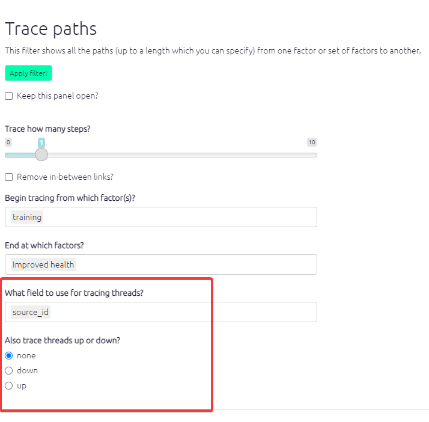

# Tracing threads{#xtracing-threads}

## Summary

When you use the [trace paths filter](#xtracing-paths) to follow paths of influence across your map, the [transitivity trap](#xtransitivity-trap) can make it a challenge to interpret your maps. Some people (or somebody) said that improved hygiene led to reduction in mosquito environments, and some people  said reduction in mosquito environments led to improved health, but *was this the same or different people*?

<!-- these need to stay full width or you cannot read them-->

## Tracing threads

If your map makes it look like Cash Transfer causally influenced Increased Wellbeing further downstream of it, you surely want to know if there are at least some sources who each mentioned the whole of one of the possible paths.  

We call this "tracing threads". A thread is a chain of individual "original links" inside the bundles, whereas a path is just a chain of bundles, regardless of which sources mentioned each link.

Tracing threads is an option within the [tracing paths](#xtracing-paths) dialog. Click to trace threads up or down. Normally you will want to trace by source_id, but sometimes you might want to set, for example, village_id.

"Ah so there are plenty of paths from X to Y, but are there any threads? yes look, here is MXFG-1 who has a thread all the way down".

We can ask "how many threads make it all the way down to Improved Wellbeing"? The threads are named by the source ids, so we can say "Let's look at downstream thread MXFG-1".

When we are tracing threads, we can trace source threads, or village threads, or whatever. But usually we will trace in terms of sources, so if we do not specify which field defines the context, we assume we mean sources.

So a thread is a continuous chain of links with the same ID along a path. Within a bundle of links, each thread is one individual link associated with one ID (or sometimes, more than one link, if the ID mentioned that bundle more than once).

This creates the following calculated fields:

- Links fields
  - has_threads threads
- Factor field
  - threads_surviving
  - threads

You can for example label the links like this `label links value=unique: threads`. 

(For compatibility purposes, the deprecated fields `has_downstream_threads`, `has_downstream_threads_surviving` etc. are also available.)

You can for example colour the factors like this `color factors field=threads_surviving`. So if you set a filter to *trace threads downstream* from Cash Transfer C, imagine factor C is coloured completely red, and imagine a factor F immediately downstream of it being coloured with an intensity of red according to the number of sources which mentioned the link from C to F. In fact every factor downstream of C will be coloured with a shade of red in the same way. The central question of whether any source mentioned a whole path from C to, say, "Increased wellbeing" can be answered simply by seeing whether there is any red in the colour of "Increased wellbeing" or whether it is completely white. 

... So you can just look at C and watch its influence (in terms of source continuity) seeping downstream and spreading out along all source-complete paths.

It's like ink starting from C and flowing downstream as long as there is source continuity.

Tracing threads upstream asks about causes of effects rather than effects of causes: "Increased wellbeing" is completely red, and the redness of "Cash Transfer C" depends on the number of sources which mention a complete path from C to Increased wellbeing. 

Tracing paths anchors the filter to one or more factors, and if you use thread tracing to format an aspect of the map (e.g. to colour the links) then this formatting is only related to this specific set of origin and/or target factors and will change if you trace from and/or to different factors.

In this example, the width of the links reflects the number of sources mentioning it, but the colour of the links (and factors) reflects how many sources have  a continuous story starting from "Living in a refugee settlement" all the way up to that point. This difference is also shown in the pair of numbers on the links: the first number is the source thread count, the second is the source count. So the top-right link was mentioned by one source, but the 0 shows that no single source mentioned a story all the way from "Living in a refugee settlement" which also includes this link.
