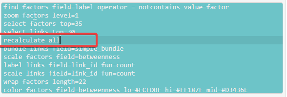

# Recalculate fields{#recalculate}

This function is probably unnecessary.

<!-- put your comment here 

You can use fields like simple_frequency and betweenness with conditional formats to format your links and factors. For example, you can colour your factors according to their frequency -- how many incoming and outgoing links they have. 

But what happens when we use other filters at the same time. For example, if we filter only for factors with a certain label, if we are going to colour them according to frequency, are we thinking of the original frequencies or the new (presumably smaller) frequencies they have after applying the other filter(s)? 

By default, we'd expect to use the initial frequencies and other metrics. But sometimes we might want to use metrics later in the chain of filters. 

The filter `recalculate all` (only available by typing in the advanced editor at the moment) is a bit hard to explain but we think it will make sense to you quickly and you might want to use it frequently.

Here, for example, the colour of the factors (last filter) now depends on the betweenness *as it is at the end* of the find, zoom, and select filters at the top. This means that the betweenness colouring makes sense for the visible map rather than depending on invisible features which have been filtered out.

If you want you can also use `recalculate factors` and/or `recalculate links` if you only want to recalculate the fields for the one or the other, or if you want to recalculate them separately, at different points in the chain of filters.

Sometimes you might use `recalculate links` just to recalculate the field `simple_bundle` to bundle your links into bundles which are currently relevant rather than the origin.

-->
