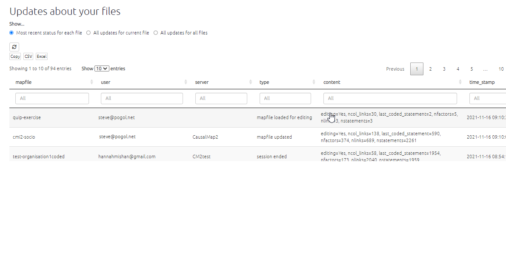

# The Updates tab{#xupdates-tab}

In this panel, you can see updates about all the files you have access to. 

With the toggle at the top, you can select whether to show:

- The most recent status for each file 
- All updates for the currently loaded file 
- All updates for all files

You can also click on a row to load the corresponding file. 

{width=650}

