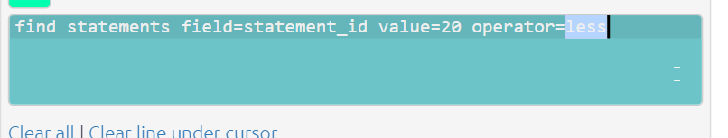

# Auto-coding using AI{#auto-coding}

This exciting new possibility to do auto coding at Causal Map.

Live on Tokyo. It's visible only to people who are hard coded as admins at the moment.

Auto coding is a new tab. The UI is not terribly sophisticated at the moment, but I'm not going to spend too long working on it. Until we're sure how we think this should all work. 

You can do already some production level coding using it with a relatively small amount of human tweaking.

## Languages

As far as we know, you can provide prompts in English to process un-translated non-English texts and it should work fine. It would probably be better to have the prompts in the same language a

## It isn't cheap

The big caveat is it's not cheap because when using GPT-4. There is a switch for this. 

If using GPT-4, work on small files to start with. 

If the batch is very large, the app switches to 32K model which is even more expensive per character.

## The coding prompt

The default prompt is a sort of generic prompt, which gives instructions to chat GPT API to to recode the file in the very generic way.

Even this generic way works quite nicely. 

## Identifying links

You can provide any prompt you want and this will be applied to currently visible statements. BUT in order to actually identify links (which is the whole point), the output needs to include at least some lines including the "`>>`" symbol, which we call the "double-arrow".

Each line of the form X >> Y will be converted to a link from X to Y. 

Each line of the form X >> Y >> Z will be converted to two links from X to Y and from Y to Z, and so on.

## Ensuring quotes are provided

So all of our approach is about making sure that there's always quotes and evidence behind the causal links that we're identifying. So you could just say to chat GPT, please find some kind of causal map based on this entire set of transcripts. And it would come out with something probably quite good, but you wouldn't know what its evidence was for each of the different links. It would just do its own thing. That's not really scientific and I'm not sure that as evaluators you could really justify doing that.

What we want is always to have evidence behind each each of the causal links that it finds, which we do with the prompt. 

We have two ways to do this, two styles, ways of telling the AI to print out the coding that it's found.

### Colon style

We ask the AI to name the from_quote and the to_quote after the from_label and to_label, separated by colons.

The app then calculates the entire quote using fuzzy matching.

### Slash style

We ask the AI to give us the whole quote at the end of the line, separated by four slashes.

In this style it is easier to specify how to work with longer chains rather than individual links. And it is required when you send several statements in one batch.

### Limitations

Prompts can only be used to add information to factor labels, not link fields like the "hashtags" field. 

Other information like quickfields e.g. `increased yields time:2013` and other factor tags are part of the factor label and so in principle can be added to the prompt. But we haven't tried that.

## The prompt library

There are other prompts in this prompt library.

- Basic prompt. 
- Social science prompt. Similar, but it's also got the idea of a high level concept and a mid level concept. And it also suggests using kind of more better, less worse kind of coding in terms of resources. You can imagine like resources, motivation, success.

  Resilience, those kinds of things have been kind of quite high level concepts, which you want the the AI to recode into.

  

And if you then click on an example prompt, the actual prompt itself is inserted in the coding prompt box.

If also when you mouse over them, as I said, you can click on them to see exactly what's going to happen.

All your previous prompts are listed, which have been used on this file, or which you have maybe used on some other file.

It's also useful to see exactly what was how this file has been processed in the past.

You can also delete previous prompts.

## Auto coding: Clicking "Go"

Coding changes the file.

It makes a new version of the file with some or all of the statements coded or recoded. So you might consider making a copy of a file first that you're working on and then working on the copy. Of course, you can always restore an earlier version using the versions feature.

The also recoding or coding works on all the statements which are currently visible in the map. So right now there are nine statements in this file altogether.

Auto coding always only works on the active statements, the ones whose links are displayed in the current maps. 

So if we switch to one we'll see that just only this statement one would be also recoded or we could say, for example let's focus on all the statements which are between one and three. So this way we should see that one, two and three will be listed in the pink bar.

So this way it is easy to use the existing filters functionality to code say all the men over 40 from village X. 

As you will frequently want to simply look at, say, all the statements up to statement 20, this kind of filter can be useful. 

There is already some coding in this file. But anything we do now would overwrite the recoding for those three statements.

Coding many statements is done in parallel, so coding a whole file takes longer than just a few statements but not as much as you'd expect. It does quite a lot of work in the background to make sure that all of those queries that are being sent in parallel are all kind of dealt with nicely.

And you'll see in a minute it says, so it's added to a couple of factors and removed a couple of links because we were already, there was already some coding there.

You might then want to go through the links one by one. 

### Batches / all at once

At the moment, each statement his treated as a separate chunk for processing unless you flip the slider to process all statements at once.

The concept of statement and where the statement breaks are is very important because the AI processes each statement separately in a separate process. So it has no idea what's the other statements look like or what solutions it's found for the other statements. It won't necessarily use the same labels, for example. 

If you press the button to process all at once, you glue all the active statements together and send them all up.

And then the AI looks over all of these maybe five or five hundred pages of text. And then provides provides coding all at once.

It has to use **slash style** in order to tell us exactly where it's found each of those causal claims.

Now you would imagine this naively might work better because it's got the app has got the opportunity or the AI has got the opportunity to look over.

In practice this needs some more experimentation. I've. I'm not that pleased with the results. It tends to be sort of more global in the way it approaches things.

### Large batches or small batches?

A paradox: generally it's better to provide larger chunks of text at once so the AI can get the whole context and make links from far-apart pieces of text. but if you do that, it is harder to provide appropriate quotes and to be sure exactly what the AI has done.

## Inspecting and improving coding

 This panel can be useful to check the progress of your coding. Green is good!

First, you want to check that your initial prompt is doing the low level, the grunt level stuff:

- is it actually finding the right sections of the text 
- is it providing suitable factor labels for each claim.

### Tagging statements as examples

I've now finished recoding this just exactly the way I want it. I will then label this one as as well.

I toggle the info toggle and in the statement memo box I put the word !EXAMPLE. And that's kind of a bit crude, but it's nice because it uses the existing functionality of the statement memo.

And if you add that to one or more statements, I don't suggest doing it too many, then it will treat those particular statements that you've marked in that way as a kind of template for how to do coding. 

Then press the button to add an additional piece to the prompt, which tells it to do exactly what you did in this particular statement.

## Clustering

Especially when we submit statements separately (but in parallel) to be coded, which is the default, we'll find that, for example, we might have things like a label, covid and another label pandemic, for example, and obviously they're talking about the same thing.

So we want to tell it: Now, please look at some of these most important things and kind of cluster them together.

And the question is then, how do we do this clustering? 

We have two ways. Both can be used iteratively.

#### Getting help with clustering

To get AI help in finding clusters, press this button and it'll go through all of the factors that are currently in the file and find some that are nearly synonyms. 

TODO: distinguish better between hierarchies.

This clustering prompt itself can be tweaked. You can give it some sensible suggestions for labels before you even start.

Note we don't want to cluster just things that are a similar theme but **near synonyms**. This phrase seems to be very good to get good clusters but you can change this prompt if you want.

Once you've done this, **output panels become visible**, including the clusters it found and a recodes table.

The cluster recodes it suggests are then attached to the file and area available to the `recode factors` filter.

### Clustering 1) Providing clustering suggestions for the prompt

We identify clusters either manually or using the AI and go back to the and tweak the original prompt simply to suggest factor labels it might like to use and then *recode the active statements again*.

So this approach does recode the file, or parts of it. 

Then once you have decided on your preferred labels, with the help of the AI or not, we add something to the recoding prompt 

#### Prefer specific labels

either just say "prefer factor labels like these: Covid-19, etc" 

#### Prefer specific labels and for each provide list to reinterpret as the preferred label

More explicitly your prompt can say"prefer factor labels like these: Covid-19, etc, and if you see synonyms like 'the pandemic' then use Covid-19 instead".

### Clustering 2) Using the *Cluster factors* filter

Here we're not recoding an existing file. 

Clustering is another filter which keeps the coding as it was and then simply clusters the factors just like, say, `zoom factors` does without changing the underlying coding. 

## Importing from StorySurvey

See [this page](#ss-to-cm).

<!--

So you can play with this if you want to but when you press this button. It then sends all of the factor labels in the file in this case there are only nine statements to the AI again, not asking it now to do any coding but simply to look at the factor labels and put them.

And to set a groups now what we then do that is with that is perhaps a bit surprising we don't.

We don't look at the details of exactly what fact. As in each group and so you have to recur this one as that one and recur COVID-19 as COVID and recur the pandemic as COVID-19 etc.

What we do is simply look for the. Look for each. We'll just look at the most typical label in each group and say, well, we'll use this one.

So we'll simply say to the AI, when you're doing your coding, please consider using these particular labels and that's. That seems to work really well, so it makes life very simple.

So when it's finished that process, it might take a little while with a, with a complete file. So here on each line, it's not really easy to see what each line is.

So. For example, here, I don't really like some of these, but here it says sending children to school with money from sales.

And here. A sharing profits not really quite the same thing.. A children being able to attend learning centers and VTC is better communication.

So I'm just going to talk about the coordination of learning centers. Even that is all going to be not quite the same thing.

Support provided by CBF facilitator support provider by I gate here they're separated with this pipe symbol. Let's, let's more or less the same thing.

So, what we're going to do. It is not necessarily care about all the rest of the things in this cluster.

So it doesn't really matter in the end. What happens, what's listed after this first one. We're just looking at the first one.

And this first one that it's found in each case, it should be sort of probably presented in the more sort of highlighted way, like better life skills outcomes for students.

We're going to, when we press that here, it's going to insert into the prompt window. Use these labels where appropriate and then it's going to, it's listed just the first one, the sort of like the mother, if you like, not the mother, but the sort of most typical member of each of those groups 

enter the prompt and all it says is just. Use these labels where appropriate, it's pretty simple. Yeah. And it's this, these things in this particular case, this file is really nice.

These, these three things that make sense to. So it's simply saying, look, these are sort of typical. Things that come up.

If this kind of stuff comes up, use this label and not some similar label. Perhaps we could perhaps tweak this tech to text to be more explicit about that, but it works really well.

So rather than literally clustering. We're not doing it post hoc. So we're not clustering after we've done some coding. We're recoding all over again, but rather than saying, Oh, here's a long complicated list of lots of different things you might want to consider as one.

We simply say. Here are some labels that might come up concepts that might come up again and again. Please use this label for them.

And that seems to work great. So if I were to press this button now, you'd see that. And of course you might want to tweet these little bit.

. You'll see that with basically this prompt and a little bit tweaking here. In this case of the file with any nine statements, I can pretty much capture everything.

With this list of suggested factors and produce a really nice result of, of a file which has already kind of, yeah, probably ready to send to the client.

So.. There's quite a lot going on here. And there's one more thing that I haven't mentioned yet is the what I've called here, the social science prompt, which.

Not only has labels like suggest labels like more better resources, more better support, less worst resources, etc. And in future, I can imagine we might suggest things like presence of something absence.

Of something working our way towards opposites coding. You'll see also that we've got two levels in the hierarchy. So we're suggesting high level concept, mid level concept, and then the details.

And this seems to work also very well. I was surprised how well it worked. Without any further tweaking of this prompt.

So perhaps as a sort of final fun thing to do. We'll, we'll do some coding like this. So, we're going to code all nine statements.

We're not going to submit them as one batch. We're not going to use any example statements. We're simply going to use this naive prompt here, which doesn't have any specific material.

It's interesting. It's got no specific material at all from this. From this file. So this is a generic prompt you could use anywhere and which we would then probably go on to tweet with some using this clustering button to provide some specific labels.

We suggest. It uses, but I think you'll find that the results from that aren't bad, even though. As is by default, we're not using.

We're not processing all the statements as one batch, but we're doing each. So, you know, the statement is being processed separately.

So you kind of expect chaos really, but because we've suggested to it, it's a sort of more standard way of expressing the ideas.

The results are not that bad. So say here we're on twenty. Five minutes this video. And so there's a lot to say.

And we're going to have to start getting around to writing some of this down. So it's it's removed some factors.

I didn't see how many it had added. But it's finished now. And so if we look at the print map now for all nine we see that the roughly the same sort of thing is going on.

See, some of these are quite long because don't forget they've got the verbatim quote at the end of the label.

So you wouldn't normally, use the you wouldn't normally use the this without zooming a bit. In this case, we're going to zoom all the way to level one.

So we're looking at what we'd call the higher level factor. And, well, it's worked nicely in the sense that there's quite a few things that have come up quite a lot.

But it's not worked well in the sense that it's here, for example, it's used COVID-19. In pandemic and also pandemic.

So we would have to go back and use the other button, this clustering button to to provide some suggested labels.

For these kind of clusters of ideas, but what it's done quite nicely is provide is find. Quite good high level, higher level labels with the.

Things like more better resources support provided by etcetera. And this is just the the top level. If we were to change this to I can't see that because it's behind the.

Loom button to. I'm going to move this to two. And now you'll see the all the labels with the higher level and mid level concepts, but without the.

Details afterwards. I would have thought, ah. That didn't make a lot of sense because I was. I mean to level one and level two at the same time here so you can see that.

In some cases it's provided. A higher level and a lower level. I doesn't work very well. Because. Yes, that needs a bit of work.

Anyway. So there's a pretty good intro and I think it's half an hour so I don't have anyone still listening.

## Costs

For OpenAI models with 32k context lengths (e.g. gpt-4-32k and gpt-4-32k-0314 ), the price is: **$0.06/1k prompt tokens**. $0.12/1k sampled tokens. 

So a file of 32K, which is around 25 k words, around 100 pages, would cost around $32*.06 = $1.92. That's a lot. Assuming the number of returned tokens, which are even more expensive, is small. 

`example-file` has around 34k words on 60 pages (11pt, single spaced).  It would cost around $2 to code using the 32k model, or $1 with the 8k model (in batches).

Coding ten statements from that file costs on average one cent.

But using 3.5 costs one thirtieth: the whole of example-file costs 10 cents.

-->
