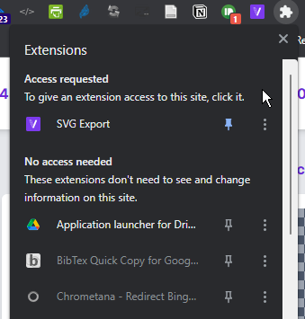

# Exporting the print map

## 🧪 Test server

Just click "Export SVG" below the Print map. You can then paste the downloaded image file into word processors including newer versions of Microsoft Word. 

## Main server

If you use the Chrome browser, go to https://chrome.google.com/webstore/detail/svg-export/naeaaedieihlkmdajjefioajbbdbdjgp/related and install the extension. Then click here to enable the extension on Causal Map:

Now, any time you want to export the print map as an svg file, click the V icon, select the Print Map (which is called %0) and save it. You can paste the resulting file directly into newer versions of Word.
