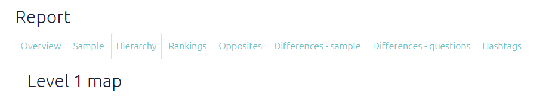

# 🧪Reports 

At the moment, this functionality is only available for admins, who will see a "Report" tab. When the "link" is visible, a report has already been created and is accessible via that link. At the moment, these reports are not permanent and may have to be recreated by clicking the `Create report` button. If the link does not appear, press the `Refresh` button.

The link leads to a separate file which at the moment is in html format although Word and PDF files might be possible. This report is constructed from a simple markdown template which could in future be customisable, i.e. you could write your own report within the app, including or excluding modules to suit. At the moment the output is just a rough hack. 

If the `sources` table (or `statements` table) includes any columns which end with the word "rank" or "rank#", then a QuIP-like table of ranked organisations is displayed near the start of the report.

One interesting section at the end shows which links were preferentially mentioned according to different groups e.g. women more than men.  We ask:

> does the proportion of women vs men who mention this link differ from what you would expect (given the total number of mentions of links by both women vs men)?

|                                            | Women  | Men    |
| ------------------------------------------ | ------ | ------ |
| *... other links ...*                      |        |        |
| Number of mentions of the link from X to Y | 10     | 9      |
| *... other links ...*                      |        |        |
| **Total number of mentions of any link**   | **60** | **10** |

In this case we can see that although women mentioned the link slightly more often than men, women altogether mentioned links twice as often as men. So we can compare the number of mentions of the link with the number of "non-mentions" of the link. So we can work out this table (not shown).

|                                            | Women | Men  |
| ------------------------------------------ | ----- | ---- |
| Number of mentions of the link from X to Y | 10    | 9    |
| Number of mentions of any *other* link     | 50    | 1    |

We can do a simple chi-squared test on this table to see if the ratio 10:9 is significantly different from 50:1 (which of course it is) -- this is the same question as to whether 10:50 is significantly different from 9:1 (which of course it is). If this test is significant, the row "Number of mentions of the link from X to Y" is shown in the table, and the intensity of the colouring of each cell reflects its chi-squared residual, i.e. how different is the number it contains from the number you would expect, given the other numbers?  

This comparison is agnostic as to whether there are, say, many men or a few men who talk a lot.

At the moment, the tests for this are chi-squared tests which would not give special treatment groups which are actually ordinal e.g. low income, medium income, high income: the chi-squared test is weaker than it should be.

Another useful section is a summary map for each question, as in the picture. 

## 🧪 New reports tab

The new reports do not require clicking a `Create report` button.

Export to Word and PDF files might be possible in the future. 

The main purpose of this tab is to provide an overview of a mapfile which makes sense and is immediately useful without any complicated searching or setting of filters. 

We do not plan to provide much customisation of these outputs. Possibly the different outputs here could also provide links to the existing, equivalent filters in the rest of the app, so the user can tweak them there instead. 

Here we describe the different sub-tabs.

### Sample

List total numbers and %s for all key groups, i.e. columns in the sources table which begin with either `#` or `x_`.

### Hierarchy

If the mapfile includes hierarchical coding, show maps zoomed out to level 1 and level 2.

### Opposites

If the mapfile includes opposites coding, show a maps in which opposites are combined.

If the mapfile includes hierarchical coding, show a map in which are opposites are combined, then zoomed out to level 1.

### Rankings

If the `sources` table (or `statements` table) includes any columns which end with the word "rank" or "rank#", then a QuIP-like table of ranked organisations is displayed in one of the sub-tabs.

### Differences - questions

Shows which links were preferentially mentioned in answer to different questions.

### Differences - sample

Shows which links were preferentially mentioned according to different groups e.g. women more than men.  We ask:

> does the proportion of women vs men who mention this link differ from what you would expect (given the total number of mentions of links by both women vs men)?

|                                            | Women  | Men    |
| ------------------------------------------ | ------ | ------ |
| *... other links ...*                      |        |        |
| Number of mentions of the link from X to Y | 10     | 9      |
| *... other links ...*                      |        |        |
| **Total number of mentions of any link**   | **60** | **10** |

In this case we can see that although women mentioned the link slightly more often than men, women altogether mentioned links twice as often as men. So we can compare the number of mentions of the link with the number of "non-mentions" of the link. So we can work out this table (not shown).

|                                            | Women | Men  |
| ------------------------------------------ | ----- | ---- |
| Number of mentions of the link from X to Y | 10    | 9    |
| Number of mentions of any *other* link     | 50    | 1    |

We can do a simple chi-squared test on this table to see if the ratio 10:9 is significantly different from 50:1 (which of course it is) -- this is the same question as to whether 10:50 is significantly different from 9:1 (which of course it is). If this test is significant, the row "Number of mentions of the link from X to Y" is shown in the table, and the intensity of the colouring of each cell reflects its chi-squared residual, i.e. how different is the number it contains from the number you would expect, given the other numbers?  

This comparison is agnostic as to whether there are, say, many men or a few men who talk a lot.

At the moment, the tests for this are chi-squared tests which would not give special treatment groups which are actually ordinal e.g. low income, medium income, high income: the chi-squared test is weaker than it should be.

### Differences - sample

Each row . 

### Differences - question

For the unfiltered map, level 1 map and combined opposites maps, every link is displayed which is answered significantly differently between qu 

### Hashtags

### Custom

This section shows maps from the most recent 10 filters for this map which have been saved as shortlinks.
