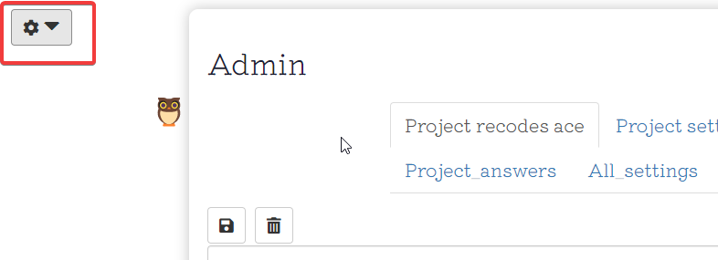

# Using StorySurvey: admin interface

This documentation is work in progress.

You have to log in as admin. 

Then, access the admin interface here:

## Explorer

Here you can click to explore the factor structure

## Map

A view of the complete map with all links with frequency of 2 or above

## Project recodes

All the current recodes on the current project, including factors which have been hidden.

## Project settings

TBC

## Project answers

TBC

## Project questions

If you change the text of the questions and there are already answers recorded, these answers will become detached from the original questions.

Each question can also have a short version which is used instead of the long question in the maps.

## Project recodes ace: The recodes advanced editor

The tab you need is `Project recodes ace` which is the first tab.

### Basic idea

The idea is that you recode daughters like Y into mothers like X by adding X; in front of Y.

This is very similar to the idea from Causal Map that `increased income; cash from sale of pig` is an example of `increased income`, but with StorySurvey the more detailed part of the label is already created by the respondent, and the analyst's job (or the NLP's job) is only to classify `cash from sale of pig` as an example of `increased income`.

Also, in Causal Map, the different lower-level labels should be meaningfully different variations of a central idea, whereas in StorySurvey that is only half the job, the other half is simply about merging different formulations of exactly the same idea.

Unlike in Causal Map, in StorySurvey the purpose of the recodes is not mainly to be able to sometimes display outputs with all the different variations. In StorySurvey, the daughters in a recode set are more like the different quotes in Causal Map -- they serve to give colour to, and illustrate, each individual factor.  

### Full hierarchy

In future it will also be possible to have more than one level, e.g. improved life; increased income; cash from sale of pig` but this is not possible yet so DON'T TRY IT.

### Making changes

As with Causal Map Factor Editor (CMFE), you have to save the changes you make in the editor.

As soon as you use the search box or change its contents, the changes you made are lost if you didn't save them.

Unlike with CMFE, all/only those lines which include a `;` are processed when you save. Each line like `X;Y` is treated as an instruction to recode Y as X, overwriting any existing recodes of Y.

Unlike with CMFE, you cannot make edits to the daughters -- or rather, you can, but these changes are simply ignored. The only thing this editor does is recode existing factor labels into (new or existing) mother labels.

That means that deleting lines from the editor doesn't do anything; they are simply ignored.

You can use all your [favourite keyboard shortcuts](#xkeyboard) like, 

- ctrl F to search
- when you have selected some word of phrase, alt ctrl arrow-right to add identical texts to the selection (multiple cursors), 
- alt ctrl arrow-down to create multiple cursors below the current cursor. 

As you'd expect, if you start with this

> X; Y
>
> X; Z

and edit it to this

> X; Y

> W; Z

Then you have only changed the recoding of Z to W, and the recoding of Y into X is untouched.

### Hiding factors

We hide factors which are irrelevant, silly, etc. We don't want to see them again but we'd rather not actually delete them.

You can hide a factor (so it never appears again either in the Editor or in the maps or survey) just by recoding it into the special mother `_hide_¬

You can use multiple cursors to quickly hide several factors at once (press alt ctrl arrow-down to recode neighbouring factors in this way).

You can hide a single factor in the line where the cursor is by pressing the delete button. This doesn't work with a selection of several lines. This is the same as writing:

> \_hide\_; old label

The editor does NOT show any factors which have been hidden so if you make a mistake or change your mind you have to go into the Project Recodes table. 

### Recoding a factor into itself

Mother labels can be the same as existing daughter labels or they can be new. 

Sometimes it is convenient to include the original daughter label in a group like this. Technically this recodes a label to itself, but that doesn't matter.

>too busy; not enough time
>too busy; too busy
>too busy; very busy

### The contents of the editor

The (unsearched) editor contains 

- of the original daughters in the file, preceded by any mothers into which they are recoded.
- in addition, one additional line for each mother if it not also recoded into itself (see above)
- one line for each question (which makes sense as these are also causal factors in the map) -- you *could* use this interface to recode these factors too, but don't!
- The editor does NOT show any factors which have been hidden. 

#### Sorting

The factors are sorted in a smart way so that lexically similar daughters are listed together. This should make it easy to recode several at once.

Note this means that the same mother can be listed in different places next to its different daughters. This might seem weird but it works - if you want specifically to see the contents of a certain mother (maybe while you are also searching for something else) just add the mother to the search box.

### Searching

Type one or more words into the search box.

Search is case-sensitive.

Search will work on any part of a word, which can be useful e.g. to find net and internet.

Remember, every time you change the search term, any edits are lost unless you pressed Save.

If you type more than one word, they are treated as alternatives. Both the recode part and the recoded part is searched, so this is pretty powerful 

- if you want to recode stuff about "wellbeing" and stuff about "wellness" together, search for both
- if you want to recode stuff about "wellbeing" and stuff about "wellness" together, and you also already have a cluster label "well-being" search for all three words

Remember, when you do a search and then edit, it doesn't matter that most of the lines which were originally shown have now disappeared. When you save your changes, only the (changed) lines in the current view are processed. 

#### Additional info

A line like this

> Kids spend a lot of time on screens; more screen time /4 /3*

means 

- `more screen time` is recoded into `Kids spend a lot of time on screens`
- this recode was created by admin (the star tells you that)

There are 4 mentions of this (`more screen time` ) as an influence factor and 3 as a consequence factor. 

The /4 /3* part is only for display, it is ignored when you save your edits. You could delete it or change it, that would make no difference.

 
