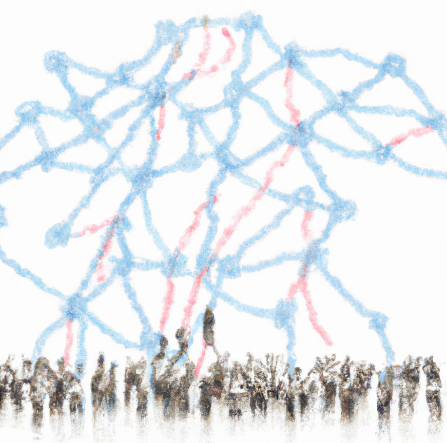

# 📚 Causal maps, systems maps, what's the difference? Does it matter?

## What is the difference between a causal map and a systems map?

Causal mapping is related to systems mapping, but we are specifically interested in *causal* connections, and we specifically map *what individual sources think/believe/claim*. 

The focus on *causal connections* means that causal maps are useful to "cut to the chase" and can be helpful in addressing questions like 

- "what are the most important drivers of X - according to the stakeholders"

- "what are some of the unintended consequences of Y- according to the stakeholders"

The focus on *individual sources* means that we can aggregate and simplify information from quite large numbers of sources and can address questions like

- do people agree about this? 

- what are the subgroups?

- do women see this differently from men?

Approaches called "systems mapping" often use causal links, and may or may not mix causal and non-causal links within a map. However, systems mapping approaches do not usually have this cognitive aspect, each link just encodes "X influences Y" whereas a link in a causal map encodes "X influences Y according to source S."

## Are systems maps about systems?

But also, many approaches have a way of mapping what-causes-what in which the resulting map is called a "systems map" without reflecting very much on the "system" part of the name. 

How do we know it is actually a system? Do you sometimes look at the map and say "nice map, unfortunately it isn't a system, so we will discard it, or at least not call it a systems map"? 

Or, perhaps the resulting map is always a systems map by definition, because any set of (interconnected) causal drivers of something is a system? Surely not?

Or, are there exclusion criteria which are applied during the process of constructing the map, according to which someone (the moderator?) says "sorry, X is indeed a driver of Y but we can't include it because it isn't part of the system"? If so, who decides this and how?

"Causal map" seems to us a conceptually more modest name: it's just a map of causal connections. 

However, as Bob Williams pointed out in an email exchange on this question: 

>The systems field was born in the practical task of solving real world problems, and many of the methods and methodologies are deeply investigative, reflective and solution oriented.

When we do causal mapping, what toolkits and ideas are we relying on which causal mapping brings to the table? Do we add anything new apart from e.g. using metrics like Centrality from network science to identify important factors? In particular, causal mapping (arguably) started from the attempt to map the internal causal models of decision-makers, and has grappled with problems like "are the rules for modelling the strength of a causal connection in the real world related to the rules for modelling how certain we are about it"? How do we model the evidence that a decision-maker believes X does not cause Y? When can we use evidence that stakeholders spontaneously mentioned Intervention X as an upstream cause of Outcome Y as evidence that X in fact meaningfully influenced Y? Some of these issues are already mentioned elsewhere in this Guide.

So if we've bothered to get people together to do some causal mapping to tackle some recurring problem, is there already a hint of something system-like which is e.g. stable and pushing back at us? 

As a phrase, "causal map" is nice and clear:  a map of the causes and effects of things. If a map consists entirely of causal links then it's certainly a causal map. It might be a systems map too e.g. if someone has done the work of highlighting/curating the map to focus on systems phenomena.

But "causal mapping" (compared to systems mapping) as an activity sounds a bit flavourless. Why would you want to do it, when would you stop? Where do we draw the boundaries, how do we exclude factors that might not be salient?

What useful tools/ideas do we offer to help move from (causal) modelling to solving a problem? 