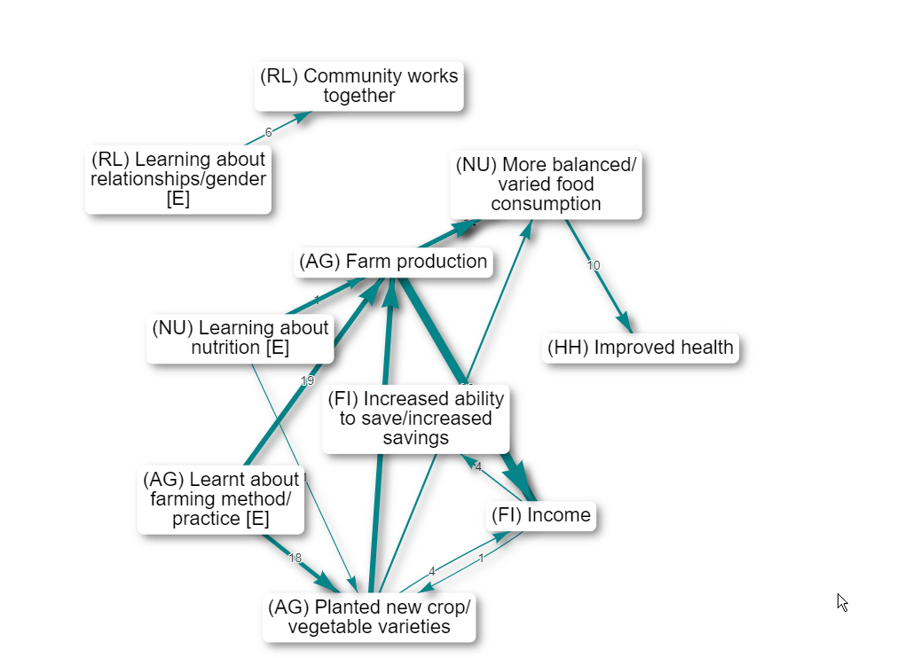
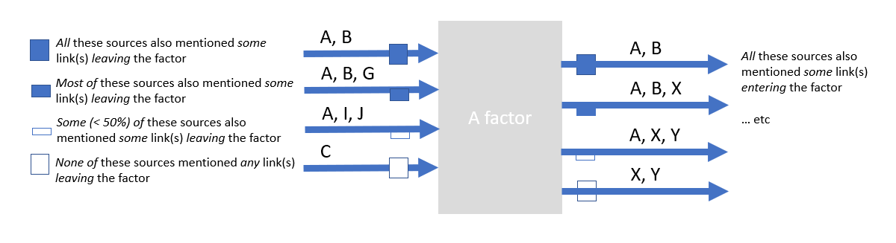
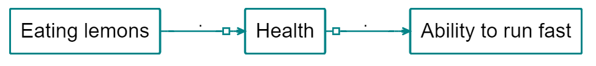

# Recent changes{#changelog}

## Version 0.76, 27/1/2022

### The Gallery

The [Gallery](#xgallery) loads as the app loads and gives you the opportunity to jump to another file and/or filter before loading the file which was already loading.

You can use it as a dashboard from which you can check out and revisit your previous work and get ideas from others.

You can also reach this dialog by pressing the 🏠 icon in the top menu, or with the key combination Alt+q. 

The Gallery contains the history of all the filters you used in the current session as well as filters from shortlinks saved by you or other users. Search to find the filters you need. For example, if you want to get some ideas for using the `combine opposites` filter, start to type "combine opposites " in the Search box on the left or (if you want to be more precise) in the search box above the `filter` column. This will show you examples from your own history or from when others have saved a filter in different projects. Then you can either load just that filter into your current file or go to see how that filter works in the file where it was used. 

 

### Continuity

[Continuity](#xcontinuity): several new features to help you visualise the effects of causes and avoid the transitivity trap. The [transitivity trap](#xtransitivity-trap) can make it a challenge to interpret your maps. Some people (or somebody) said that improved hygiene led to reduction in mosquito environments, and some people  said reduction in mosquito environments led to improved health, but *was this the same or different people*? Our favourite filter is [tracing threads](#xtracing-threads).

### Quickfields

[Quickfields](#xquickfields) are a special kind of flag for factor labels. They are a refinement of flags for when you have a set of categories which is mutually exclusive. You can add information about one or more dimensions using a format like this: `Crops improved / time:before` or `Crops improved / time:after`. A field (in this case, a field called time) will then be created in the factors table. Useful for coding a wide range of concepts which cut across your existing factor coding scheme. 

### Other features

The [Factor Editor Sidebar](xfactor-editor-sidebar) has added functionality

- view and edit factor memos
- when hovering over influence or consequence factors, see entire statement text, and click to edit the links

[Print view for tables](xprint-view-tables): If you want printable quotes for your report, there is now a table preset for that. Or go manually to the links table, click the 🖨️ button to display Print View, and choose the columns you want. They will be shown in the Print View in the same order. Then just copy and paste using the "Copy" button.

[Colour text](#xcolour-text): You can now conditionally colour the text of your factor labels. For example, this can be useful to draw attention to [factors which are opposites](https://causalmap.shinyapps.io/CM2test/?s=651).

Factor labels: You can now also choose whether or not to include the name of the field in your factor labels.

 `source_frequency` is now available for links: the number of different sources in each bundle

**Improved application of the order of the filters with calculated fields**: We have changed the point in the chain of filters when [calculated fields](#xcalculated-fields) are calculated. Previously, factor frequency meant "the frequency as it was at the start of the chain". Now, it means "the frequency of the factors as they are now at this point in the chain of filters". The same applies to nearly all the calculated fields

[Initials](#xinitials): Shorten link labels in maps with the new `initials` function. 

**Click on factors** in interactive view to focus on them, trace paths from/to them, edit their memo, or delete them.

Finding factors also works when you include 0 steps upstream and 0 steps downstream:

{width=650}

Reorder columns: You can reorder the columns just by dragging the column headers.

## Version 0.75, 27/12/2021

### Print view: exporting and zooming

You can now export your map as SVG using the export SVG button at bottom right.

You can now change the size of the Print map by using the `+` and `-` (and `Reset`) buttons. You can also drag it around.

### Label links

You can have multiple labels on your links (as you always could with factors), for example, count: link_id as well as unique: source_id: set `clear_previous = F` if you want to append a label to any existing label rather than replacing it. The app will correspondingly delete filters which are not needed. 

### Highlight factors without removing other factors

Maybe you want to just highlight the factors or links you find, but not remove the others. You can do this with the advanced editor, adding `highlight_only=TRUE`:

`find factors value=risk operator=contains highlight_only=TRUE`

`color factors field=found lo=white hi=#7FC97F`

You can use any of the normal conditional formatting options, e.g. `color factors field=found lo=blue hi=red` - the hi colour will be used for factors which match the search, and the lo colour for those which do not. 

This is a useful way to highlight factors which have the opposites symbol `~`:

`find factors value=~ highlight_only=TRUE`

`color borders field=found`

At the moment you can't use this to colour factor background by one criterion and colour factor borders by another (because they both use the hidden field called `found`).

### Printout (for example, printout of quotes) option in tables

Do you want some preformatted quotes for your report? 

Each table can also be shown as simple text for copying and pasting. 

If you want quotes, go to the links table, click the 📘 button to display the printout, choose the columns you want. They will be shown in the Printout in the same order. Then just copy and paste.

### Path tracing

If you want you can also leave either (but not both) factor selectors blank, e.g.

- to search from some specific factor or factors to "anywhere", or 
- to search from "anywhere" to some specific factor or factors.

(However, at the moment you can not calculate robustness if either factor selector is blank.)

##### Calculating robustness by field, e.g. "by source"

Just because there is a lot of evidence for all the different parts of a path does not mean that any one source, or type of source, actually mentioned all those parts. 

For this reason, `trace robustness` also lets you ask that question. 

For example you can put `source_id` in the box in order to count how many sources mentioned at least one entire path from the source to the target factor(s).  

This is important because it's usually more credible to ask how many people mentioned all the bits of some path than to ask how many pieces of evidence are there altogether.

Or you could put `District` to find out, looking at each district individually, there is evidence (possibly assembled from different sources within that district) for the path.   

### Mark links for continuity (Print View only)

This filter is experimental and the details will certainly change. 

The [transitivity trap](#xtransitivity-trap) can make it a challenge to interpret your maps. Some people (or somebody) said that improved hygiene led to reduction in mosquito environments, and some people  said reduction in mosquito environments led to improved health, but *was this the same or different people*?

{width=650}{width=650}

Add the filter `mark links` (there is no button for it, you have to type it) provides the following diagnostics:

{width=650}{width=650}

The incoming (bundles of) links to every factor (actually to every factor with outgoing links) are labelled a, b, etc, including when links are bundled e.g. by gender. Then the outgoing links are marked with say `a` if at least one of the sources who mentioned the outgoing link also mentioned link `a`. 

So we can see that none of the people who said that improved hygiene led to reduction in mosquito environments also said that reduction in mosquito environments led to improved health: there is no label at all on the arrow going out of reduction in mosquito environments. There is no source continuity. 

Note that the labels get re-used for each factor, so the `a`s and `b`s here are related:

{width=650}

but the `a`s here are not:

{width=650}

This also works with all the other fields, e.g. you can type `mark links field=statement_id` in order to test statement continuity, which is a stricter test of continuity. source_id is default so you don't need to type it specially.

Yes, it is a bit difficult to communicate this in a report. But it is important for interpretation. Of course a chain without source continuity isn't an invalid chain per se, it's just something to be aware of. 

We will probably also add a simpler metric for outgoing links which does not distinguish between the incoming links, something like "Percentage of sources who mentioned a link leaving factor F who mentioned any of the links entering F". This metric could be used to colour or scale the links, or perhaps be printed on the tail of the links.

### Show continuity

##### Summary

{width=650}{width=650}

Above, the links are labelled with the sources. 

The ▭ open half-box at the end of the first link tells us that at least half but not all of these stories stop here: less than half the sources mentioned any link *out of* K. 

The ◼ filled box at the start of the second link tells us that all of these stories are continuations: all these sources mentioned some link *into* K.

The  ▂ filled half-box at the end of the second link tells us that at least half but not all of these stories continue: Bob mentioned some link out of L, but Carla did not. 

The  ▢ open box on the link from L to N tells us that this story is not a continuation: Donna did not mention any link *into* L. 

There is no UI for this filter yet. You can just type

`show continuity`

in the advanced editor. 

----

The four kinds of boxes are (possibly aggregated) indicators of continuity, with respect to sources, between stages in a path.

If you want to look at say statement continuity rather than source continuity (the default), type

`show continuity field=statement_id`

If you want to see numbers (see examples below) rather than symbols (see examples further below; symbols are the default) then type:

`show continuity type=label`

{width=650}

Here, the 0.9 says that 90% of the sources mentioning the link to ~performed well also mention the link *from* ~performed well. The 1 says that 100% of the sources mentioning the link *from* ~performed well also mention the link *to* ~performed well. And the zeros below say that there is no source continuity at all. 

What this doesn't tell you is, when there are more than one incoming link, which of them have sources which continue to the outgoing link (that is what the bs and cs are for in `mark_links`). It's just an aggregate.

But what happens with filters which actually transform the map: zoom, bundle factors and combine opposites? Zoom can create its own version of the transitivity trap, if we [have](https://causalmap.shinyapps.io/CM2test/?s=415):

> eating lemons --> health; no scurvy

and

> health; fitness --> fast runner

{width=650}

we should be very careful when concluding (when zooming)

> eating lemons --> health --> fast runner

... and indeed, [showing continuity](https://causalmap.shinyapps.io/CM2test/?s=416) highlights this error: 

{width=650}

##### Showing continuity with arrowtypes

Printing actual numbers (from 0 to 1) on the arrows can be very confusing. So the default is to use symbols. 

- white box: 0
- half white box: <= 0.5
- half full box: > .5
- full box: 1

{width=650}

{width=650}{width=650}

{width=650}

{width=650}

### Roundtripping with the `statements` table

Statements table on our Test server: the `statement_id` field now IS included when you download a file.

- This means you can delete rows and reorder rows (by dragging them around in Excel). Don't change the `statement_id`.
  - Note: If you delete rows which had links, these links will become orphaned and will be displayed in the maps only when you do not filter by any `statement_id`. This probably isn't what you want -- you might want to delete the corresponding links too. If you choose to add new rows as well as deleting old rows, the `statement_id` of the new rows will be the row number, so make sure this is what you want -- will they then get "gifted" orphaned links?
