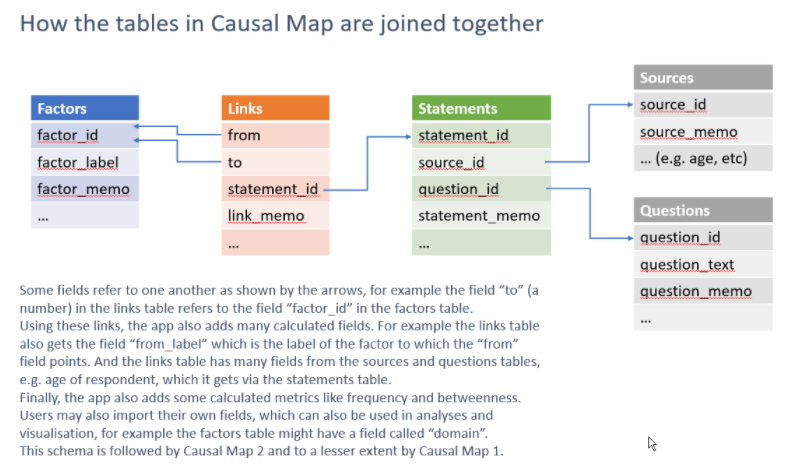

# Core tables in Causal Map{#core-tables}

Each table has the following types of field:

- ID field
- Standard fields e.g. statement_memo. Users enter data into these fields.
- Custom fields which users can add, as long as their names are not reserved field names
- System fields like *frequency* which are added by the system. These are not included if you download a file and are ignored when uploading a file.

These are the standard fields. You can add other custom fields too if you wish, and they will be available to the app.

## The main five tables and the most important fields / columns

### Factors

- `label`. Has to be unique - you can't have two factors with the same label
- `factor_id`. This is just a number like 1, 2 etc.  This number doesn't change even if the label does.

### Links

- `from`. Contains numbers which match the factor_ids of the factors.
- `to`. Contains numbers which match the factor_ids of the factors.
- `statement_id`. Contains numbers which match the statement_ids of the statements.
- `link_memo`. For making notes about a link as you code.
- `hashtags`. Re-usable tags which are usually common across several links, for example #hypothetical or #certain or #check.

### Statements

- `statement_id`. A running number from 1 upwards. 
- `source_id`. A code which matches the field `source_id` in the `sources` table.
- `question_id`. A code which matches the field `question_id` in the `questions` table.
- `statement_memo`.  For making notes about a statement as you code.

### Sources

- `source_id`. A code which matches the field `source_id` in the `statements` table.
- `source_memo`.  For making notes about a source as you code.
- Any other fields which you have uploaded.

### Questions

- `question_id`. A code which matches the field `question_id` in the `statements` table.
- `question_memo`.  For making notes about a question as you code.
- Any other fields which you have uploaded.

### Special case: Closed question blocks

This QuIP-oriented special feature is only provided for one single block of questions which each have the same set of answers, or could be recoded to have the same set of answers, e.g. twenty questions which are all answered or could be recoded as "always/sometimes/rarely/never" or whatever.

