# Recent changes{#changelog}

## Version 0.85, 1/12/2022

## Tables

The biggest change is the full release of the [new tables functionality](https://guide.causalmap.app/xall-tables.html). Now all your tables (factors, links, mentions, sources, statements, questions and metrics) use the [new features](https://guide.causalmap.app/xall-tables.html). There are lots of tables you can create, from a table simply showing the total links to and from each factor to a summary of each respondent’s response to a closed question. The possibilities are large - and increase with the amount of additional data your project has.

- Complete set of table presets in the Dashboard
- Filter, search and sort 
- Pivot tables
- [Lots more](#xtables-advanced.html)

### Removing unwanted links

Suppose you have a map with links B --> D, C --> D and also B --> C. If you run this filter:

`trace paths length=1 to=D`

the app will show you also the path from B to C, because both B and C are one link away from D, and there is a path from B to C. But that might have surprised you, as the path from B to C does not get you any closer to D. 


So you might prefer this filter:

`trace paths length=1 to=D remove_links=T` (which is equivalent to clicking this box in the dialog:)


... which will remove any such links. 


In other words, `trace paths length=L from=X to=Y` says "show me all the factors which are on paths from X to Y no longer than L, and all the links between such factors" whereas `trace paths length=L from=X to=Y remove_links=F` says "show me all the paths from X to Y no longer than L". 

Read more [here](#xremoving-unwanted-links).

## Quickfields for links

[Quickfields](#xquickfields) are now available for links too. You use the same syntax in the "hashtags" box as for [quickfields for factors](#xquickfields). This might seem like a small tweak but it means you can now systematically include information about the *context* of each link. Whereas previously you could mark that a particular link refers only to the context of before Covid by marking it with a hashtag like `#before-covid`, now you can use systematic *sets* of hashtags like `#covid:before` and  `#covid:after`, which automatically then adds a column to your links table called `covid` which can have values like `before`, `after`, and anything 

## Version 0.81, 9/8/2022

### [Importing a simple, wide-format file](#upload-summary) 

There are many ways to import data into Causal Map. We have just introduced perhaps the simplest way to upload your data: wide format. This is the kind of data you might often get if you have been using Google Forms. 

In this format, you only need an Excel file with one tab; each row is all the data from one source. So, many of the columns will probably be additional data like gender, etc.

#### Adding additional cases with wide-format files

You can start coding your data even if you do not yet have all the cases/sources. When you get more data, simply add them to the bottom of the original file and upload again. You don't need to do "[roundtripping](#xroundtripping)". All your sources and statements will be overwritten but your coding (links and statements) will be untouched. The questions table will also be untouched. If you want to add information about your questions, for example adding question text as well as question id, you can use [roundtripping](#xroundtripping). 

### [Bundling links](#bundlelinks)

When you specify a field to bundle by, it is enough to only specify only the first part of the field name. Remember, this name matches any field associated with sources, links or statements. 

So `#2` will match  `#2-village-name`. We recommend marking your top few fields for analysis like gender etc., or whatever else interests you the most, not just with a leading `#` (this anyway marks out the field as important) but then with a number, like `#2`. This makes it easy to create reproducible filters which you can conveniently share across different files. 


### Improved percentage labels when calculating surprise

If you use [percentages for labels](#percent), the label now shows the raw number, the baseline, and the percentage. 


## Version 0.80, 10/6/2022

### [Smart zoom](#smart-zoom)

If you are using [hierarchical aka nested coding](#xsimplifying-with-hierarchical), you can use ordinary zooming to "zoom out" your map to give a simple, more general overview. But sometimes this can mean oversimplifying your map: there are lower-level factors which are so important and popular that it is unhelpful or even misleading to roll them up into a parent factor. Smart zooming solves that problem.

### [Collaboration](##collaboration)

One feature we've been asked for most on Causal Map is **[live collaborative coding](https://guide.causalmap.app/collaborating-at-causal-map.html#details)**: if only two people could edit the same file at the same time! Well, we've now made that possible.

###  [The Dashboard](#dashboard)

The Dashboard replaces the Gallery, which many people found hard to use. It still packs plenty of functionality! [Read](#dashboard) to find out more.

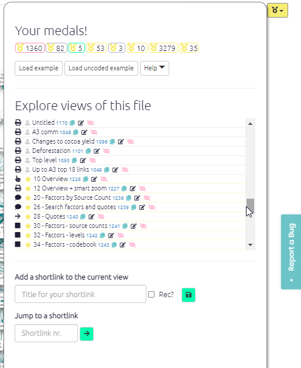

### [Reports Tab](xreports) 

Sometimes all the filters which are available in Causal Map can be bewildering and perhaps you just want to get your report finished already. The main purpose of this new tab is to provide an overview of a mapfile which makes sense and is immediately useful without any complicated searching or setting of filters. It provides for example sample description tables and some of the most useful tables which you can just copy and paste as needed. It's work in progress, so let us know what you want.

### [Document coding score!](#xgamification)

Coding a large file can be a daunting task. At the top right of the app, you will see some feedback on your progress in coding your file.

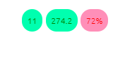

These show you:

- number of (top level) factors. You get a warning if this is more than100. Ideally you'd have less than 10 or 20 top-level factors, enough so that you can remember most of them and could explain them to someone else without notes. Of course, each top-level factor might have subfactors, but again we'd recommend no more than say 10 lower-level factors within each higher-level factor. So, it doesn't really matter how many factors you have, but the number of top-level factors should be fairly small.
- ratio of links to (top level) factors. You get a warning if this is less than 3. Ideally, each of your top level factors will be mentioned lots of times (including mentions of factors nested within them, like `Health behaviour; hand washing`) so they will have lots of links. If your factors don't have many links each, consider consolidating them.
- percentage of statements which have been coded. You get a warning if this is less than 60%.


### [Copying your map as a vector image](#copy-svg)

You can now export your map as SVG using the export SVG button at bottom right.

When you export an SVG image, a shortlink is automatically created for you. The ID of the shortlink is printed in grey at the bottom left of the image, and the link is also copied into your clipboard so you can paste it straight into a report if you want. Anyone who clicks on the shortlink will be taken to the app with the same image with the same filters.


### [Clustering sources](#cluster-sources)

This new filter groups all the sources in the file (as currently filtered) into clustersof sources  which are similar in terms of the maps they tend to produce.  

To use it, add a filter like this to the advanced editor:

```
cluster sources n_clusters=all
```

...
So the maps for each cluster should be maximally different from one another. This filter adds corresponding fields to the sources table (and other tables like the links table) which you can use to filter and format your maps.

### [Quickfields](#xquickfields)

Quickfields are a special kind of [flag](#xflag) for factor labels. They are a *refinement* of flags for when you have a set of categories which is mutually exclusive, like before/after which are not attributes of your sources and which you don't want to include in your hierarchy of factors.

You can add information about one or more such dimensions using a format like this:

<u>Crops improved / time:before</u>

<u>Crops improved / time:after</u>

**A field (in this case, a field called `time`) will then be created in the factors table** which you can then use for example to filter the maps, to search, filter and organise the factors, links and mentions tables, and to format the maps.

Example uses:

- capturing time before/after
- capturing factors which are explicitly or implicitly attributed to a particular project
- capturing the valence of a factor e.g. when a subject explicitly says the liked or did not like the fact that they had more work
- capturing things which apply only, say, to girls or only to boys
- organising ideas within a hierarchy

### [Plain coding](#plain-coding)

Causal mapping doesn't usually deal with the kind of non-causal themes which are the focus of ordinary QDA (like in NVivo!). However sometimes it can be really useful to be able to simply note the presence of something without any causal connection. 

We call this "plain coding". You can use it for:

1. Noting the presence of something which is not mentioned as part of a causal link in the statement you are coding but does appear *elsewhere* as a causal factor as part of a causal link. 
2. ...Or noting the presence of something which is "nothing but" a theme and never appears in causal coding.

### [New palettes for conditional formatting](#xconditional-formats)

The [default palette for discrete fields like gender or village](https://colorbrewer2.org/#type=qualitative&scheme=Set1&n=9) is nice, but maybe you want something different. With continuous fields like source count, you can specify the high, low and mid colours; now you can change the palette for discrete fields too, by adding `pal=6` or  `pal=3` like this:

```
color links field = #area fun=literal pal=6
```

Palette 2 is a good choice if you don't like the paler colours in palette 1 (the default).


See also the special sections on [conditional formatting with percentages](#percent) and [conditional formatting with surprise](#xsurprise).


### [Quick tails](#xquick-tails)

{width=350}

Suppose you want to create a new factor “Health behaviour; wearing a mask” and you know there is an existing higher-level factor “Health behaviour”, you can select “Health behaviour” from the list and then just add “; wearing a mask” with a leading semi-colon. These two fragments will be combined into a new factor label. This is quicker and ensures you don’t end up with different spellings of the higher-level factors. 

### [Search for main drivers and/or outcomes](#howtotracepathsandrobustness)

If you want to search from or to the **main** drivers and/or outcomes:

- put "main_drivers" in the first box
- and/or put "main_outcomes" in the second box.


### [Filtering print view of tables](#xprint-view-tables)

Have you ever tried pressing the toggle for Print View in a table? It provides you with a text version of text in your table. This can be really handy for example for getting a list of quotes related to your current map. Now, you use the additional table filters in combination with Print View to filter the information in your (text) table. Don't forget you can also include and exclude the fields which appear in Print View, and change their order, using the Show Columns box. Only the first 100 rows are shown.

## Version 0.78

### The Gallery

The [Gallery](#xgallery) loads as the app loads and gives you the opportunity to jump to another file and/or filter before loading the file which was already loading.

You can use it as a dashboard from which you can check out and revisit your previous work and get ideas from others.

You can also reach this dialog by pressing the 🏠 icon in the top menu, or with the key combination Alt+q. 

The Gallery contains the history of all the filters you used in the current session as well as filters from shortlinks saved by you or other users. Search to find the filters you need. For example, if you want to get some ideas for using the `combine opposites` filter, start to type "combine opposites " in the Search box on the left or (if you want to be more precise) in the search box above the `filter` column. This will show you examples from your own history or from when others have saved a filter in different projects. Then you can either load just that filter into your current file or go to see how that filter works in the file where it was used. 

 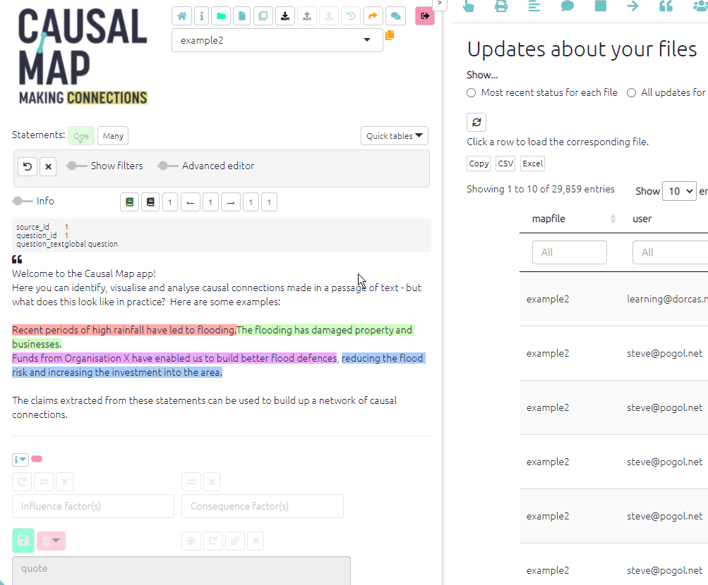


### Continuity

[Continuity](#xcontinuity): several new features to help you visualise the effects of causes and avoid the transitivity trap. The [transitivity trap](#xtransitivity-trap) can make it a challenge to interpret your maps. Some people (or somebody) said that improved hygiene led to reduction in mosquito environments, and some people  said reduction in mosquito environments led to improved health, but *was this the same or different people*? Our favourite filter is [tracing threads](#xtracing-threads).

### Quickfields

[Quickfields](#xquickfields) are a special kind of flag for factor labels. They are a refinement of flags for when you have a set of categories which is mutually exclusive. You can add information about one or more dimensions using a format like this: `Crops improved / time:before` or `Crops improved / time:after`. A field (in this case, a field called time) will then be created in the factors table. Useful for coding a wide range of concepts which cut across your existing factor coding scheme. 

### Other features


The [Factor Editor Sidebar](xfactor-editor-sidebar) has added functionality

- view and edit factor memos
- when hovering over influence or consequence factors, see entire statement text, and click to edit the links

[Print view for tables](xprint-view-tables): If you want printable quotes for your report, there is now a table preset for that. Or go manually to the links table, click the 🖨️ button to display Print View, and choose the columns you want. They will be shown in the Print View in the same order. Then just copy and paste using the "Copy" button.

[Colour text](#xcolour-text): You can now conditionally colour the text of your factor labels. For example, this can be useful to draw attention to [factors which are opposites](https://causalmap.shinyapps.io/CM2test/?s=651).

Factor labels: You can now also choose whether or not to include the name of the field in your factor labels.

 `source_frequency` is now available for links: the number of different sources in each bundle

**Improved application of the order of the filters with calculated fields**: We have changed the point in the chain of filters when [calculated fields](#xcalculated-fields) are calculated. Previously, factor frequency meant "the frequency as it was at the start of the chain". Now, it means "the frequency of the factors as they are now at this point in the chain of filters". The same applies to nearly all the calculated fields

[Initials](#xinitials): Shorten link labels in maps with the new `initials` function. 

**Click on factors** in interactive view to focus on them, trace paths from/to them, edit their memo, or delete them.


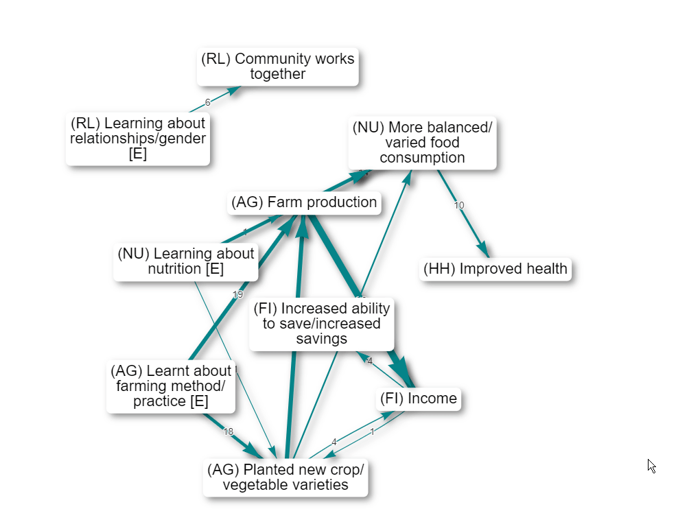


Finding factors also works when you include 0 steps upstream and 0 steps downstream:

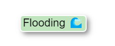

Reorder columns: You can reorder the columns just by dragging the column headers.

## Version 0.75, 27/12/2021

### Print view: exporting and zooming

You can now export your map as SVG using the export SVG button at bottom right.

You can now change the size of the Print map by using the `+` and `-` (and `Reset`) buttons. You can also drag it around.

### Label links

You can have multiple labels on your links (as you always could with factors), for example, count: link_id as well as unique: source_id: set `clear_previous = F` if you want to append a label to any existing label rather than replacing it. The app will correspondingly delete filters which are not needed. 

### Highlight factors without removing other factors

Maybe you want to just highlight the factors or links you find, but not remove the others. You can do this with the advanced editor, adding `highlight_only=TRUE`:

`find factors value=risk operator=contains highlight_only=TRUE`

`color factors field=found lo=white hi=#7FC97F`

You can use any of the normal conditional formatting options, e.g. `color factors field=found lo=blue hi=red` - the hi colour will be used for factors which match the search, and the lo colour for those which do not. 

This is a useful way to highlight factors which have the opposites symbol `~`:

`find factors value=~ highlight_only=TRUE`

`color borders field=found`

At the moment you can't use this to colour factor background by one criterion and colour factor borders by another (because they both use the hidden field called `found`).

### Printout (for example, printout of quotes) option in tables


Do you want some preformatted quotes for your report? 


Each table can also be shown as simple text for copying and pasting. 

If you want quotes, go to the links table, click the 📘 button to display the printout, choose the columns you want. They will be shown in the Printout in the same order. Then just copy and paste.


### Path tracing

If you want you can also leave either (but not both) factor selectors blank, e.g.

- to search from some specific factor or factors to "anywhere", or 
- to search from "anywhere" to some specific factor or factors.

(However, at the moment you can not calculate robustness if either factor selector is blank.)

##### Calculating robustness by field, e.g. "by source"


Just because there is a lot of evidence for all the different parts of a path does not mean that any one source, or type of source, actually mentioned all those parts. 

For this reason, `trace robustness` also lets you ask that question. 

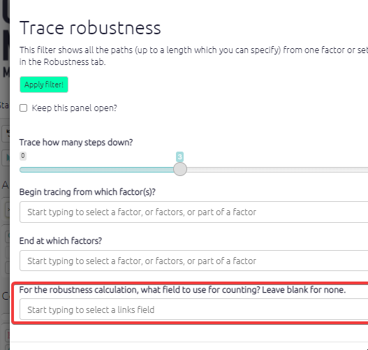

For example you can put `source_id` in the box in order to count how many sources mentioned at least one entire path from the source to the target factor(s).  

This is important because it's usually more credible to ask how many people mentioned all the bits of some path than to ask how many pieces of evidence are there altogether.

Or you could put `District` to find out, looking at each district individually, there is evidence (possibly assembled from different sources within that district) for the path.   


### Mark links for continuity (Print View only)

This filter is experimental and the details will certainly change. 

The [transitivity trap](#xtransitivity-trap) can make it a challenge to interpret your maps. Some people (or somebody) said that improved hygiene led to reduction in mosquito environments, and some people  said reduction in mosquito environments led to improved health, but *was this the same or different people*?

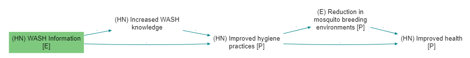{width=650}

Add the filter `mark links` (there is no button for it, you have to type it) provides the following diagnostics:

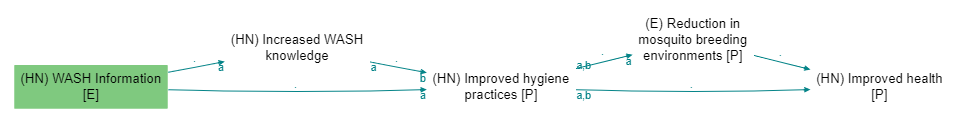{width=650}

The incoming (bundles of) links to every factor (actually to every factor with outgoing links) are labelled a, b, etc, including when links are bundled e.g. by gender. Then the outgoing links are marked with say `a` if at least one of the sources who mentioned the outgoing link also mentioned link `a`. 

So we can see that none of the people who said that improved hygiene led to reduction in mosquito environments also said that reduction in mosquito environments led to improved health: there is no label at all on the arrow going out of reduction in mosquito environments. There is no source continuity. 

Note that the labels get re-used for each factor, so the `a`s and `b`s here are related:

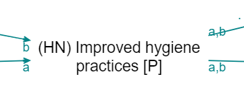

but the `a`s here are not:

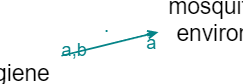

This also works with all the other fields, e.g. you can type `mark links field=statement_id` in order to test statement continuity, which is a stricter test of continuity. source_id is default so you don't need to type it specially.

Yes, it is a bit difficult to communicate this in a report. But it is important for interpretation. Of course a chain without source continuity isn't an invalid chain per se, it's just something to be aware of. 

We will probably also add a simpler metric for outgoing links which does not distinguish between the incoming links, something like "Percentage of sources who mentioned a link leaving factor F who mentioned any of the links entering F". This metric could be used to colour or scale the links, or perhaps be printed on the tail of the links.

### Show continuity

##### Summary

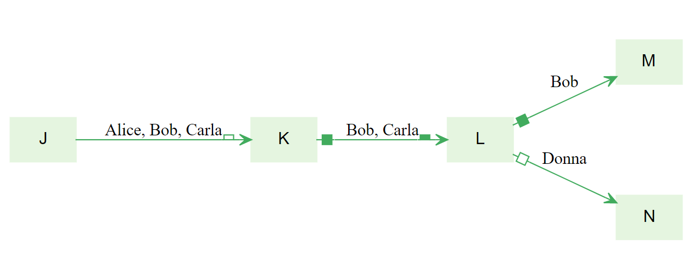{width=650}

Above, the links are labelled with the sources. 

The ▭ open half-box at the end of the first link tells us that at least half but not all of these stories stop here: less than half the sources mentioned any link *out of* K. 

The ◼ filled box at the start of the second link tells us that all of these stories are continuations: all these sources mentioned some link *into* K.

The  ▂ filled half-box at the end of the second link tells us that at least half but not all of these stories continue: Bob mentioned some link out of L, but Carla did not. 

The  ▢ open box on the link from L to N tells us that this story is not a continuation: Donna did not mention any link *into* L. 

There is no UI for this filter yet. You can just type

`show continuity`

in the advanced editor. 

----

The four kinds of boxes are (possibly aggregated) indicators of continuity, with respect to sources, between stages in a path.

If you want to look at say statement continuity rather than source continuity (the default), type

`show continuity field=statement_id`

If you want to see numbers (see examples below) rather than symbols (see examples further below; symbols are the default) then type:

`show continuity type=label`

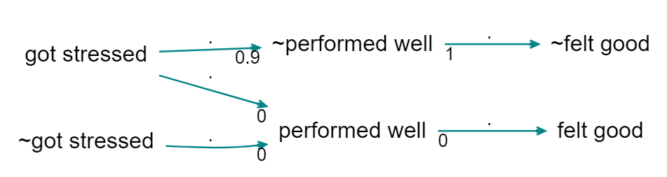{width=650}

Here, the 0.9 says that 90% of the sources mentioning the link to ~performed well also mention the link *from* ~performed well. The 1 says that 100% of the sources mentioning the link *from* ~performed well also mention the link *to* ~performed well. And the zeros below say that there is no source continuity at all. 

What this doesn't tell you is, when there are more than one incoming link, which of them have sources which continue to the outgoing link (that is what the bs and cs are for in `mark_links`). It's just an aggregate.

But what happens with filters which actually transform the map: zoom, bundle factors and combine opposites? Zoom can create its own version of the transitivity trap, if we [have](https://causalmap.shinyapps.io/CM2test/?s=415):

> eating lemons --> health; no scurvy

and

> health; fitness --> fast runner

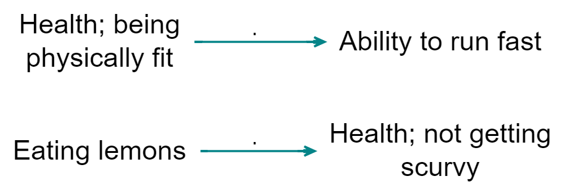{width=650}

we should be very careful when concluding (when zooming)

> eating lemons --> health --> fast runner

... and indeed, [showing continuity](https://causalmap.shinyapps.io/CM2test/?s=416) highlights this error: 


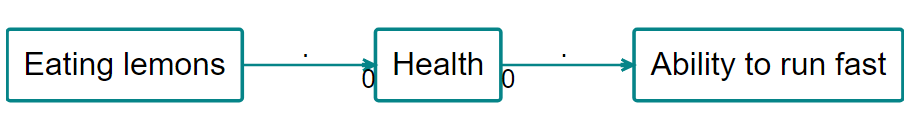{width=650}

##### Showing continuity with arrowtypes

Printing actual numbers (from 0 to 1) on the arrows can be very confusing. So the default is to use symbols. 

- white box: 0
- half white box: <= 0.5
- half full box: > .5
- full box: 1

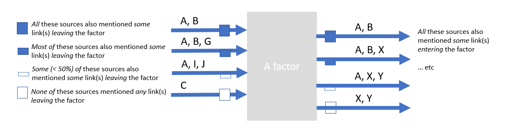{width=650}

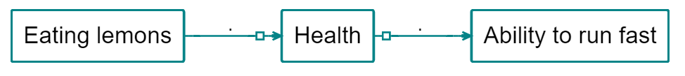{width=650}{width=650}

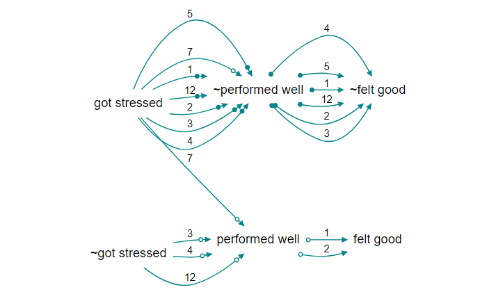{width=650}

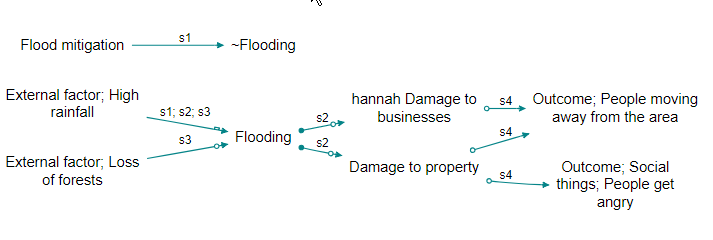{width=650}


### Roundtripping with the `statements` table

Statements table on our Test server: the `statement_id` field now IS included when you download a file.

- This means you can delete rows and reorder rows (by dragging them around in Excel). Don't change the `statement_id`.
  - Note: If you delete rows which had links, these links will become orphaned and will be displayed in the maps only when you do not filter by any `statement_id`. This probably isn't what you want -- you might want to delete the corresponding links too. If you choose to add new rows as well as deleting old rows, the `statement_id` of the new rows will be the row number, so make sure this is what you want -- will they then get "gifted" orphaned links?
